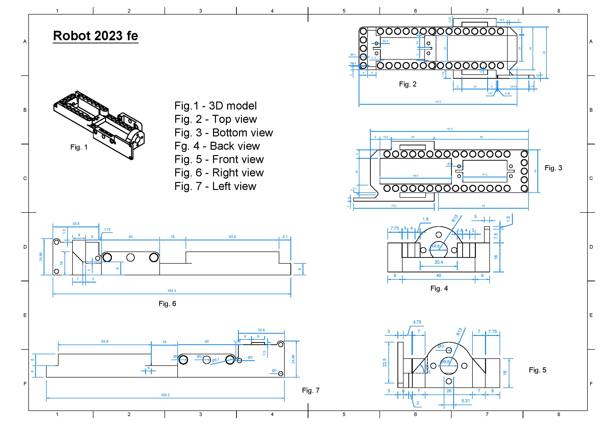
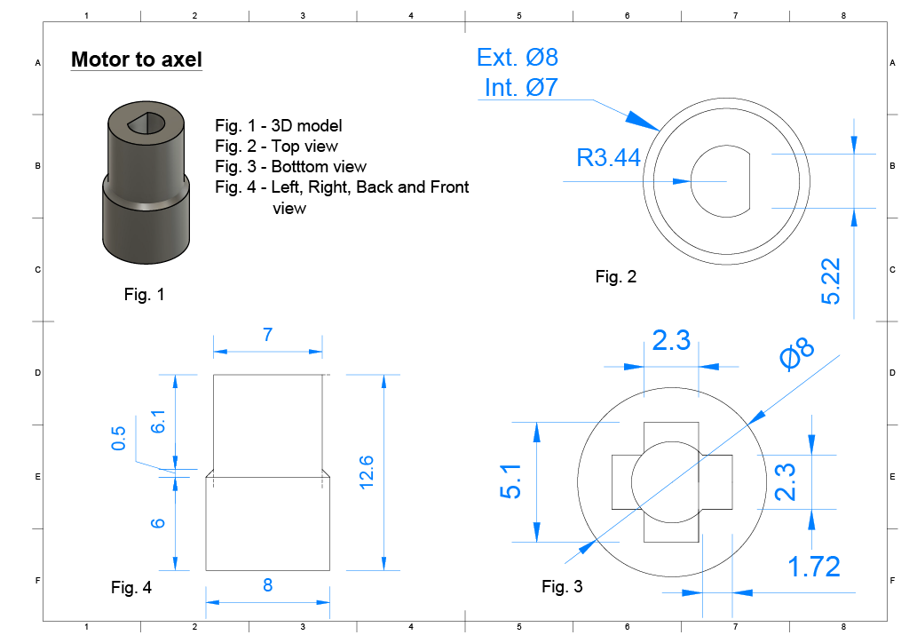
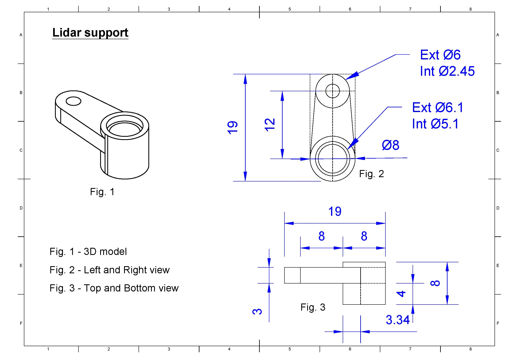
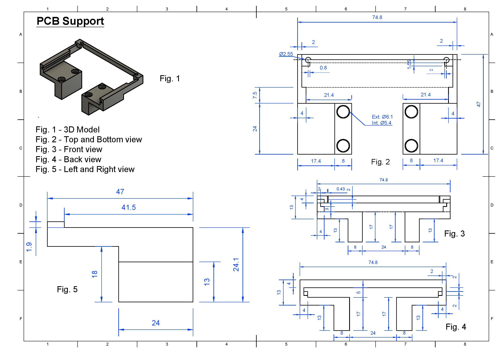
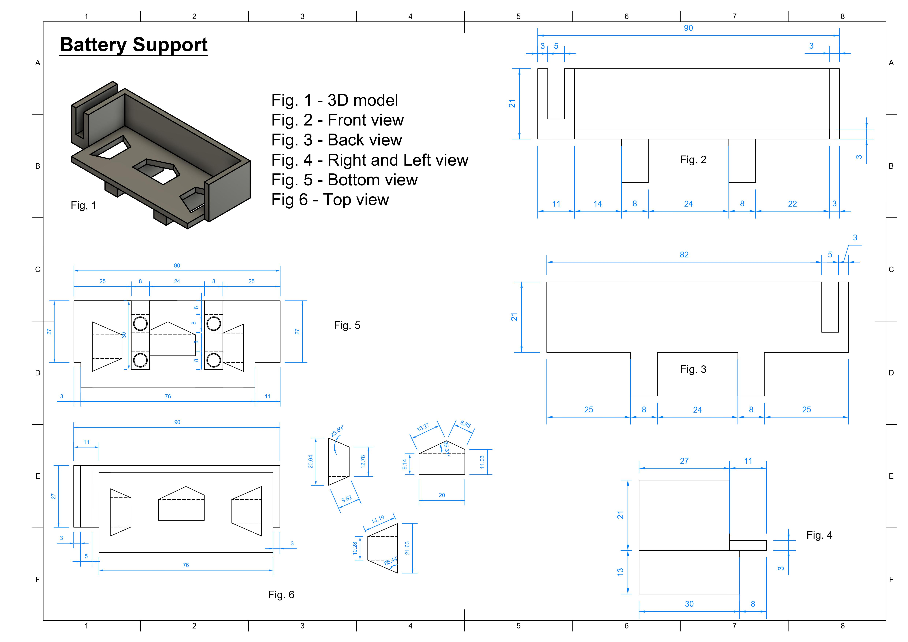
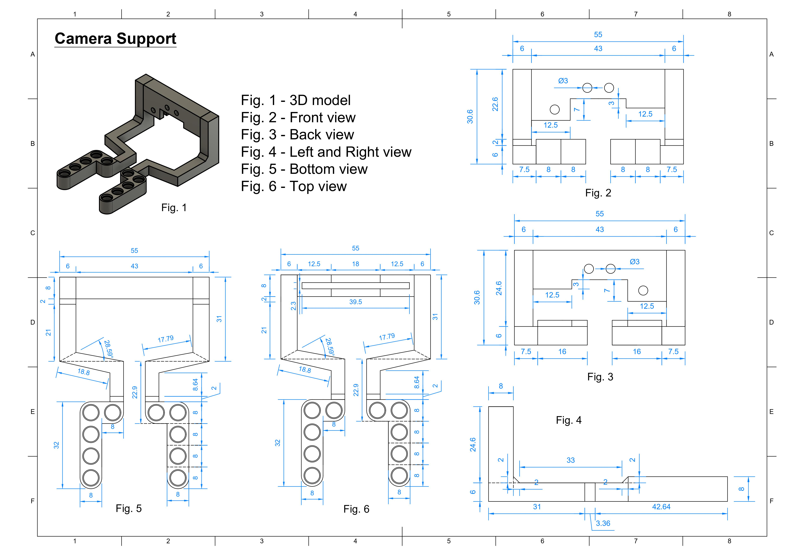
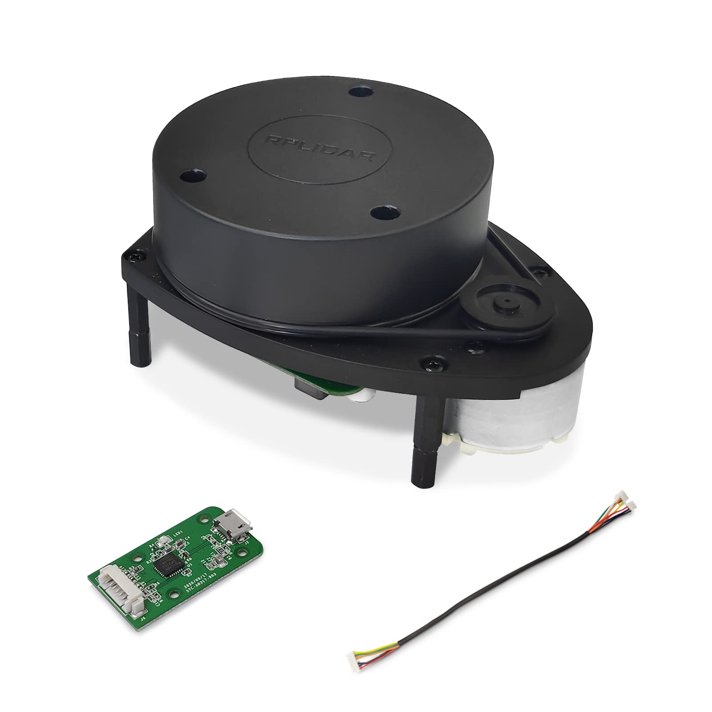

<center><h1> Nerdvana Nemesis 2023 </center>

## Table of Contents
* [Photos](#team-image)
  * [Team](#team-image)
  * [Robot](#robot-image)
* [Performance Video](#video)
* [Mobility Management](#mobility-management)
  * [Mechanical Components](#mechanical-components)
    * [All-wheel drive](#all-wheel-drive)
    * [Drivetrain](#drivetrain-mechanical)
    * [Steering](#steering-mechanical)
  * [Electrical Components](#electrical-components)
    * [Servo Motor](#servo-motor)
    * [Drive Motor](#drive-motor)
    * [Motor Driver](#motor-driver)
* [Power and Sense Management](#power-and-sense-management)
  * [Teensy 4.1](#teensy-4.1)
  * [Lidar sensor](#lidar-sensor)
  * [Ultrasonic sensor (HC-SR04)](#ultrasonic-sensor-(HC-SR04))
  * [Gyro Sensor](#gyro-sensor-(BMI088))
  * [Li-Po Battery](#li-po-battery)
  * [PixyCam 2.1](#pixy-cam-2.1)
  * [Voltage regulator](#voltage-regulator-(L7805CV))
  * [Circuit diagram](#circuit-diagram)
* [Obstacle Management](#obstacle-management)
* [Code for each component](#code-for-each-component)
  * [Drive Motor](#drive-motor-code)
  * [Servo Motor](#servo-motor-code)
  * [Camera](#camera-code)
  * [UltraSonic Sensor](#ultrasonic-sensor-code)
  * [Gyro Sensor](#gyro-sensor-code)
  * [SD Card](#sd-card-code)
  * [Display](#display-code)
* [Resources](#resources)
  * [3D Models](#3d-models-resources)
  * [Images](#images-resources)
  * [Copyright](#copyright)

### Team: Priboi Mihai, Onișoru Antonia, Bălan Teodor <a class="anchor" id="team-image"></a>
  

## Photos of our robot Paula Mia (**P**retty **A**wesome **U**ltra **L**ow **A**ccurate **M**inimum **I**ntelligence **A**ugmentation) <a class="anchor" id="robot-image"></a>

|  |  | 
| :--: | :--: | 
| *Front* | *Back* |
|  |  | 
| *Left* | *Right* |
|  |  | 
| *Top* | *Bottom* |

<br>

## Our video of the robot on [Youtube](https://youtu.be/QVi7v2j4KB4) <a class="anchor" id="video"></a>

<br>

# Mobility Management <a class="anchor" id="mobility-management"></a>


## Mechanical components <a class="anchor" id="mechanical-components"></a>
After our experience from last year's edition, where we used a back-wheel drive with a differential, this year, at the national, we decided to go with a AWD system. We chose this system because the BWD has a harder time steering as there is no power on the steering wheels. Also, an AWD system assure a more stable power distribution.

Our drivetrain is constructed using Lego Technic pieces and 3D printed pieces to connect the electrical components with the Lego.

The main components of the drivetrain, as you can see in the picture in _all-wheel drive_ section, are the differentials on the front/back set of wheel, and the center one which conects them to the motor. In order to increase the speed of the robot we also used a system of cogs with a gear ratio of **1:1.67**.

We've tried different steering mechanisms like the _Ackermann steering_ or the _Bell-crank steering_. Because of their complexity, we came to the conclusion that it is better for us to use a simpler one, as it can be contructed with fewer pieces and it is smaller.

### All-wheel drive <a class="anchor" id="all-wheel-drive"></a>


As we said, we've designed 3D printed parts to connect the electronic components to the lego structure of the steering. Therefore, our construction includes a big chassis (as the body), made by use with the help of a 3D printer, to which the motors and sensors are attached to by screws or their own custom 3D printed piece.

### Chassis <a class="anchor" id="drivetrain-mechanical"></a>


To the chassis, or the body the servo, the DC motor, the gyro sensor, the steering system and the differential are directly attached. The servo and the motor are attached to the body by using screws. The motor is placed at the very back of the robot and the servo is at the front. The steering system and differential are connected by using lego pieces.

In the sketch you can see the dimensions of the chassis of your robot.

### Chassis drawing <a class="anchor" id="drivetrain-mechanical"></a>


In order to be able to move the wheels we needed to transform the axle of the motor to a lego axle (because we are using lego gears), we did this by designing a 3D piece that does this. You can see the specification of it below.

### Drivetrain <a class="anchor" id="drivetrain-mechanical"></a>


For the servo motor, to connect its axle to the drivetrain, so again we've made 2 different pieces that convert the axle of the motor to a lego axle, as you can see in the drawing below.

### Steering <a class="anchor" id="steering-mechanical"></a>


Now that we finished with the components attached directlly to the chassis, we still need to connect the other components in order to make the robot move.

First, we have the RPLIDAR A1 sensor, which takes a lot of space. It's size explains its weight. Being one of your heavier components we tried to place it at the center of your robot so we can have a balance construction. To connect the sensor to the body we came up with a quite simple idea. We use 4 pieces identical with the one shown in the drawing below. These 3D pieces are designed to me attached with screws to the lidar and with black lego pins to the body. Is such a simple solution for this big, heavy and complicated sensor.

### RPLIDAR Support <a class="anchor" id="steering-mechanical"></a>


And this concludes the sensors, that our robot has. All that we need to make the robot functinal is a microcontroller, a battery and a camera.

We will start with the microcontroller. We used a teensy and a PCB to create our circuit. The teensy is connected to the PCB, so this way the PCB and the teensy are like one component together. We placed them at the back of the robot, and we designed a 3D piece to attach them to the body. In order to fix the PCB and teensy to the 3D part we used screws, and to connect to the body we used black lego pins. You can see the design below.

### PCB Support <a class="anchor" id="steering-mechanical"></a>


The battery, as the RPLIDAR A1 sensor, is quite heavy, so we tried to place it as close to the middle of the robot as possible. For it we also designed another piece as you can see in the skech. What is special about this piece is that we made a special space so we can put its cable, so the construction is neat and compact.

### Battery Support <a class="anchor" id="steering-mechanical"></a>


Now the final component is the camera. It's an important component for the robot, because we use it to distinguish the colors of the cubes. We made another 3D model, to attach it to the body. Like the majority of the electronic components we use screws to fix the camera to the 3D piece and black logo pins to connect the piece to the chassis.

### Camera Support <a class="anchor" id="steering-mechanical"></a>


<br>

## Electrical Components <a class="anchor" id="electrical-components"></a>

Two of the most important electrical components of your robot are the motors. For the steering we are using a servo motor, respectively MG996R servo motor. And to make the robot move we are using a geared DC motor with a magnetic encoder (output - 7 V, 1:20 ratio). They are attached to the body directly without using 3D parts or lego pieces.

### Drive Motor <a class="anchor" id="drive-motor"></a>


The geared DC motor is connected to the ground and power line of the teensy. We are using a motor controller to be able to change the velocity of the motor (we connected the motor to A01, A02 pins of the driver).For the cables of the encoder of the DC motor we connected them directly to the teensy board (they are on PIN4 and PIN5).

### Motor Driver <a class="anchor" id="motor-driver"></a>


To control the velocity of the DC motor we used a motor driver from SparkFun (Dual TB6612FNG). The PWMA of the driver is connected to PIN7 of the teensy board, also AI2 and AI1 of the driver are connected to PIN4, respectively PIN5. 

### Servo Motor <a class="anchor" id="servo-motor"></a>


For the steering part, the servo is essentially. The servo is MG996R servo motor. It has a 180 rotate angle and enough torque (the servo torque is 9kg/cm for 4.8V and 11 kg/cm for 6V). Like the DC motor, the MG996R is connected to the power and ground line, and PIN10 (this pin helps us change the rotating direction) of the teensy.


# Power and Sense Management <a class="anchor" id="power-and-sense-management"></a>

Last year we've made a robot that used Raspberry Pi, but also Arduino. After the international in Germany, we've come to a conclusion, that we  need just a microcontroller. So we've searched and found the perfect mach, the Teensy 4.1 board.

### Teensy 4.1 <a class="anchor" id="teensy-4.1"></a>


Why did we choose this board, you may ask. Well, we wanted to have as more special pins (example IC2 and interrupt pins) and is much faster in comparison to the arduino, the teensy having a 600 MHz frequency and a flash memory of 8 Mbytes, while an Arduino Every (this arduino board we've used last year) has a 20MHz freqency and a flash memory of 48 KB.

So this year our work was much easier, because we didn't have problems, such as trying to connect the Raspberry Pi to the Arduino board, which made our sensors reading slower (we had to send the readings to the Raspberry Pi and make the Arduino wait for the Raspberry to procces it). Now we could procces the readings of the sensors on the same board, which made our data more accurate.

### RPLIDAR A1 <a class="anchor" id="lidar"></a>


Regarding the distance sensor, it is a long story. At first, after the international we thought that using a lidar (VL53L0X) sensor for measuring distances was a great idea, but it turned out that it wasn't. Because the VL53L0X sensor is using a laser to measure the distances, the color of the object that the laser reaches influences the data that the sensor is reading. We discovered this by testing, by observing that, because the walls are black, the data that we were reading with the sensor was not accurate if the distance from the lidar to the walls was bigger than 70cm, which isn't the result we wanted. 

After this, we searched so much more and found out that we can gain precision by using a RPLIDAR A1, specifically RPLIDAR A1M8, which is a 360 degree 2D laser scanner (LIDAR). Why is this sensor better than VL53L0X, you may ask. Well the first big difference between the two is the data that we can process. The RPLIDAR A1 is constantly rotating and measuring the distances in all directions. Meanwhile the VL53L0X sensor could measure the distance in a single direction. So this way with the RPLIDAR A1 we could map and determine the walls positions, cubes positions and the robot position at any time we want. Another difference between the sensors is the precision. The RPLIDAR A1 is more precise than the VL53L0X.

So how is RPLIDAR A1 working? RPLIDAR is based on laser triangulation ranging principle, and it measures distance data in more than 2000 times per second with high resolution distance output (<1% of the distance).
The sensor emits modulated infrared laser signal, the laser signal is then reflected by the object to be detected. The returning signal is sampled by vision acquisition system in RPLIDAR A1 and the DSP embedded in RPLIDAR A1 starts processing the sample data and output distance value and angle value between object and RPLIDAR A1.

To connect the scanner to the teensy we have seven cables. Three for controlling the motor, which is rotating the sensor, and the other 4 are for powering the lidar and reading data. The pins for reading data are PIN0 and PIN1, and the PWM pin for the motor is PIN2.

### Gyro sensor (BMI088) <a class="anchor" id="gyro-sensor-(BMI088)"></a>
")

Another sensor that amazed us is the gyro sensor. In the previous year the gyro sensor (MPU6050) was ok, but still had a relatively big drift. However this year, we've solved that problem and now the gyro is one of the most accurate sensors we have. We are using the Grove 6 Axis Accelerometer and Gyroscope BMI088. This sensor is based on Bosch BMI088, which is widely used for drones. The gyro is wired to a SDA and SCL pin on the teensy (the SDA pin is PIN18 and the SCL pin is PIN19 on the board). Also we have two more pins, the INT1 and INT2 pins (interrupt pins) that are connected to PIN14, respectively PIN15 to the board.

### Li-Po Battery <a class="anchor" id="li-po-battery"></a>


As for the battery, last year we used a 6 pack of AA Nickel–metal hydride batteries, which generated about 7.2V, 2000mAh and had a weight of about 650g. After we decided to make a smaller and lighter robot, we knew that the battery had to change. We went with a Li-Po battery, as they are lighter, smaller, and charge faster. The battery that we chose is the _LiPo GENS ACE Soaring_ (7.4V, 2200mAh, 20C). This took the weight of the batterypack from 650g to 100g, which made the robot 2 times as light. To add, it is more than 2 times smaller in volume.

### PixyCam 2.1 <a class="anchor" id="pixy-cam-2.1"></a>


One of our biggest drawbacks last year was the speed of the camera readings. We were using a Raspberry Pi with the PiCam V2. Mainly because we had to do the cube recognition machine learning algorithm and procces it on the Raspberry Pi, the fps of the proccesed images was pretty low, about 15. This also cost the other readings on the Raspberry Pi to slow down.

Because of this, we opted for the Pixy cam 2.1, which has a quite a few advantages: it has it's own processing power, so it doesn't slow the other components down; it has a expert made machine learning algorithm for detecting and traking objects, so it works really well; it can output directly to an arduino or another microcontroller, so a Raspberry Pi isn't necessary, which can increase the frequency of the readings.

### Voltage regulator <a class="anchor" id="voltage-regulator"></a>
")

In order to power the teensy with the 5V required, we needed to lower the voltage of the 7.4V battery, that fully charged goes as high as 8.4V. For this we used a linear voltage regulator (L7805CV), that could take any voltage lower than 35V and reduce it to 5V.

Because we wanted the robot to be as fast as possible, the motor driver is powered directly from the battery, so we can have a voltage as high as possible.

### Circuit diagram <a class="anchor" id="circuit-diagram"></a>


<br>

# Obstacle Management <a class="anchor" id="obstacle-management"></a>

As we mentioned above we utilize the A1M8 360° LiDAR scanner to meticulously measure distances, enabling comprehensive spatial data acquisition. Subsequent data analysis allows us to establish correlations between points, facilitating the construction of detailed representations of the walls and complex geometric entities.

In this research, the A1 LiDAR is interfaced with a Teensy microcontroller via a UART connection, initiating the 'scan_express' mode for rapid data acquisition at a 10Hz frequency across a 360° field. The data is transmitted in 32-point buffers. To ascertain accurate angular measurements, we employ a differential approach, comparing consecutive readings, and implement angle compensation based on the values obtained, thereby enhancing the precision of our measurements.

The LiDAR sensor yields a dataset for each point, comprising both distance (measured in millimeters) and angle (measured in degrees). Our objective is to convert these polar coordinates into Cartesian coordinates (x, y), and subsequently adjust their positioning due to the LiDAR’s inverted orientation, which is designed for spatial efficiency.
We can do the conversion by using the equations below.

```
x= -distance * cos(angle) 
y= -distance * sin(angle)
```

In which the angle needs to be mesure in radians and the ditances is in mm. You can spot these relations in our function _lidarProcessingData_ writen below.

```ino
// Getting angle compensation
double getDiffAngle(byte data_angle) {
    bool sign = data_angle >> 7;
    double diff_angle = (double)(data_angle & 0b1111111) / (1 << 3);
    if (sign) {
        diff_angle = -diff_angle;
    }
    return diff_angle;
}

double angleDiff(double old_angle, double now_angle) {
    return old_angle <= now_angle ? now_angle - old_angle : now_angle - old_angle + 360;
}

// Processing data from the lidar
void lidarProcessingData() {

    double start_angle = (((uint16_t)(lidar_buff[3] & 0b01111111) << 8) ^ lidar_buff[2]) / 64.;
    double old_start_angle = (((uint16_t)(lidar_old_buff[3] & 0b01111111) << 8) ^ lidar_old_buff[2]) / 64.;

    for (int i = 0; i < 16; ++i) {
        byte* cabin = lidar_old_buff + 5 * i + 4;
        
        d0[0] = getDiffAngle(((cabin[0] & 0b11) << 4) ^ (cabin[4] & 0b1111));
        d0[1] = getDiffAngle(((cabin[2] & 0b11) << 4) ^ (cabin[4] >> 4));

        for (int i = 0; i < 2; ++i) {
            distance[i] = ((uint16_t)cabin[2 * i + 1] << 6) ^ (cabin[2 * i] >> 2);
        }

        for (int j = 0; j < 2; ++j) {
            int k = 2 * i + 1 + j;
            double angle = old_start_angle + angleDiff(old_start_angle, start_angle) / 32 * k;
            if (angle >= 360) {
                angle -= 360;
            } else if(angle < 0) {
              angle = angle + 360;
            }

            double x, y;

            float gx_angle = fmod((double)(angle + (double)gx - current_angle), 360.0);

            y = -distance[j] * cos(radians(gx_angle));
            x = -distance[j] * sin(radians(gx_angle));

            if(distance[j] > 5 && distance[j] < 4000) {
              // Serial << x << " " << y << '\n';
              // Serial << distance[j] << " " << gx_angle << '\n';
              lidarProcessPoint(Angle(distance[j], gx_angle), Point(x, y));
            }

        }
    }
}
```
How do we know it's a wall or a cube you may ask. The task at hand involves identifying adjacent data points, a process that might seem straightforward initially—simply determining the "closeness" of the points. However, the reality is more nuanced. Given the LiDAR's fixed angular resolution, the gap between consecutive points expands with their distance, complicating the identification process.

The elegance of machine learning shines through in our project, where we applied polynomial regression to a dataset. Our goal was to find the right coefficients to correlate the distances of data points, enhancing our understanding of their relationships on a linear path.

```ino
#define MAX_POINTS 1000
#define INF 10000

bool wall_updated[WALL_NR] = {1, 1, 1, 1};

double old_ang = 10000;
double old_dist = 10000;

Point current_line[MAX_POINTS];
int current_line_size = 0;

double calculate_threshold(double distance) {
  double a = 0.0010947040728267199;
  double b = -0.46574727812407213;
  double c = 56.010728111461475;
  double points = a * distance * distance + b * distance + c;
  double threshold = max(7.0, points);  // Ensure threshold is at least 7
  return threshold;
}

void calculate_linear_regression_segment(Point& start, Point& end, double& dist, int& dir) {  
  if(current_line_size < 2) return; // Not enough points for regression
  
  double x_start = INFINITY, x_end = -INFINITY;
  double x_sum = 0, y_sum = 0, x2_sum = 0, xy_sum = 0;
  for(int i = 0; i < current_line_size; ++i) {
    x_sum += current_line[i].x;
    y_sum += current_line[i].y;
    x2_sum += current_line[i].x * current_line[i].x;
    xy_sum += current_line[i].x * current_line[i].y;

    if(current_line[i].x < x_start) x_start = current_line[i].x;
    if(current_line[i].x > x_end) x_end = current_line[i].x;
  }

  double m, c;

  if(current_line_size * x2_sum - x_sum * x_sum == 0) m = INF;
  else m = (current_line_size * xy_sum - x_sum * y_sum) / (current_line_size * x2_sum - x_sum * x_sum);
  
  c = (y_sum - m * x_sum) / current_line_size;

  start.x = x_start;
  start.y = m * x_start + c;
  
  end.x = x_end;
  end.y = m * x_end + c;

  dist = abs(c) / sqrt(1 + m * m);

  if(abs(m) < 1) {
    if((start.y + end.y) / 2 < 0)
      dir = BACK;
    else
      dir = FRONT;
  } else {
    if((start.x + end.x) / 2 < 0)  {
      dir = LEFT; 
    }
    else
      dir = RIGHT;
  }
}
```

We also made a python script to help us visualize the objects that the sensor has identified.

```python
from cmath import cos
from math import radians, sin, sqrt
import math
import matplotlib.pyplot as plt
from collections import deque
import random
import time
import numpy as np
import serial


# Arduino setup
arduino = serial.Serial(port='COM9', baudrate=115200, timeout=.1)

# Create a fixed-length deque of length 50 to store the data points
data_points = deque(maxlen=600000)

# Create an empty plot
fig, ax = plt.subplots()

# Set the x-axis and y-axis limits
ax.set_xlim(-2000, 2000)
ax.set_ylim(-2000, 2000)

# Create a scatter plot to visualize the data points
scatter = ax.scatter([], [])

last_update_time = time.time()

update_interval = 0.5

data = arduino.readline().decode().strip()
old_dist, old_ang = map(float, data.split())

line_counter = 0
colorLines = ['black', 'red', 'blue', 'green', 'yellow', 'orange', 'purple', 'pink', 'brown', 'gray']
colorVec = []

saveLine = []
lines = []
cubes = []

m_left = 0

def calculate_linear_regression_segment(points):
    
    x, y = points[:, 0], points[:, 1]
    A = np.vstack([x, np.ones_like(x)]).T
    m, c = np.linalg.lstsq(A, y, rcond=None)[0]
    
    # Calculate endpoints of the segment
    x_start = x.min()
    y_start = m * x_start + c
    
    x_end = x.max()
    y_end = m * x_end + c

    dist = abs(c) / np.sqrt(1 + m**2)
    
    
    return x_start, y_start, x_end, y_end, m, dist

def plot_segment_with_coefficient(ax, points, order):
    global m_left
    x_start, y_start, x_end, y_end, m, dist = calculate_linear_regression_segment(points)

    color = 'black'
    #black not determined
    #red right
    #blue left
    #green up
    #yellow down

    if(abs(m) < 1): # horizontal line
      if((y_start + y_end) / 2 < 0):
        color = 'yellow'
      else:
        color = 'green'
    else:
      if (x_start + x_end) / 2 < 0:
        color = 'blue'
        m_left = m
      else:
        color = 'red'
       

    ax.plot([x_start, x_end], [y_start, y_end], color=color, linewidth=2)

    # get distnace from origin to the line
    ax.text((x_start + x_end) / 2, (y_start + y_end) / 2, f'{round(float(dist), 2)}', 
            horizontalalignment='center', verticalalignment='bottom')
    

def calculate_threshold(distance):
    distance = distance / 10
    a = 0.0010947040728267199
    b = -0.46574727812407213
    c = 56.010728111461475
    points = a * distance**2 + b * distance + c
    threshold = max(14, points)  # Ensure threshold is at least 14
    threshold = min(20, points)
    return threshold
    
    

# Main loop to continuously read and update data
while True:
    data = arduino.readline().decode().strip()
    if data:
        dist, ang = map(float, data.split())
        point_y = -1 * dist * cos(radians(ang));
        point_x = -1 * dist * sin(radians(ang));

        if(old_ang <= 360 and ang >= 0 and old_ang > ang):
           if(len(lines)):  

            for line in ax.lines:
              line.remove()
            for text in ax.texts:
              text.remove()

            order = 0
            for line in lines:
              plot_segment_with_coefficient(ax, line, order)
              order += 1


            if m_left:
              for cube in cubes:
                x1, y1 = cube[0]
                b = y1 - m_left * x1
                y_line = m_left * np.array([x1, x1 - 100]) + b  # x1+10 is just an example, you can choose other values
                dist = -1 * b / sqrt(m_left * m_left + 1)
                ax.plot([x1, x1 - 100], y_line, color="black", linewidth=2)
                ax.text((x1 + x1 - 100) / 2, (y1) / 2, f'{round(float(dist), 2)}', 
                  horizontalalignment='center', verticalalignment='bottom')
              
            
            cubes.clear()

            
            lines = []
            cubes = []
            
            line_counter = 0
            colorVec = []
            pointCnt = 0

              # Pause briefly to allow the plot to update
            plt.pause(0.00001)
        #same lin
        if(abs(dist - old_dist) < 10 and min(abs(ang - old_ang), 360 - abs(ang - old_ang)) < 1.5):
            saveLine.append((point_x, point_y))
        else:
            if(len(saveLine) > calculate_threshold(old_dist)):

              lines.append(np.array(saveLine));
              # save line is a list of tuples

              line_counter += 1
            elif(len(saveLine) > 2 and (abs(dist - old_dist) > 20 or abs(ang - old_ang) > 5) and (old_ang > 130 and old_ang < 240) and old_dist < 800):
               cubes.append(np.array(saveLine));
               data_points.extend(saveLine)
            saveLine.clear()
            saveLine.append((point_x, point_y))

        old_dist = dist
        old_ang = ang

# Show the plot
plt.show()

```

Our qualifying round strategy is simple. It is based only on the readings of the lidar and gyro sensor. We are using a PID controller to make sure the robot stays between the walls at a certain distance and it's as straight as possible. To make sure the robot doesn't bump into the walls we have the PID controller based on the data from the lidar.

```ino
move_servo(pid_error); 
pid_error = (wall_dist[RIGHT] - wall_dist[LEFT]) * kp + (pid_error - pid_last_error) * kd;
pid_last_error = pid_error;
last_time_pid = millis();
```

Similar to the PID controller based on the lidar we have a PID controller that uses the data from the gyro. That way we can make sure our robot is straight all the time.

```ino
pid_error_gyro = (current_angle - gx) * kp_gyro + (pid_error_gyro - pid_last_error_gyro) * kd_gyro;
pid_last_error_gyro = pid_error_gyro;

move_servo(pid_error_gyro); 
```

The final code for the qualifying is structured as a machine state. The first state is the _SECTION_ state, in which there are de PID contollers. The second state is _ROTATE_, in which the robot makes the turn to go to the next section. And last we have the _STOP_ section, that stops the motors of the robot.

```ino
switch(CASE) {
   case SECTION: {
     if(wall_dist[FRONT] > 0 && wall_dist[FRONT] < 500) {
       writeSD(1, -1, -1, -1);
       pid_case = 0;
       current_angle += direction * 90;
       turns++;
       last_rotate = millis();
       CASE = ROTATE;
     }
     else if(abs(pid_error) <= 0.15 || abs(wall_dist[RIGHT] - wall_dist[LEFT]) > 1200) {
       pid_case = 1;
       pid_error_gyro = (current_angle - gx) * kp_gyro + (pid_error_gyro - pid_last_error_gyro) * kd_gyro;
       pid_last_error_gyro = pid_error_gyro;

       move_servo(pid_error_gyro); 
     }
     else {
       if(millis() - last_time_pid > 10 && wall_dist[LEFT] && wall_dist[RIGHT] && abs(wall_dist[RIGHT] - wall_dist[LEFT]) < 1200) {
         pid_case = 2;
         move_servo(pid_error); 
         pid_error = (wall_dist[RIGHT] - wall_dist[LEFT]) * kp + (pid_error - pid_last_error) * kd;
         pid_last_error = pid_error;
         last_time_pid = millis();
       }
     }
     break;
   }
   case ROTATE: {
     if((wall_dist[RIGHT] - wall_dist[LEFT]) < 1200 && abs(current_angle - gx) < 5 && millis() - last_rotate >= 1000) {
       if(turns >= 12) 
         CASE = STOP;
       else
         CASE = SECTION;
     } else {
       pid_error_gyro = (current_angle - gx) * kp_gyro + (pid_error_gyro - pid_last_error_gyro) * kd_gyro;
       pid_last_error_gyro = pid_error_gyro;

       move_servo(pid_error_gyro); 
     } 
     break;
   }
   case STOP: {
     delay(500);
     move_servo(-1);
     motor_start(-5);
     Serial.println("Stop case");
     writeSD(-1, -1, -1, -1);
     delay(100000);
     break;
   }
   default: {
     break;
   }
 }
```

The next step in solving this year's challenge is to make the robot avoid the obstacles. For this we are not only using the lidar sensor and gyro, but also the PixyCam to detect the color of the cubes.

The code for the final round, is similar to the one of the qualifying one. Is structured as a machine state, consisting of 5 states, respectively _SECTION_, _AVOID_CUBE_, _PASS_CUBE_, _ROTATE_, _STOP_.

```ino
switch (CASE) {

   case SECTION: {
     if(wall_dist[RIGHT] > 1500 && wall_dist[FRONT] && wall_dist[FRONT] < 1000 && millis() - last_rotate > rotate_timeout) {
       turns++;
       last_rotate = millis();
       last_cube_color = 0;
       flag = 0;
       if(wall_dist[LEFT] > 400)
         CASE = ROTATE;
       else
         current_angle += 90;
     }
     else if(last_dist_to_cube && cube_color && wall_dist[LEFT] && wall_dist[BACK] < 1800) {
       move_servo(cube_color * 1);

       if (cube_color == GREEN)
         goal_distance = (wall_dist[LEFT] + last_dist_to_cube) / 2 + 150;
       else
         goal_distance = (1000 + wall_dist[LEFT] + last_dist_to_cube) / 2 - 200;

       last_cube_color = cube_color; 

       CASE = AVOID_CUBE;
     } else {
       pid_error_gyro = ((current_angle + last_cube_color * 0) - gx) * kp_gyro + (pid_error_gyro - pid_last_error_gyro) * kd_gyro;
       pid_last_error_gyro = pid_error_gyro;

       move_servo(pid_error_gyro); 
     }
   }

   case AVOID_CUBE: {
     if(last_cube_color == GREEN && wall_dist[LEFT] < goal_distance || last_cube_color == RED && wall_dist[LEFT] > goal_distance) {
       CASE = PASS_CUBE;
     } else if(abs(current_angle - gx) > 55){
       move_servo(0);
     }
     break;
   }

   case PASS_CUBE: {
     if(wall_dist[BACK] > last_cube_y + 100) {
       last_dist_to_cube = 0;
       CASE = SECTION;
     } else {
       pid_error_gyro = (current_angle - gx) * kp_gyro + (pid_error_gyro - pid_last_error_gyro) * kd_gyro;
       pid_last_error_gyro = pid_error_gyro;

       move_servo(pid_error_gyro); 
     }
     break;
   }

   case ROTATE: {
     if(abs((current_angle - 270) - gx) < 5) {
       current_angle -= 270;
       last_rotate = millis();
       CASE = SECTION;
     } else if((wall_dist[LEFT] > 500 || wall_dist[FRONT] > 300) && (wall_dist[LEFT] > 350 || wall_dist[FRONT] > 200) && flag == 0) {
       ang = myacos((wall_dist[FRONT] - 300) / 
       sqrt((wall_dist[FRONT] - 300) * (wall_dist[FRONT] - 300) + (wall_dist[LEFT] - 500) * (wall_dist[LEFT] - 500)));

       pid_error_gyro = ((current_angle - ang) - gx) * kp_gyro + (pid_error_gyro - pid_last_error_gyro) * kd_gyro;
       pid_last_error_gyro = pid_error_gyro;

       move_servo(pid_error_gyro);
     } else {
       // CASE = STOP;
       flag = 1;
       pid_error_gyro = ((current_angle - 270) - gx) * kp_gyro + (pid_error_gyro - pid_last_error_gyro) * kd_gyro;
       pid_last_error_gyro = pid_error_gyro;

       move_servo(pid_error_gyro); 
     }
     break;
   }

   case STOP: {
     lidarMotorWrite(0);
     move_servo(0);
     motor_start(-10);
     Serial.println("Stop case");
     delay(100000);
     break;
   }
   
   default: {
       break;
   }
 }
```
<br>

# Code for each component <a class="anchor" id="code-for-each-component"></a>

## Drive Motor <a class="anchor" id="drive-motor-code"></a>

We didn't need to include a specific library to control the motor driver, beacause arduino (and Teensy) have inbuilt functions for this. 

First, we define the pins we need.

```ino
/// Motor pins
#define PWM1 7
#define AIN1 9
#define AIN2 8
```

After the we've defined the pins, we had to make the motors move. The fuction that makes the motor start is named _motor_start_, which has a parameter for setting the speed of the motor. We also have a function that stops the motor, _motor_stop_ function. Because of the inertia we had to set the speed of the motor to combat it, that's why we have a _motor_start(-10)_ in _motor_stop_, in order to stop the robot moving.

```ino
void motor_start(int speed) {
  speed = -speed;  
  int out = abs(speed) * 2.55; // Convert speed to PWM value (0 to 255)
  if(speed >= 0) { // Forward direction
    digitalWrite(AIN1, HIGH);
    digitalWrite(AIN2, LOW);
  }
  else { // Reverse direction
    digitalWrite(AIN1, LOW);
    digitalWrite(AIN2, HIGH);
  }
  analogWrite(PWM1, out);

  Serial << "speed: " << speed << "\n";
}

void motor_stop() {
  motor_start(-10); 
}
```

If we didn't import a library for the motor, for the encoder we had to. The library we are using is named _Encoder.h_. 

```ino
#include <Encoder.h>
```

Like earlier, the first step is to define the pins we are going to use for the component.

```ino
// Motor Encoder
#define ENCODER_PIN1 5
#define ENCODER_PIN2 4
 ```

Compared to the motor, we need to initialize the encoder.

```ino
// Motor encoder
Encoder myEnc(ENCODER_PIN1, ENCODER_PIN2);
```

The encoder has only one function, and lucky for us it is quite easy to understand it and code it. The constant, with which we are dividing the value that the encoder has returned us, was calculated by testing of different lengths, so we are transforming the reading of the encoder in cm.

```ino
long read_motor_encoder() {
  return (0.01285) * (double)myEnc.read();
}
```

## Servo Motor <a class="anchor" id="servo-motor-code"></a>

The last component we needed to program in order for the robot to move and steer is the servo motor. The library we used is _Servo.h_.

```ino
#include <Servo.h> 
```

The first step is to define the pin, initialize the servo and set it up.

```ino
// Servo 
#define SERVO_PIN 10
Servo servo;

void servo_setup() {
  #ifdef QUALI
  servo.attach(SERVO_PIN, 1400, 1611);
  #else
  servo.attach(SERVO_PIN, 1400, 1611);
  #endif // QUALI

  move_servo(0);
  delay(50);
}
```

And the second step, is the function, in which we make the servo to rotate a specific angle, given by the parameter _angle_. If the angle is negativ the motor will rotate to the left, and if is pozitiv the motor will rotate to right. This way 0 is going to be the position, in which the wheels are straight. Also, the values we are giving the motor need to be between -1 and 1, so we use a clamp function to limit the value we are going to give the motor to roatate to.

```ino
/// Servo functions

void move_servo(double angle) {
  angle = clamp(angle + servo_correction, -1, 1);

  double angle_deg = 90 + angle * 90.0;  // Convert angle to degrees (0 to 180)
  angle_deg = clamp(angle_deg, 0, 180);
  servo.write(angle_deg);
}
```

## Camera <a class="anchor" id="camera-code"></a>

Now that we finished to implement the functions we need to make the robot move and steer, we have to make him see the cubes and move according to them. The library we used for the camera is _Pixy2I2C.h_.

```ino 
#include <Pixy2I2C.h>
```

We need to initialize the camera. There are no pins, as we have a I2C connection. The I2C address must be configured in the _Pixy2I2C.h_ library. We also need to set up the camera.

```ino
// Camera
Pixy2I2C pixy;

#define LINE -1000
const int sig_to_col[] = { 0, 1, -1, LINE, LINE };  // 0 - none, -1 - green, 1 - red

bool sees_line;

int image_w, image_h;

void camera_setup(bool debug) {
  if (debug) Serial.println(F("Cameras starting..."));
  //display_print("Cam err!");
  pixy.init(0x54);
  if (debug) Serial.println(F("Cameras ok!"));

  pixy.getResolution();
  image_w = pixy.frameWidth;
  image_h = pixy.frameHeight;
  // Serial << image_w << " " << image_h << '\n';
}
```

In order to read the inputs from the camera, we have some methods from the Pixy2I2C class.

```ino
pixy.ccc.blocks[i].m_signature
// The signature number of the detected object
// For us, 1 is for red, and 2 is for green
pixy.ccc.blocks[i].m_x
// The x location of the center of the detected object (0 to 316)
pixy.ccc.blocks[i].m_y
// The y location of the center of the detected object (0 to 208)
pixy.ccc.blocks[i].m_width
// The width of the detected object (1 to 316)
pixy.ccc.blocks[i].m_height
// The height of the detected object (1 to 208)
pixy.ccc.blocks[i].m_indez
// The tracking index of the block
```

For the camera we made a function in which we are reading the color of the cube in front of us.

```ino
void read_camera(bool debug) {
  if (millis() - last_camera_read >= camera_interval) {
    pixy.ccc.getBlocks();

    if(pixy.ccc.numBlocks < 1)
      cube_color = 0;
    else
      cube_color = sig_to_col[pixy.ccc.blocks[0].m_signature];

    last_camera_read = millis();
  }
}
```

## RPLIDAR A1M8 Sensors <a class="anchor" id="RPLIDAR-A1M8-sensors-code"></a>

For measuring distances and mapping the walls and cubes we are using the lidar sensor. We don't have a library that we used, we received the data and processed it by ourselves. To do that we had to send the lidar what data we want to send us, by defining vectors with the codes (each action has an unique code for exemple 0xA5, 0x40 for restart) to do that.

```ino
#define lidarSendBuff(buff) Serial1.write(buff, sizeof(buff))

const byte port_lidar_motor_pwm = 2;

const byte buff_start_express_scan[] = {0xA5, 0x82, 0x05, 0x00, 0x00, 0x00, 0x00, 0x00, 0x22};
const byte buff_reset[] = {0xA5, 0x40};
```
The setup of the lidar is a series of different functions, so we'll take it step by step. First we need to give speed to the motor which is rotating the lidar. Then we need to set the data transfer rate between the teensy and sensor, and after this we are resetting the lidar. Like we mentioned above the reset is made by sending the lidar a buffer that contains the command of restart. When we finish restarting the lidar we are reading until the Serial1 is unavailable. And finally we can start the express scan and reading the description, we are doing this by sending a buffer with the commands.

```ino
// Restarting lidar
void lidarReset() {
    lidarSendBuff(buff_reset);
}

// Starting express scanning
void lidarStartExpressScan() {
    lidarSendBuff(buff_start_express_scan);
}

// Reading the lidar response
void lidarReadDescription() {
    for (int i = 0; i < 7; ++i) {
        long lastTime = millis();
        Serial.println(i);
        while (!Serial1.available()) {};
        Serial1.read();
    }
    
    Serial.println("done");
}

// Setting the lidar motor speed
void lidarMotorWrite(int speed_motor) {
    analogWrite(port_lidar_motor_pwm, speed_motor); 
}

// Initializing lidar
void lidarSetup() {
    lidarMotorWrite(255);
    delay(100);
    Serial1.begin(115200);
    lidarReset();
    delay(1000);
    while (Serial1.available()) {
        Serial1.read();
    }
    lidarStartExpressScan();
    lidarReadDescription();
}
```

The next step is to read the data from the lidar. We need to store the data, for that we are using _lidar_buff_ vector. We are reading byte by byte the data and storing it in the vector as we read it.

```ino
// Reading information from lidar
byte lidar_buff[84];
byte lidar_old_buff[84];

int lidar_buff_ptr = 0;

void lidarRead() {
    if (!Serial1.available()) {
        return;
    }
    byte current_byte = Serial1.read();
    //Serial.println("Current byte: ");
    //Serial.println(current_byte);
    if (lidar_buff_ptr == 0) {
        if ((current_byte >> 4) != 0xA) {
            return;
        }
    } else if (lidar_buff_ptr == 1) {
        if ((current_byte >> 4) == 0xA) {
            lidar_buff_ptr = 0;
        } else if ((current_byte >> 4) != 0x5) {
            lidar_buff_ptr = 0;
            return;
        }
    }

    lidar_buff[lidar_buff_ptr++] = current_byte;

    if (lidar_buff_ptr == 4) {
        lidarProcessingData();
    }

    if (lidar_buff_ptr == 84) {
        memcpy(lidar_old_buff, lidar_buff, 84);
        lidar_buff_ptr = 0;
    }
}
```

## Gyro Sensor <a class="anchor" id="gyro-sensor-code"></a>

We also have a gyroscope to help with driving straight and following a trajectory. For the gyro sensor it was needed to import a library, _BMI088.h_.

```ino
#include "BMI088.h"
```

We defined a constant - the period of time in which we are calculating the drift of the gyro, so we know how much we need to correct for it.

```ino
#define DRIFT_TEST_TIME 10
```

We had to initilized it first, the parameters are: the I2C port, the address of the sensor, and the address of the accelerometer.

```ino

// Gyro sensor
Bmi088Gyro gyro(Wire,0x69);
Bmi088Accel accel(Wire,0x19);
```

In the setup, we calculate the drift of the gyro, so we can correct for it later.

```ino
// Gyro sensor
double gyro_last_read_time = 0;
double drifts_x = 0;

/// Gyro functions

void gyro_drdy()
{
  gyro_flag = true;
}

void accel_drdy()
{
  accel_flag = true;
}

void gyro_setup(bool debug) {
  int status = accel.begin();
  status = accel.setOdr(Bmi088Accel::ODR_200HZ_BW_80HZ);// we a setting the frequency at which we are reading data 
  status = accel.pinModeInt1(Bmi088Accel::PUSH_PULL,Bmi088Accel::ACTIVE_HIGH);
  status = accel.mapDrdyInt1(true);


  status = gyro.begin();

  status = gyro.setOdr(Bmi088Gyro::ODR_400HZ_BW_47HZ);// we a setting the frequency at which we are reading data 
  status = gyro.pinModeInt3(Bmi088Gyro::PUSH_PULL,Bmi088Gyro::ACTIVE_HIGH);
  status = gyro.mapDrdyInt3(true);

  pinMode(15,INPUT);
  attachInterrupt(15,gyro_drdy,RISING);  


  if(status < 0) {
    if(debug) Serial << "BMI Initialization Error!  error: " << status << "\n";
  }
  else  {
    // Gyro drift calculation
    if(debug) Serial.println("Starting gyro drift calculation...");

    gx = 0;

    gyro_last_read_time = millis();

    double start_time = millis();
    while(millis() - start_time < DRIFT_TEST_TIME * 1000) {
      gyro.readSensor();  
      double read_time = millis();
      gx += (gyro.getGyroX_rads() * (read_time - gyro_last_read_time) * 0.001);

      gyro_last_read_time = read_time;
    }

    drifts_x = gx / DRIFT_TEST_TIME;

    if(debug) Serial.print("Drift test done!\nx: ");
    if(debug) Serial.print(drifts_x, 6);
  }
  // Gyro value reset
  gx = 0;

  gyro_last_read_time = millis();
}
```

In the _read_gyro_ we are reading the data from the gyro, and we are correcting for the drift. As the gyro is giving us the data in radians, we need to convert it to degrees. Also, we need only the x-axis rotation of the robot, that's why we are only calculating gx.

```ino
void read_gyro(bool debug) {
  if(gyro_flag) {
    gyro_flag = false;
    cnt1++;
    gyro.readSensor();   
    double read_time = millis();

    gx += ((gyro.getGyroX_rads() - drifts_x) * (read_time - gyro_last_read_time) * 0.001) * 180.0 / PI;

    gyro_last_read_time = read_time;

    if(debug) Serial << "Gyro: gx: " << gx;

    if(debug) {
      Serial.print("Gyro: gx: ");
      Serial.print(gx);
    }
  }
}
```

## SD Card <a class="anchor" id="sd-card-code"></a>

Because we are using Teensy 4.1, which is a board similar to arduino, we can't see the data the robot is reading in real time, but still need to know what the robot is reading. So we found a solution, which is quite simple. We log everything the robot is reading on a SD, because the Teensy has a port for SD cards, which is perfect in this situation. The libraries we used for this is _SD.h_ and _SPI.h_.

```ino
#include <SD.h>
#include <SPI.h>
```

To use the SD Card we defined the pin we are using.

```ino
// SD Card
#define chipSelect BUILTIN_SDCARD
```

For writing data in a file on the SD card we made multiple functions. The function named _file_print_ is writig the date without a newline character in the file, unlike the function _file_println_. Both of them have a parameter of type _String_, which is the data that we are writing in the file. 

```ino
/// SD card
void file_print(String s) {
  File data_file = SD.open(sd_filename, FILE_WRITE);
  if(data_file) {
    data_file.print(s);
    data_file.close();
  }
}

void file_println(String s) {
  File data_file = SD.open(sd_filename, FILE_WRITE);
  if(data_file) {
    data_file.println(s);
    data_file.close();
  }
}
```

For the SD card we also have a function called _writeSD_ that we are currently using. The principle of the function is simple. We have a data string to which we keep adding data, and at the end of the function we are printing it on the SD card.

Also in both the qualifing round and final round we have to setup all our components, and we did it like below:

```ino
void setup() {
  Serial.begin(115200);

  servo_setup();

  SD_setup();
  camera_setup(true); ///we setup the camera only for the run program

  gyro_setup(true);
  Serial.println("Finished Gyro");

  lidarSetup();

  Serial.println("Finised seting up the lidar");

  motor_driver_setup();

  double start_lidar_time = millis();
  
  while(millis() - start_lidar_time < 1000) {
    lidarRead();
    read_gyro(false);
  }

  motor_start(motor_speed);
}
```

<br>


# Resources <a class="anchor" id="resources"></a>

## 3D Models <a class="anchor" id="3d-models-resources"></a>
<li> Pixy cam 2.1 - https://grabcad.com/library/cmucam-pixy-2-2
<li> DC motor - https://grabcad.com/library/12v-dc-motor-6
<li> Servo motor - https://grabcad.com/library/servomotor-mg996r-4
<li> Battery - https://grabcad.com/library/2s-7-4v-li-po-battery-1
<li> Gyro sensor - https://grabcad.com/library/mpu6050-1
<li> Ultrasonic sensor - https://grabcad.com/library/sensor-ultrassonico-hc-sr04-1
<li> Display - https://grabcad.com/library/ssd1312-oled-display-0-96-1
<li> Button - https://grabcad.com/library/button-pcb-12mm-1
<li> Teensy 4.1 - https://grabcad.com/library/teensy-4-1-2
<li> Sparkfun motor driver - https://grabcad.com/library/sparkfun-motor-driver-dual-tb6612fng-1a-1
<li> Prototype board - https://grabcad.com/library/pcb-board-prototype-3x7cm-1
<li> Linear voltage regulator - https://grabcad.com/library/linear-voltage-regulators-78xx-1

<br>

## Images <a class="anchor" id="images-resources"></a>
<li> MG996R Servo motor - https://www.digikey.com/htmldatasheets/production/5014637/0/0/1/media/bg1.jpg
<li> DC geared motor - https://grabcad.com/library/12v-dc-motor-350rpm-w-encoder-from-dfrobot-1
<li> Sparkfun motor driver - https://cdn.sparkfun.com//assets/parts/1/2/4/8/2/14450a-01.jpg
<li> Teensy 4.1 - https://circuitpython.org/assets/images/boards/large/teensy41.jpg
<li> Vl53l0x lidar - https://media.elektor.com/media/catalog/product/cache/787d235d52214c6d5b6ff19d7070090a/g/r/grove.jpg
<li> Grove HC-SR04 ultrasonic - https://files.seeedstudio.com/wiki/Grove_Ultrasonic_Ranger/V2.jpg
<li> Grove BMI088 gyroscope - https://files.seeedstudio.com/wiki/Grove-6-Axis_Accelerometer-Gyroscope-BMI088/img/main.jpg
<li> LiPo battery - https://www.autorc.ro/16064-large_default/acumulator-lipo-gens-ace-3s-111v-2200mah-20c-mufa-xt60.jpg
<li> Pixy cam 2.1 - https://pixycam.com/wp-content/uploads/2021/05/pixy2_3_result.jpg
<li> Linear voltage regulator - https://ro.farnell.com/productimages/standard/en_GB/GE3TO220-40.jpg
<li> RPLIDAR A1 - https://grabcad.com/library/rplidar-a1-holder-1

<br>

## Copyright <a class="anchor" id="copyright"></a>

Unless explicitly stated otherwise, all rights, including copyright, in the content of these files and images are owned or controlled for these purposes by Nerdvana Romania.

You may copy, download, store (in any medium), adapt, or modify the content of these Nerdvana Romania resources, provided that you properly attribute the work to Nerdvana Romania.

For any other use of Nerdvana Romania's content, please get in touch with us at office@nerdvana.ro.

© 2023 Nerdvana Romania. All rights reserved.
