# Nerdvana_Nemesis_2023

# Mobility Management
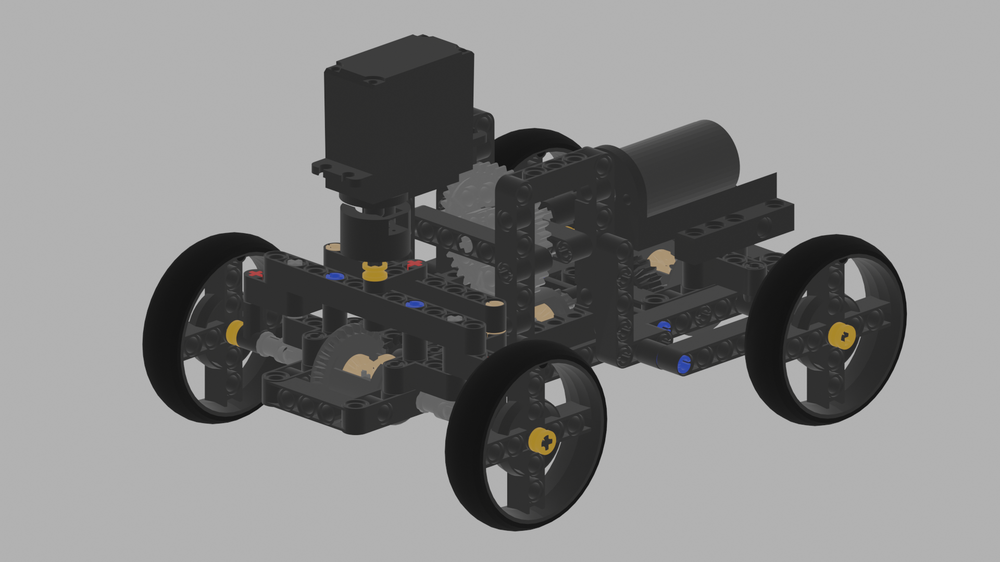

## Mechanical components
After our experience from last year's edition, where we used a back-wheel drive with a differential, we decided to go with a AWD system. We chose this system because the BWD had a hard time steering as there is no power on the steering wheels. Also, an AWD system assure a more stable power distribution.

Our drivetrain is constructed using Lego Technic pieces and 3D printed pieces to connect the electrical components with the Lego.

The main components of the drivetrain, as you can see in the picture in _all-wheel drive_ section, are the differentials on the front/back set of wheel, and the center one which conects them to the motor. In order to increase the speed of the robot we also used a system of cogs with a gear ratio of **1:1.67**.

We've tried different steering mechanisms like the _Ackermann steering_ or the _Bell-crank steering_. Because of their complexity, we came to the conclusion that it is better for us to use a simpler one, as it can be contructed with fewer pieces and it is smaller.

### All-wheel drive

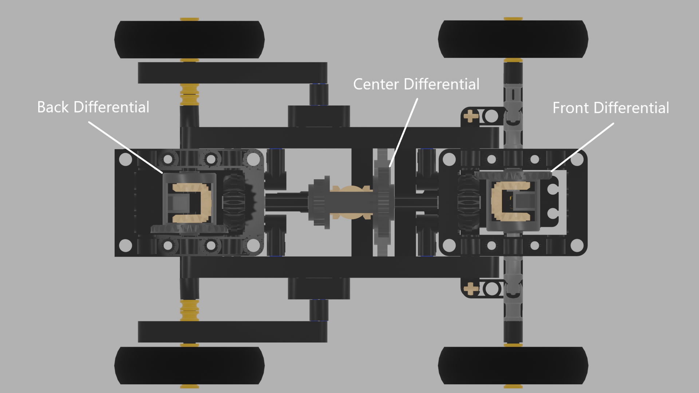

As we said, we've designed 3D printed parts to connnect the electronic components to the lego structure.

First of all, for the DC motor we've made a tiny piece that links its axle to a normal lego axle.

### Gearmotor to axle 
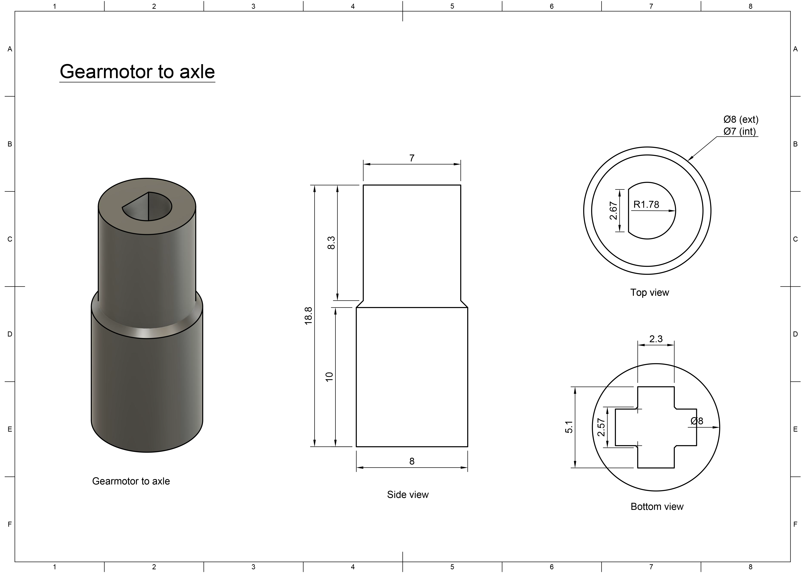

For the servo motor, to connect its axle to the drivetrain, we've made another piece to comvert its axle to a lego one.

### MG996 to axle
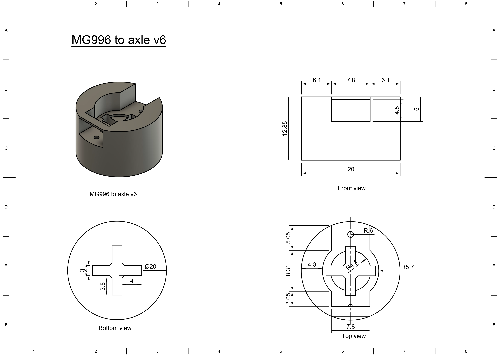

Now, we had to attach the motors to our drivetrain, so that we can have a stady contruction without components hanging only in their cables.

Therefore, the pierce below is used to connnect the DC motor to the lego structure and we've placed it at the back of the robot.

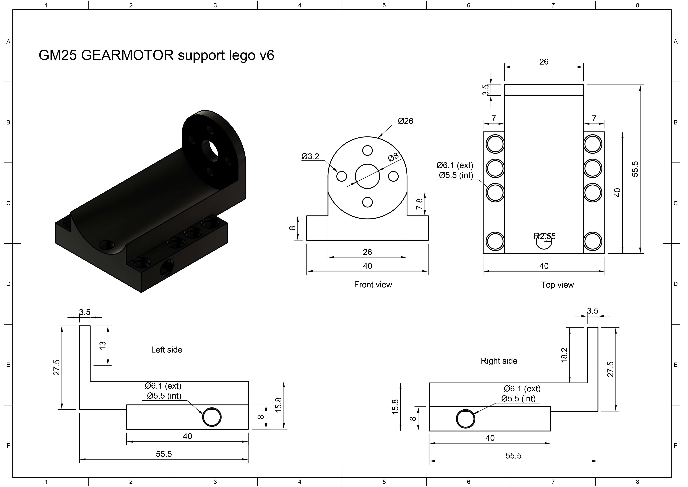

In the case of the servor motor, because it has a diffrent shape than the DC motor, we've made a completely diffrent piece. Also we've put the servo motor in the front of the robot, with its axel facing the ground.

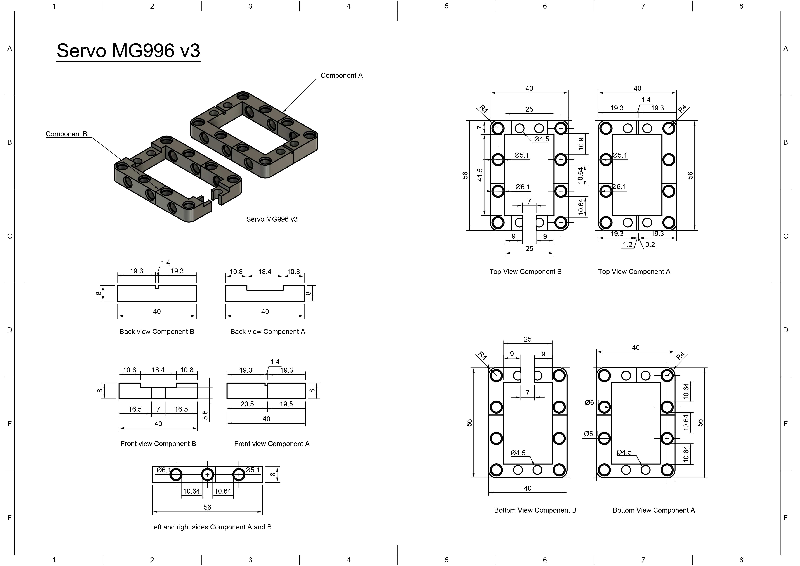

 

## Electrical components

  As for the electrical components, we've used a servo motor (MG996R) for steering and a geared DC motor with a magnetic encoder (output - 7 V, 1:20 ratio). As we metioned before we used 3D printed parts, designed by us, to connect the motors to the the contruction made of lego pieces. 
### Servo motor
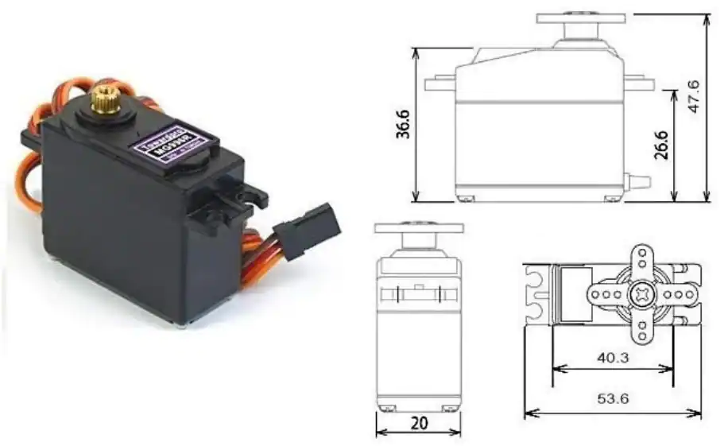

### Drive motor
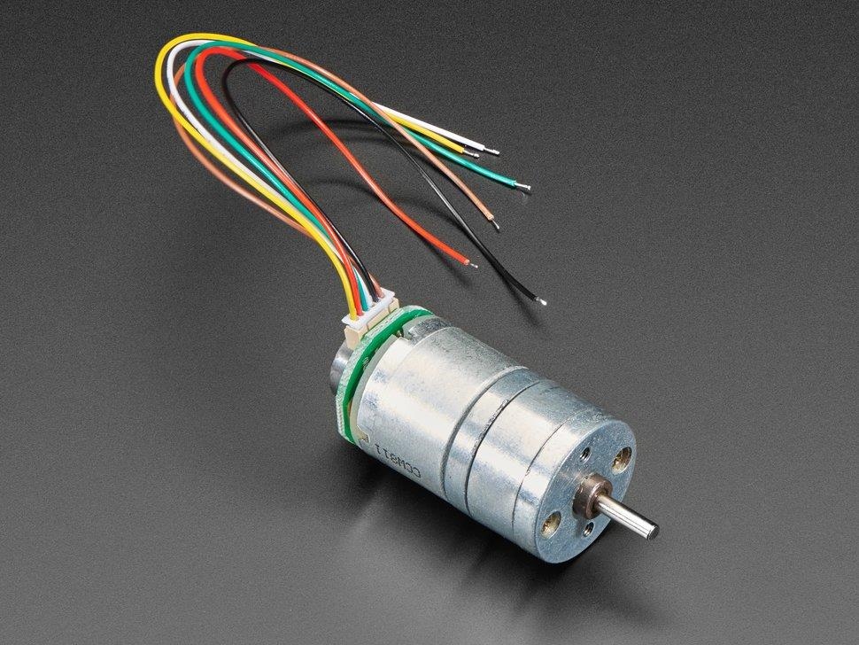

  To control the DC motor, we've used a motor driver from SparkFun (Dual TB6612FNG).
### Motor Driver
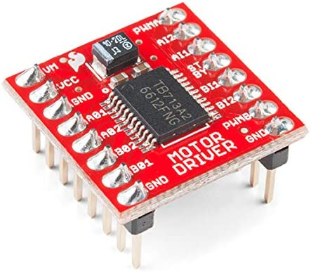

## Power and Sense Management

Last year we've made a robot that used Raspberry Pi, but also Arduino.After the international in Germany, we've come to a conclusion, that we  need just a microcontroller. So we've searched and found the perfect mach, the Teensy 4.1 board.

### Teensy 4.1

Why did we choose this board, you may ask. Well, we wanted to have as more special pins (example IC2 and interrupt pins) and is much faster in comparison to the arduino, the teensy having a 600 MHz frequency and a flash memory of 8 Mbytes, while an Arduino Every (this arduino board we've used last year) has a 20MHz freqency and a flash memory of 48 KB.

So this year our work was much easier, because we didn't have problems, such as trying to connect the Raspberry Pi to the Arduino board, which made our sensors reading slower (we had to send the readings to the Raspberry Pi and make the Arduino wait for the Raspberry to procces it). Now we could procces the readings of the sensors on the same board, which made our data more accurate.

Regarding the distance sensor, it is a long story. At first, after the international we've thought that using a lidar (vl53l0x) sensor for mesuring distances was a great idea, but it turned out that it wasn't so great. There is a problem with them. The lidar sensor is using a laser, not sounds waves, to mesure the ditances so the color of the object the laser reaches can influence the data that the sensor is reading. In conclusion, because the fences of our map are black, which makes a big amount of the light to be absorbed, we coudn't mesure more than 70cm accurately, which isn't the result we've wanted. 
### Lidar sensor
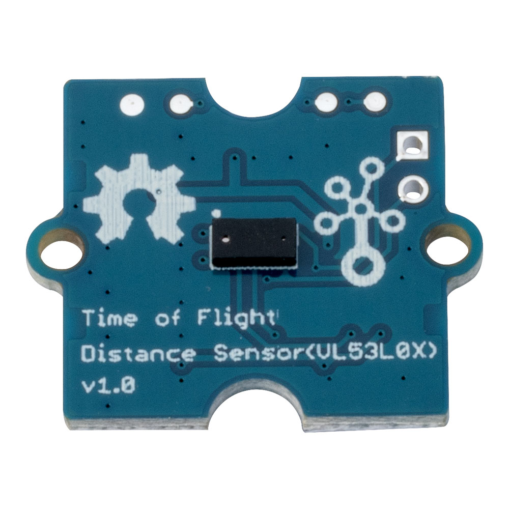

After we've realised we need to find another solution, we've decided to go back to our long friends: the ultrasonic sensors. And we can say that this year they are more reliable. They are giving us more accurate reading, because we've incressed the frequency that we are reading with and we are processinng the data much faste. The model that we are using is
grove ultrasonic distance sensor. We have one on each side (right and left) and one in the front of the robot.

### Ultrasonic sensor
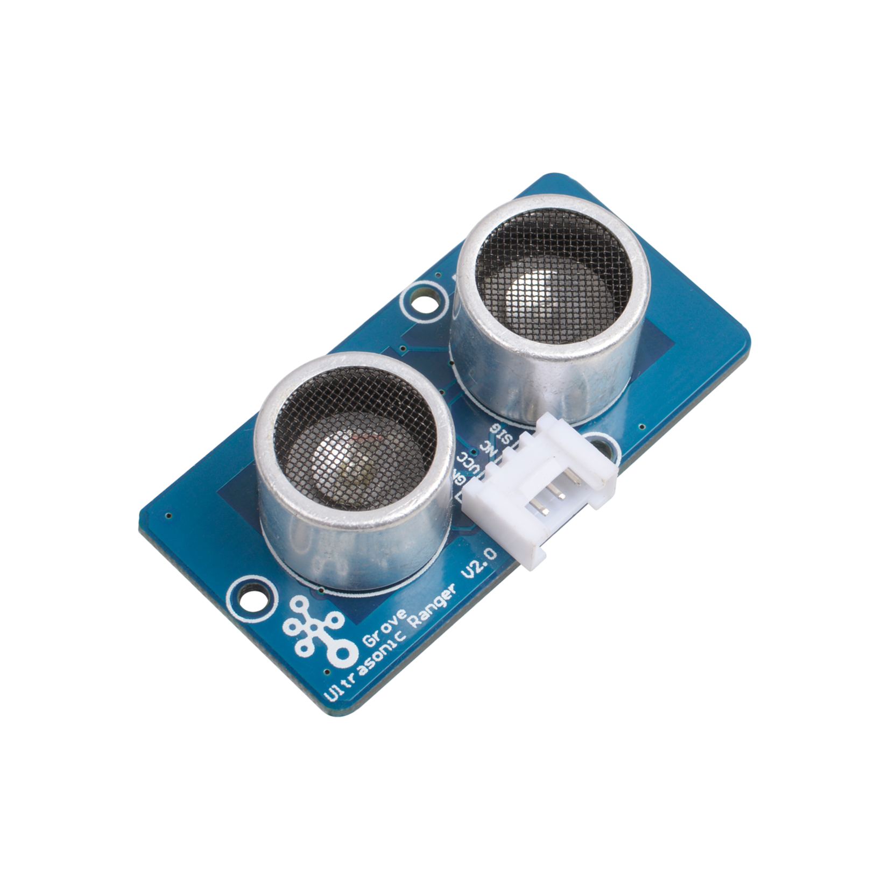

Another sensor that amazed us is the gyro sensor. In the previous year the gyro sensor (MPU6050) was ok, but still had a relatively big drift. However this year, we've solved that problem and now the gyro is one of the most accurate sensor we have. We are using the Grove 6 Axis Accelerometer and Gyroscope BMI088. This sensor is based on Bosch BMI088, which is widely used for drones.

### Gyro sensor

