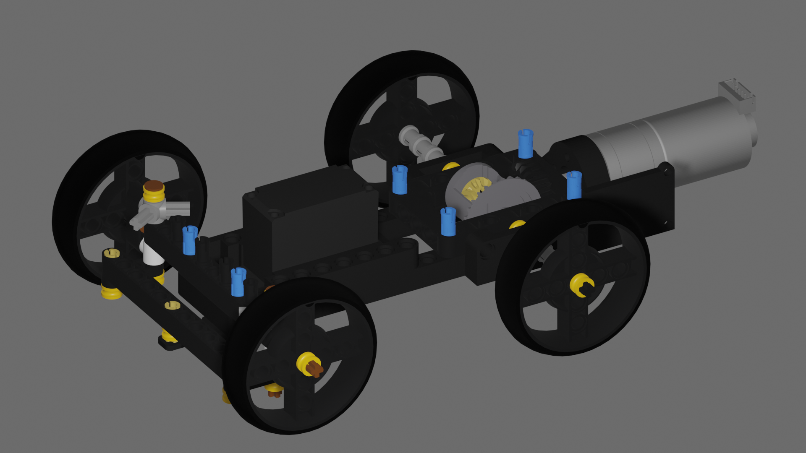

# Nerdvana_Nemesis_2023

## Photos of our robot Paula V2 (**P**retty **A**wesome **U**ltra **L**ow **A**ccurate robot V2)
|  |  | 
| :--: | :--: | 
| *Front* | *Back* |
|  |  | 
| *Left* | *Right* |
|  |  | 
| *Top* | *Bottom* |

<br>

# Mobility Management


## Mechanical components
After our experience from last year's edition, where we used a back-wheel drive with a differential, we decided to go with a AWD system. We chose this system because the BWD had a hard time steering as there is no power on the steering wheels. Also, an AWD system assure a more stable power distribution.

Our drivetrain is constructed using Lego Technic pieces and 3D printed pieces to connect the electrical components with the Lego.

The main components of the drivetrain, as you can see in the picture in _all-wheel drive_ section, are the differentials on the front/back set of wheel, and the center one which conects them to the motor. In order to increase the speed of the robot we also used a system of cogs with a gear ratio of **1:1.67**.

We've tried different steering mechanisms like the _Ackermann steering_ or the _Bell-crank steering_. Because of their complexity, we came to the conclusion that it is better for us to use a simpler one, as it can be contructed with fewer pieces and it is smaller.

### All-wheel drive


As we said, we've designed 3D printed parts to connnect the electronic components to the lego structure.

First of all, for the DC motor we've made a tiny piece that links its axle to a normal lego axle.

### Gearmotor to axle 


For the servo motor, to connect its axle to the drivetrain, we've made another piece to comvert its axle to a lego one.

### MG996 to axle


Now, we had to attach the motors to our drivetrain, so that we can have a stady contruction without components hanging only in their cables.

Therefore, the pierce below is used to connnect the DC motor to the lego structure and we've placed it at the back of the robot.


In the case of the servor motor, because it has a diffrent shape than the DC motor, we've made a completely diffrent piece. Also we've put the servo motor in the front of the robot, with its axel facing the ground.


<br>

## Electrical components

As for the electrical components, we've used a servo motor (MG996R) for steering and a geared DC motor with a magnetic encoder (output - 7 V, 1:20 ratio). As we metioned before we used 3D printed parts, designed by us, to connect the motors to the the contruction made of lego pieces. 
### Servo motor


### Drive motor


To control the DC motor, we've used a motor driver from SparkFun (Dual TB6612FNG).
### Motor Driver


# Power and Sense Management

Last year we've made a robot that used Raspberry Pi, but also Arduino.After the international in Germany, we've come to a conclusion, that we  need just a microcontroller. So we've searched and found the perfect mach, the Teensy 4.1 board.

### Teensy 4.1


Why did we choose this board, you may ask. Well, we wanted to have as more special pins (example IC2 and interrupt pins) and is much faster in comparison to the arduino, the teensy having a 600 MHz frequency and a flash memory of 8 Mbytes, while an Arduino Every (this arduino board we've used last year) has a 20MHz freqency and a flash memory of 48 KB.

So this year our work was much easier, because we didn't have problems, such as trying to connect the Raspberry Pi to the Arduino board, which made our sensors reading slower (we had to send the readings to the Raspberry Pi and make the Arduino wait for the Raspberry to procces it). Now we could procces the readings of the sensors on the same board, which made our data more accurate.

Regarding the distance sensor, it is a long story. At first, after the international we've thought that using a lidar (VL53L0X) sensor for mesuring distances was a great idea, but it turned out that it wasn't so great. There is a problem with them. The lidar sensor is using a laser, not sounds waves, to mesure the ditances so the color of the object the laser reaches can influence the data that the sensor is reading. In conclusion, because the fences of our map are black, which makes a big amount of the light to be absorbed, we coudn't mesure more than 70cm accurately, which isn't the result we've wanted. 

### Lidar sensor
")

After we've realised we need to find another solution, we've decided to go back to our long friends: the ultrasonic sensors. And we can say that this year they are more reliable. They are giving us more accurate reading, because we've incressed the frequency that we are reading with and we are processinng the data much faste. The model that we are using is
grove ultrasonic distance sensor (HC-SR04). We have one on each side (right and left) and one in the front of the robot.

### Ultrasonic sensor (HC-SR04)
")

Another sensor that amazed us is the gyro sensor. In the previous year the gyro sensor (MPU6050) was ok, but still had a relatively big drift. However this year, we've solved that problem and now the gyro is one of the most accurate sensor we have. We are using the Grove 6 Axis Accelerometer and Gyroscope BMI088. This sensor is based on Bosch BMI088, which is widely used for drones.

### Gyro sensor (BMI088)
")

As for the battery, last year we used a 6 pack of AA Nickel–metal hydride batteries, which generated about 7.2V, 2000mAh and had a weight of about 650g. After we decided to make a smaller and lighter robot, we knew that the battery had to change. We went with a Li-Po battery, as they are lighter, smaller, and charge faster. The battery that we chose is the _LiPo GENS ACE Soaring_ (7.4V, 2200mAh, 20C). This took the weight of the batterypack from 650g to 100g, which made the robot 2 times as light. To add, it is more than 2 times smaller in volume.

### Li-Po Battery


One of our biggest drawbacks last year was the speed of the camera readings. We were using a Raspberry Pi with the PiCam V2. Mainly because we had to do the cube recognition machine learning algorithm and procces it on the Raspberry Pi, the fps of the proccesed images was pretty low, about 15. This also cost the other readings on the Raspberry Pi to slow down.

Because of this, we opted for the Pixy cam 2.1, which has a quite a few advantages: it has it's own processing power, so it doesn't slow the other components down; it has a expert made machine learning algorithm for detecting and traking objects, so it works really well; it can output directly to an arduino or another microcontroller, so a Raspberry Pi isn't necessary, which can increase the frequency of the readings.

### Pixy cam 2.1


In order to power the teensy with the 5V required, we needed to lower the voltage of the 7.4V battery, that fully charged goes as high as 8.4V. For this we used a linear voltage regulator (L7805CV), that could take any voltage lower than 35V and reduce it to 5V.

Because we wanted the robot to be as fast as possible, the motor driver is powered directly from the battery, so we can have a voltage as high as possible.

### Voltage regulator (L7805CV)
")

### Circuit diagram


<br>

# Obstacle Management
The next step in order to solve this year's challenge was to make the robot avoid the obstacles. For this we used not one, but two Pixy cameras. This way, we could obtain a wider imagine without using any lens. Now you may ask how did we used this cameras to avoid the obstacles.

Well the answer is simple. We used a PID controller, which is helping us to keep the robot at a specific distance from the obstacles. The PID controller is using the data from the two cameras,that are placed on the left and right side of the robot, to get the position of the cube, which is in front of us. Based on the position of the cube, the PID controller is giving us a value, which is the angle we need to rotate the servo motor, in order to keep the robot at a specific distance from the cube.

```ino
pid_error = (cube.x - image_w / 2 + cube.color * 15) * kp + integral * ki + (pid_error - pid_last_error) * kd;
integral += pid_error;
pid_last_error = pid_error;

move_servo(pid_error);
```

As you can see we are keeping the red cube on the left of the robot, while the green cube on the right. We are stopping the PID when we are at a distance of 35cm or smaller from the cube, because we don't want to bump into it. 

The distances, at which we keep the cubes away is still small, so we still need to make sure we avoid them without bumping into them. So if our ultrasonic sensor, which is placed at the front of the robot ,detects a cube at a distance smaller than 35cm, we stop the robot and rotate the servo motor to the left or right, depending on the color of the cube, so we can avoid it.

```ino
double angle = curr_angle + last_cube_color * (avoid_angle);

  
  if ((-last_cube_color) * (gz - angle) > 0 && flag == 0) {
    move_servo(last_cube_color);
    ignore_index = last_cube_index;
    into_turn_cube = last_cube_color;
  } else if (abs(gz - current_angle) > 4) {
    flag = 1;
    pid_error_gyro = (gz - current_angle) * kp_gyro + integral * ki_gyro - (pid_last_error_gyro - pid_error_gyro) * kd_gyro;
    integral_gyro += pid_error_gyro;
    pid_last_error_gyro = pid_error_gyro;
    move_servo(-pid_error_gyro);
  } else {
    move_servo(0);
    if(flag_straight)
      loop_case = GO_STRAIGHT_CASE;
    else {
      loop_case = TURN_CASE;
    }
  }
```


Now that we had all the components that we were gonna use, the next step was to test them and make specific functions for each of them.

## Drive Motor

So we started with the motors. We didn't need to include a specific library to control the motor driver, beacause arduino (and Teensy) have inbuilt functions for this. 

First, we need to define the pins we need.

```ino
// Motor driver
#define PWM1 7
#define AIN1 9
#define AIN2 8
```

After the we've defined the pins, we had to make the motors. The fuction that makes the motor start is named _motor_start_, which has a parameter for setting the speed of the motor. We also have a function that stops the motor, _motor_stop_ function. Because of the inertia we had to set the speed of the motor to combat it, that's why we have a _motor_start(-1)_ in _motor_stop_, before setting the current motor speed to 0, in order to stop the robot moving.

```ino
void motor_start(int speed) {
  current_motor_speed = speed;
  
  int out = abs(speed) * 2.55; // Convert speed to PWM value (0 to 255)
  if(speed >= 0) { // Forward direction
    digitalWrite(AIN1, HIGH);
    digitalWrite(AIN2, LOW);
  }
  else { // Reverse direction
    digitalWrite(AIN1, LOW);
    digitalWrite(AIN2, HIGH);
  }
  analogWrite(PWM1, out);
}

void motor_stop() {
  motor_start(-1); 
  current_motor_speed = 0;
}
```

If for the motor we didn't import a labrary for it, for the encoder we had to. The library we are using this year is named _Encoder.h_. 

```ino
#include <Encoder.h>
```
 
As we had earlier, the first step is to define the pins we are going to use for the component.

```ino
// Motor Encoder
#define ENCODER_PIN1 5
#define ENCODER_PIN2 4
 ```

Compared to the motor, we need to initialize the encoder.

```ino
// Motor encoder
Encoder myEnc(ENCODER_PIN1, ENCODER_PIN2);
```

The ecoder has only one function, and lucky for us is quite easy to understand it and code it. The constan, with which we are deviding the value the encoder returns us, was calculated by testing of diffrent lengths, so we are transforming the reading of the ecoder in cm.

```ino
long read_motor_encoder() {
  return (double)myEnc.read() / 47.74;
}
```

## Servo Motor

The last component we needed to program in order for the robot to move and steer is the servo motor. The library we used is _Servo.h_.

```ino
#include <Servo.h> 
```

The first step is to define the pin, and we also observed that we could't quite center the wheels on the 0 position of the servo, so we defined a servo corection angle to combat this.

```ino
// Servo 
#define SERVO_PIN 6
#define SERVO_ANGLE_CORECTION 5
```

Then, we initialized the servo.

```ino
// Servo
Servo servo;
```

And the last step, is the function, in which we make the servo to rotate a specific angle, given by the parameter _angle_. If the angle is negativ the motor will rotate to the left, and if is pozitiv the motor will rotate to right. This way 0 is going to be the position, in which the wheels are straight. Also, the values we are giving the motor need to be between -1 and 1, so we use a clamp function to limit the value we are going to give the motor to roatate to.

```ino
/// Servo functions

void move_servo(double angle) {
  angle = -clamp(angle, -1, 1);

  double angle_deg = 90 + angle * 90.0 + servo_corrections; // Convert angle to degrees (0 to 180)
  angle_deg = clamp(angle_deg, 0, 180);
  servo.write(angle_deg);
}
```

## Camera

Now that we finished to implement the functions we need to make the robot move andd steer, we have to make him see the cubes and move according to them. The library we used for the camera is _Pixy2I2C.h_.

```ino 
#include <Pixy2I2C.h>
```

We need to initialize the camera. There are no pins, as we have a I2C connection. The I2C address must be configured in the _Pixy2I2C.h_ library.

```ino
// Camera
Pixy2I2C pixy;
```

In order to read the inputs from the camera, we have some methods from the Pixy2I2C class.

```ino
pixy.ccc.blocks[i].m_signature
// The signature number of the detected object
// For us, 1 is for red, and 2 is for green
pixy.ccc.blocks[i].m_x
// The x location of the center of the detected object (0 to 316)
pixy.ccc.blocks[i].m_y
// The y location of the center of the detected object (0 to 208)
pixy.ccc.blocks[i].m_width
// The width of the detected object (1 to 316)
pixy.ccc.blocks[i].m_height
// The height of the detected object (1 to 208)
pixy.ccc.blocks[i].m_indez
// The tracking index of the block
```

For the camera we made a function in which we determine if we have a cube we need to avoid, and its color. In order to take a cube in considertion, the area needs to be greater or equal to a constant we determine experimentally.

```ino
void signature_to_cube_color(double current_angle, int current_side) {
  cube_color = 0;

  if(pixy.ccc.numBlocks >= 1) {
    cub_index = pixy.ccc.blocks[0].m_index;
    if(current_side == 0) {
      if(pixy.ccc.blocks[0].m_width * pixy.ccc.blocks[0].m_height > 250) {
        if(pixy.ccc.blocks[0].m_x > 40 && pixy.ccc.blocks[0].m_x < 240) {
          if(pixy.ccc.blocks[0].m_signature == 1)
            cube_color = 1;
          else if(pixy.ccc.blocks[0].m_signature == 2)
            cube_color = -1;
        } 
      }
    } else if(current_side == -1) {
      if(pixy.ccc.blocks[0].m_width * pixy.ccc.blocks[0].m_height > min_area_cube) {
        if(pixy.ccc.blocks[0].m_x > 80) {
          if(pixy.ccc.blocks[0].m_signature == 1)
            cube_color = 1;
          else if(pixy.ccc.blocks[0].m_signature == 2)
            cube_color = -1;
        }
      }
    } else if(current_side == 1) {
      if(pixy.ccc.blocks[0].m_width * pixy.ccc.blocks[0].m_height > min_area_cube) {
        if(pixy.ccc.blocks[0].m_x < 80) {
          if(pixy.ccc.blocks[0].m_signature == 1)
            cube_color = 1;
          else if(pixy.ccc.blocks[0].m_signature == 2)
            cube_color = -1;
        }
      }
    }

    if(cube_color == 0) {
      if(pixy.ccc.blocks[0].m_signature == 1)
        cube_corner_color = 1;
      else if(pixy.ccc.blocks[0].m_signature == 2)
        cube_corner_color = -1;

      cube_corner_side = current_side;
    }
    else 
      cube_corner_color = 0;
      cube_corner_side = 0;
  }
}
```

## Ultrasonic Sensors

For mesuring distances, as we said ealier, we are using ultrasound sensors. For them we used the library _Ultrasonic.h_.

```ino
#include "Ultrasonic.h"
```

For each sensor we defined one pin.

```ino
#define FRONT_SENSOR_PIN 2
#define LEFT_SENSOR_PIN 1
#define RIGHT_SENSOR_PIN 0
```

And after that we initilized them, like below.

```ino
// Distance sensors
Ultrasonic ultrasonic_front(FRONT_SENSOR_PIN);
Ultrasonic ultrasonic_left(LEFT_SENSOR_PIN);
Ultrasonic ultrasonic_right(RIGHT_SENSOR_PIN);
```

We are reading the sensor data in the _void loop_, with a delay of 50ms between readings (for each sensor separately).

```ino
#ifdef USE_DISTANCE_SENSORS
if(millis() - last_time_front_sensor >= 50) {
  front_sensor_cm = ultrasonic_front.MeasureInCentimeters();
  last_time_front_sensor = millis();
} 

if(millis() - last_time_left_sensor >= 50) {
  left_sensor_cm = ultrasonic_left.MeasureInCentimeters();
  last_time_left_sensor = millis();
} 

if(millis() - last_time_right_sensor >= 50) {
  right_sensor_cm = ultrasonic_right.MeasureInCentimeters();
  last_time_right_sensor = millis();
} 

if(debug) Serial << "Distance:   left: " << left_sensor_cm << "cm   front: " 
        << front_sensor_cm << "cm   right: " << right_sensor_cm << "cm\n";
#endif // USE_DISTANCE_SENSORS
```

## Gyroscope

We also have a gyroscope to help with driving straight and taking turns. The library we are using for it is _"BMI088.h"_.

```ino
#include "BMI088.h"
```

We defined a constant - the period of time in which we are calculating the drift of the gyro, so we know how much we need to correct for it.

```ino
#define DRIFT_TEST_TIME 10
```

We had to initilized it first, the parameters are: the I2C port, the address of the sensor, and the address of the accelerometer.

```ino
// Gyro sensor
Bmi088 bmi(Wire, 0x19, 0x69);
```

In the setup, we calculate the drift of the gyro, so we can correct for it later.

```ino
#ifdef USE_GYRO
int status = bmi.begin();
bmi.setOdr(Bmi088::ODR_400HZ);
bmi.setRange(Bmi088::ACCEL_RANGE_6G,Bmi088::GYRO_RANGE_500DPS);
if(status < 0) {
  if(debug) Serial << "BMI Initialization Error!  error: " << status << "\n";
  init_error = init_gyro_error = true;
}
else  {
  // Gyro drift calculation
  if(debug) Serial.println("Starting gyro drift calculation...");

  gx = 0;
  gy = 0;
  gz = 0;

  gyro_last_read_time = millis();

  double start_time = millis();
  while(millis() - start_time < DRIFT_TEST_TIME * 1000) {
    bmi.readSensor();
    double read_time = millis();

    gx += (bmi.getGyroX_rads() * (read_time - gyro_last_read_time) * 0.001);
    gy += (bmi.getGyroY_rads() * (read_time - gyro_last_read_time) * 0.001);
    gz += (bmi.getGyroZ_rads() * (read_time - gyro_last_read_time) * 0.001);

    gyro_last_read_time = read_time;
  }

  drifts_x = gx / DRIFT_TEST_TIME;
  drifts_y = gy / DRIFT_TEST_TIME;
  drifts_z = gz / DRIFT_TEST_TIME;

  if(debug) Serial.print("Drift test done!\nx: ");
  if(debug) Serial.print(drifts_x, 6);
  if(debug) Serial.print("   y: ");
  if(debug) Serial.print(drifts_y, 6);
  if(debug) Serial.print("   z: ");
  if(debug) Serial.println(drifts_z, 6);
}
// Gyro value reset
gx = 0;
gy = 0;
gz = 0;

gyro_last_read_time = millis();
#endif // USE_GYRO
```

In the _void loop_ we are reading the data from the gyro, and we are correcting for the drift. As the gyro is giving us the data in radians, we need to convert it to degrees. Also, we are correcting the sign of the data, because the gyro is giving us the data in the opposite direction we need it.

```ino
/// Gyro
#ifdef USE_GYRO
bmi.readSensor();
double read_time = millis();

gx += ((bmi.getGyroX_rads() - drifts_x) * (read_time - gyro_last_read_time) * 0.001) * 180.0 / PI;
gy += ((bmi.getGyroY_rads() - drifts_y) * (read_time - gyro_last_read_time) * 0.001) * 180.0 / PI;
gz -= ((bmi.getGyroZ_rads() - drifts_z) * (read_time - gyro_last_read_time) * 0.001) * 180.0 / PI;

gyro_last_read_time = read_time;

if(debug) Serial << "Gyro: gx: " << gx << "    gy: " << gy << "    gz: " << gz << "\n";
#endif // USE_GYRO
```

## Sd Card

Because we are using Teensy 4.1, which is a board similar to arduino, we can't see the data the robot is reading in real time, but still need to know what the robot is reading. So we found a solution, which is quite simple. We log everything the robot is reading on a SD, because the Teensy has a port for SD cards, which is perfect in this situation. The libraries we used for this is _SD.h_ and _SPI.h_.

```ino
#include <SD.h>
#include <SPI.h>
```

To use the SD Card we defined the pin we are using.

```ino
// SD Card
#define chipSelect BUILTIN_SDCARD
```

For writing data in a file on the SD card we made two functions. The function named _file_print_ is writig the date without a newline character in the file, unlike the function _file_println_. Both of them have a parameter of type _String_, which is the data that we are writing in the file. 

```ino
/// SD card
void file_print(String s) {
  File data_file = SD.open(sd_filename, FILE_WRITE);
  if(data_file) {
    data_file.print(s);
    data_file.close();
  }
}

void file_println(String s) {
  File data_file = SD.open(sd_filename, FILE_WRITE);
  if(data_file) {
    data_file.println(s);
    data_file.close();
  }
}
```

## Display

Even though, we are storing the data on the SD Card, we also have a display, so we can check things in real time.

First we initialized the display.

```ino
// Display
U8G2_SSD1306_128X64_ALT0_F_HW_I2C u8g2(U8G2_R0, /* reset=*/ U8X8_PIN_NONE);
```
To write on the display we made four funtions. As you can see all of the four functions have the same name, because the parameters we are sending to the functions are of diffrent types, which is called function overloading and a .ino feature used to to improve the readability of the code.

```ino
/// Display functions

void display_print(const char *s) {
  #ifdef USE_DISPLAY
  u8g2.clearBuffer();
  u8g2.drawStr(30, 20, s);
  u8g2.sendBuffer();
  #endif // USE_DISPLAY
}

void display_print(const char *s1, const char *s2) {
  #ifdef USE_DISPLAY
  u8g2.clearBuffer();
  u8g2.drawStr(30, 15, s1);
  u8g2.drawStr(30, 25, s2);
  u8g2.sendBuffer();
  #endif // USE_DISPLAY
}

void display_print(const double n, const char *sufix = "") {
  #ifdef USE_DISPLAY
  char s[100];
  itoa(n, s, 10);
  strcat(s, sufix);

  u8g2.clearBuffer();
  u8g2.drawStr(30, 20, s);
  u8g2.sendBuffer();
  #endif // USE_DISPLAY
}

void display_print(const double a, const double b) {
  #ifdef USE_DISPLAY
  char s1[100], s2[100];
  itoa(a, s1, 10);
  itoa(b, s2, 10);

  u8g2.clearBuffer();
  u8g2.drawStr(30, 15, s1);
  u8g2.drawStr(30, 25, s2);
  u8g2.sendBuffer();
  #endif // USE_DISPLAY
}
```

<br>

# Resources

## 3D Models
<li> Pixy cam 2.1 - <a>https://grabcad.com/library/cmucam-pixy-2-2</a>
<li> DC motor - <a>https://grabcad.com/library/12v-dc-motor-6</a>
<li> Servo motor - <a>https://grabcad.com/library/servomotor-mg996r-4</a>
<li> Battery - <a>https://grabcad.com/library/turnigy-nano-tech-2200mah-4s-25-50c-lipo-battery-pack-1</a>
<li> Gyro sensor - <a>https://grabcad.com/library/mpu6050-1</a>
<li> Ultrasonic sensor - <a>https://grabcad.com/library/sensor-ultrassonico-hc-sr04-1</a>
<li> Display - <a>https://grabcad.com/library/ssd1312-oled-display-0-96-1</a>
<li> Button - <a>https://grabcad.com/library/button-pcb-12mm-1</a>
<li> Teensy 4.1 - <a>https://grabcad.com/library/teensy-4-1-2</a>
<li> Sparkfun motor driver - <a>https://grabcad.com/library/sparkfun-motor-driver-dual-tb6612fng-1a-1</a>
<li> Prototype board - <a>https://grabcad.com/library/pcb-prototype-development-board-6x8-cm-1</a>
<li> Linear voltage regulator - <a>https://grabcad.com/library/linear-voltage-regulators-78xx-1</a>

<br>

## Images
<li> MG996R Servo motor - <a>https://www.digikey.com/htmldatasheets/production/5014637/0/0/1/media/bg1.jpg</a>
<li> DC geared motor - <a>https://www.adafruit.com/product/4416</a>
<li> Pixy cam 2.1 - <a>https://pixycam.com/wp-content/uploads/2021/05/pixy2_3_result.jpg</a>
<li> LiPo battery - <a>https://www.autorc.ro/16064-large_default/acumulator-lipo-gens-ace-3s-111v-2200mah-20c-mufa-xt60.jpg</a>

<li> Linear voltage regulator <a>https://ro.farnell.com/productimages/standard/en_GB/GE3TO220-40.jpg</a>
