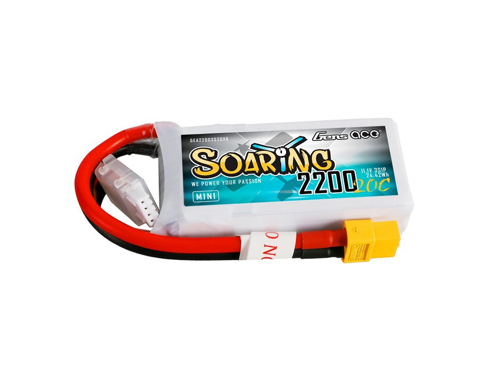

<center><h1> Nerdvana Nemesis 2023 </center>

## Table of Contents
* [Photos](#team-image)
  * [Team](#team-image)
  * [Robot](#robot-image)
* [Performance Video](#video)
* [Mobility Management](#mobility-management)
  * [Mechanical Components](#mechanical-components)
    * [All-wheel drive](#all-wheel-drive)
    * [Drivetrain](#drivetrain-mechanical)
    * [Steering](#steering-mechanical)
  * [Electrical Components](#electrical-components)
    * [Servo Motor](#servo-motor)
    * [Drive Motor](#drive-motor)
    * [Motor Driver](#motor-driver)
* [Power and Sense Management](#power-and-sense-management)
  * [Teensy 4.1](#teensy-4.1)
  * [Lidar sensor](#lidar-sensor)
  * [Ultrasonic sensor (HC-SR04)](#ultrasonic-sensor-(HC-SR04))
  * [Gyro Sensor](#gyro-sensor-(BMI088))
  * [Li-Po Battery](#li-po-battery)
  * [PixyCam 2.1](#pixy-cam-2.1)
  * [Voltage regulator](#voltage-regulator-(L7805CV))
  * [Circuit diagram](#circuit-diagram)
* [Obstacle Management](#obstacle-management)
* [Code for each component](#code-for-each-component)
  * [Drive Motor](#drive-motor-code)
  * [Servo Motor](#servo-motor-code)
  * [Camera](#camera-code)
  * [UltraSonic Sensor](#ultrasonic-sensor-code)
  * [Gyro Sensor](#gyro-sensor-code)
  * [SD Card](#sd-card-code)
  * [Display](#display-code)
* [Resources](#resources)
  * [3D Models](#3d-models-resources)
  * [Images](#images-resources)
  * [Copyright](#copyright)

### Team: Priboi Mihai, Onișoru Antonia, Bălan Teodor <a class="anchor" id="team-image"></a>
  

## Photos of our robot Paula Mia (**P**retty **A**wesome **U**ltra **L**ow **A**ccurate **M**inimum **I**ntelligence **A**ugmentation) <a class="anchor" id="robot-image"></a>

|  |  | 
| :--: | :--: | 
| *Front* | *Back* |
|  |  | 
| *Left* | *Right* |
|  |  | 
| *Top* | *Bottom* |

<br>

## Our video of the robot on [Youtube](https://youtu.be/QVi7v2j4KB4) <a class="anchor" id="video"></a>

<br>

# Mobility Management <a class="anchor" id="mobility-management"></a>


## Mechanical components <a class="anchor" id="mechanical-components"></a>
After our experience from last year's edition, where we used a back-wheel drive with a differential, this year, at the national, we decided to go with a AWD system. We chose this system because the BWD has a harder time steering as there is no power on the steering wheels. Also, an AWD system assure a more stable power distribution.

Our drivetrain is constructed using Lego Technic pieces and 3D printed pieces to connect the electrical components with the Lego.

The main components of the drivetrain, as you can see in the picture in _all-wheel drive_ section, are the differentials on the front/back set of wheel, and the center one which conects them to the motor. In order to increase the speed of the robot we also used a system of cogs with a gear ratio of **1:1.67**.

We've tried different steering mechanisms like the _Ackermann steering_ or the _Bell-crank steering_. Because of their complexity, we came to the conclusion that it is better for us to use a simpler one, as it can be contructed with fewer pieces and it is smaller.

### All-wheel drive <a class="anchor" id="all-wheel-drive"></a>


As we said, we've designed 3D printed parts to connect the electronic components to the lego structure of the steering. Therefore, our construction includes a big chassis (as the body), made by use with the help of a 3D printer, to which the motors and sensors are attached to by screws or their own custom 3D printed piece.

To the chassis, or the body the servo, the DC motor, the steering system and the differential are directly attached. The servo and the motor are attached to the body by using screws. The motor is placed at the very back of the robot and the servo is at the front. The steering system and differential are connected by using lego pieces.

In the sketch you can see the dimensions of the chassis of your robot.

### Chassis <a class="anchor" id="drivetrain-mechanical"></a>


In order to be able to move the wheels we needed to transform the axle of the motor to a lego axle (because we are using lego gears), we did this by designing a 3D piece that does this. You can see the specification of it below.

### Drivetrain <a class="anchor" id="drivetrain-mechanical"></a>


For the servo motor, to connect its axle to the drivetrain, so again we've made 2 different pieces that convert the axle of the motor to a lego axle, as you can see in the drawing below.

### Steering <a class="anchor" id="steering-mechanical"></a>


Now that we finished with the components attached directlly to the chassis, we still need to connect the other components in order to make the robot move.

First, we have the RLIDAR A1 sensor, which takes a lot of space. It's size explains its weight. Being one of your heavier components we tried to place it at the center of your robot so we can have a balance construction. To connect the sensor to the body we came up with a quite simple idea. We use 4 pieces identical with the one shown in the drawing below. These 3D pieces are designed to me attached with screws to the lidar and with black lego pins to the body. Is such a simple solution for this big, heavy and complicated sensor.

Meanwhile, the gyro 3D printed piece is as small and simple as the sensor. The design of this piece allows us to connect the sensor with just a couple of black lego pins.

And this concludes the sensors, that our robot has. All that we need to make the robot functinal is a microcontroller, a battery and a camera.

We will start with the microcontroller. We used a teensy and a PCB to create our circuit. The teensy is connected to the PCB, so this way the PCB and the teensy are like one component together. We placed them at the back of the robot, and we designed a 3D piece to attach them to the body. In order to fix the PCB and teensy to the 3D part we used crews, and to connect to the body we used black lego pins. You can see the design below.

The battery, as the RLIDAR A1 sensor, is quite heavy, so we tried to place it as close to the middle of the robot as possible. For it we also designed another piece as you can see in the skech. What is special about this piece is that we made a special space so we can put its cable, so the construction is neat and compact.

Now the final component is the camera. Its a important component for the robot, because we use it to distinguish the colors of the cubes. We made another 3D model, to attach it to the body. Like the majority of the electronic componemts we used screws to fix the camera to the 3D piece and black logo pins to connect the piece to the chassis.

<br>

## Electrical Components <a class="anchor" id="electrical-components"></a>

Our robot electrical components are the motors (the DC motor and the servo motor), a motor driver, the PCB board and teensy 4.1 board, a RLIDAR A1M8 sensor, the BMI008 gyro sensor, the battery and the PixyCam 2.1.

We will start with the motors. For the steering we are using a servo motor, respectively MG996R servo motor. And to make the robot move we are using a geared DC motor with a magnetic encoder (output - 7 V, 1:20 ratio). They are attached to the body directly without using 3D parts or lego pieces.

The geared DC motor is connected to the ground and power line of the teensy. We are using a motor controller to be able to change the velocity of the motor (we connected the motor to A01, A02 pins of the driver).

### Servo Motor <a class="anchor" id="servo-motor"></a>


### Drive Motor <a class="anchor" id="drive-motor"></a>


To control the DC motor, we've used a motor driver from SparkFun (Dual TB6612FNG).

### Motor Driver <a class="anchor" id="motor-driver"></a>


# Power and Sense Management <a class="anchor" id="power-and-sense-management"></a

Last year we've made a robot that used Raspberry Pi, but also Arduino. After the international in Germany, we've come to a conclusion, that we  need just a microcontroller. So we've searched and found the perfect mach, the Teensy 4.1 board.

### Teensy 4.1 <a class="anchor" id="teensy-4.1"></a>


Why did we choose this board, you may ask. Well, we wanted to have as more special pins (example IC2 and interrupt pins) and is much faster in comparison to the arduino, the teensy having a 600 MHz frequency and a flash memory of 8 Mbytes, while an Arduino Every (this arduino board we've used last year) has a 20MHz freqency and a flash memory of 48 KB.

So this year our work was much easier, because we didn't have problems, such as trying to connect the Raspberry Pi to the Arduino board, which made our sensors reading slower (we had to send the readings to the Raspberry Pi and make the Arduino wait for the Raspberry to procces it). Now we could procces the readings of the sensors on the same board, which made our data more accurate.

 There is a problem with them. The lidar sensor is using a laser, not sounds waves, to mesure the ditances so the color of the object the laser reaches can influence the data that the sensor is reading. In conclusion, because the fences of our map are black, which makes a big amount of the light to be absorbed, we coudn't mesure more than 70cm accurately, which isn't the result we've wanted. 

Regarding the distance sensor, it is a long story. At first, after the international we thought that using a lidar (VL53L0X) sensor for measuring distances was a great idea, but it turned out that it wasn't. Because the VL53L0X sensor is using a laser to measure the distances, the color of the object that the laser reaches influences the data that the sensor is reading. We discovered this by testing, by observing that, because the walls are black, the data that we were reading with the sensor was not accurate if the distance from the lidar to the walls was bigger than 70cm, which isn't the result we wanted. 

After this, we searched so much more and found out that we can gain precision by using a RPLIDAR A1, specifically RPLIDAR A1M8, which is a 360 degree 2D laser scanner (LIDAR). Why is this sensor better than VL53L0X, you may ask. Well the first big difference between the two is the data that we can process. The RPLIDAR A1 is constantly rotating and measuring the distances in all directions. Meanwhile the VL53L0X sensor could measure the distance in a single direction. So this way with the RPLIDAR A1 we could map and determine the walls positions, cubes positions and the robot position at any time we want. Another difference between the sensors is the precision. The RPLIDAR A1 is more precise than the VL53L0X.

So how is RPLIDAR A1 working? RPLIDAR is based on laser triangulation ranging principle, and it measures distance data in more than 2000 times per second with high resolution distance output (<1% of the distance).
The sensor emits modulated infrared laser signal, the laser signal is then reflected by the object to be detected. The returning signal is sampled by vision acquisition system in RPLIDAR A1 and the DSP embedded in RPLIDAR A1 starts processing the sample data and output distance value and angle value between object and RPLIDAR A1.

### Lidar sensor <a class="anchor" id="lidar-sensor"></a>
")

Another sensor that amazed us is the gyro sensor. In the previous year the gyro sensor (MPU6050) was ok, but still had a relatively big drift. However this year, we've solved that problem and now the gyro is one of the most accurate sensor we have. We are using the Grove 6 Axis Accelerometer and Gyroscope BMI088. This sensor is based on Bosch BMI088, which is widely used for drones.

### Gyro sensor (BMI088) <a class="anchor" id="gyro-sensor-(BMI088)"></a>
")

As for the battery, last year we used a 6 pack of AA Nickel–metal hydride batteries, which generated about 7.2V, 2000mAh and had a weight of about 650g. After we decided to make a smaller and lighter robot, we knew that the battery had to change. We went with a Li-Po battery, as they are lighter, smaller, and charge faster. The battery that we chose is the _LiPo GENS ACE Soaring_ (7.4V, 2200mAh, 20C). This took the weight of the batterypack from 650g to 100g, which made the robot 2 times as light. To add, it is more than 2 times smaller in volume.

### Li-Po Battery <a class="anchor" id="li-po-battery"></a>


One of our biggest drawbacks last year was the speed of the camera readings. We were using a Raspberry Pi with the PiCam V2. Mainly because we had to do the cube recognition machine learning algorithm and procces it on the Raspberry Pi, the fps of the proccesed images was pretty low, about 15. This also cost the other readings on the Raspberry Pi to slow down.

Because of this, we opted for the Pixy cam 2.1, which has a quite a few advantages: it has it's own processing power, so it doesn't slow the other components down; it has a expert made machine learning algorithm for detecting and traking objects, so it works really well; it can output directly to an arduino or another microcontroller, so a Raspberry Pi isn't necessary, which can increase the frequency of the readings.

### PixyCam 2.1 <a class="anchor" id="pixy-cam-2.1"></a>


In order to power the teensy with the 5V required, we needed to lower the voltage of the 7.4V battery, that fully charged goes as high as 8.4V. For this we used a linear voltage regulator (L7805CV), that could take any voltage lower than 35V and reduce it to 5V.

Because we wanted the robot to be as fast as possible, the motor driver is powered directly from the battery, so we can have a voltage as high as possible.

### Voltage regulator <a class="anchor" id="voltage-regulator"></a>

")

### Circuit diagram <a class="anchor" id="circuit-diagram"></a>


<br>

# Obstacle Management <a class="anchor" id="obstacle-management"></a>

Now we needed to put everything we've made so far to test. And the best test is the qualifing round. Our qualifing strategy is quite simple. We are using a PID controller based on the gyro to keep the robot moving streight and to make it turn to the next side. Also we are using the ultrasonic sensors, placed on the left and right side of the robot, to determine the direction i which the robot needs to move. Because one of the ultrasonic sensors placed on the sides are going to read a distance greater than 100cm before we need to make a turn, we can use this to decide the direction the robot needs to move.

```ino
// We are deciding the direction the robot needs to move only once at the beginning of the round, before the first turn
if(turn_direction == 0) {
  if(left_sensor_cm > 100)
    turn_direction = -1;
  if(right_sensor_cm > 100)
    turn_direction = 1;

  if(turn_direction) {
    read_lidars = false;
    if(debug) Serial << "Turn direction is: " << turn_direction << "\n";
  }
}

// We are reading the ultrasonic front sensor and verify if we need to turn
if(front_sensor_cm > 0 && front_sensor_cm < distance_to_wall_for_turn) {
  // If we need to turn we are calculating the angle at which we need to turn
  if(millis() - last_turn_time > turn_delay) {
    current_angle += turn_angle * turn_direction;
    if( turn_direction ==  -1 )
      current_angle += turn_angle_left * turn_direction;
    turns++;
    last_turn_time = millis();
  }
}

if(debug) Serial << "Turns: " << turns << "\n";

// PID algorithm based on gyro
pid_error = (gz - current_angle) * kp - (pid_last_error - pid_error) * kd;
pid_last_error = pid_error;

move_servo(pid_error);

if(debug) Serial << "Servo angle: " << pid_error << "\nStraight angle: " << current_angle << "\n";

// Last turn

// We are done with the last turn
if(turns == 12) {
  last_drive_start_cm = read_motor_encoder();
  turns++;
}

// Stop
// We are making sure that the robot is stopping at the right spot
if(turns == 13 && read_motor_encoder() - last_drive_start_cm >= last_drive_cm) {
  motor_stop();
  delay(100000);
}
```

The next step in order to solve this year's challenge was to make the robot avoid the obstacles, in order to solve the final round. For this we used not one, but two Pixy cameras. This way, we could obtain a wider imagine without using any lens. Now you may ask how did we used this cameras to avoid the obstacles.

Well the answer is simple. We used a PID controller, which is helping us to keep the cube at the center of the picture. The PID controller is using the data from the camera to calculate the error, which is the difference between the center of the picture and the x axies coordonate of the cube. The PID controller is using this error to calculate the angle he's going to rotate the servo motor.

```ino
pid_error = (cube.x - image_w / 2) * kp + integral * ki + (pid_error - pid_last_error) * kd;
integral += pid_error;
pid_last_error = pid_error;

move_servo(pid_error);
```

It is obvious, that the cube will be right in front of the robot, so we need to make sure that we are not going to bump into it. In order to avoid this, we are using the ultrasonic sensor that is placed in the front of the robot. If the sensor detects a cube at a distance smaller than 35cm, we stop the robot and rotate the servo motor to the left or right, depending on the color of the cube, so we can avoid it.

```ino
double angle = curr_angle + last_cube_color * (avoid_angle);
    
if ((-last_cube_color) * (gz - angle) > 0 && flag == 0) {
  move_servo(last_cube_color);
  // ignore_index = last_cube_index;
  into_turn_cube = last_cube_color;
} else if (abs(gz - current_angle) > 4) {
  flag = 1;
  pid_error_gyro = (gz - current_angle) * kp_gyro + integral * ki_gyro - (pid_last_error_gyro - pid_error_gyro) * kd_gyro;
  integral_gyro += pid_error_gyro;
  pid_last_error_gyro = pid_error_gyro;
  move_servo(-pid_error_gyro);
} else {
  move_servo(0);

  if (front_sensor_cm > 120)
    flag_straight = true;

  if (flag_straight)
    loop_case = GO_STRAIGHT_CASE;
  else {
    loop_case = TURN_CASE;
  }
}

```

This is not all, because we still need to make the robot to turn and make full laps, so having an algoritm with which we are avoiding the cubes is not enought. To solve the this round we decided that if we can avoid on a side corectly and can go to the next one without bumping in a cube than we can solve the problem, because we can have a loop that has 2 stages: one for avoiding the cubes and one for turninng to get to the next side.

So in our strategy we are focusing on avoinding the cubes on the side we are on and turning to the text side. In order to do that, we've came up with a startegy that is based on 6 stages, based on the cubes we are reading and the position of the robot.

At the very first of our round we are deciding which is the direction of the robot needs to move and also in which stated we need to start first.

If we don't see any cube will go to _STRAIGHT_CASE_ and if we see a cube we will go to _CUBE_PID_CASE_.
In the _STRAIGHT_CASE_ we are going to move forward using a PID controller based on the gyro sensor.

```ino
// If we see a cube in front of us we are going to the _CUBE_PID_CASE_ and if we don't we are going to the _STRAIGHT_CASE_
if (front_sensor_cm < 100 || actual_cube_nr > 1)
  loop_case = CUBE_PID_CASE;
else if ((turn_direction == -1 && pixy_left.ccc.numBlocks > 0) || (turn_direction == 1 && pixy_right.ccc.numBlocks > 0))
  loop_case = CUBE_PID_CASE;
else
  loop_case = GO_STRAIGHT_CASE;
```

In the first stage  _CUBE_PID_CASE_  we are doing a PID to keep the cube in front of us in the middle of the image, so we can avoid it when the front sensor is reading a distance less than 35cm. If we don't have a cube in front of us, we are going to keep moving forwward, until we see a distance less than 35cm with our front sensor.

In this stage we are also read the color for the next cube, and we are deciding how to do the turn based on this. Because we are using two cameras then imagine that we can see with the robot is pretty wide. So we can see the first cube on the next side, if is one on the first posision. We are using this to determine the type of turn we need to use, in order to avoid the next cube, while turning  to the next side.

```ino
case CUBE_PID_CASE: {
  if (cube.color == 0) {
    move_servo(0);
  } else {
    if ((front_sensor_cm > 35 && front_sensor_cm > 0)) {
      // We are doing a PID to keep the cube in front of us in the middle of the image
      pid_error = (cube.x - image_w / 2) * kp + integral * ki + (pid_error - pid_last_error) * kd;
      integral += pid_error;
      pid_last_error = pid_error;

      move_servo(pid_error);

      last_cube_color = cube.color;
      last_cube_index = cube.index;
    } else {
      file_println(corner_cube.color);
      
      // We are reading the next cube color and deciding which type of turn we need to do

      out_turn_cube = corner_cube.color;

      if (turn_direction == -1) {  // cube on the left side
        if (out_turn_cube == -1) { wall_dist = int_wall_dist; center_angle = -turn_direction * center_angle_value; } 
        else if (out_turn_cube == 0) { wall_dist = mid_wall_dist; center_angle = 0; }
        else if (out_turn_cube == 1) { wall_dist = ext_wall_dist; center_angle = turn_direction * center_angle_value; }
      } else {
        if (out_turn_cube == -1) { wall_dist = ext_wall_dist; center_angle = turn_direction * center_angle_value; } 
        else if (out_turn_cube == 0) { wall_dist = mid_wall_dist; center_angle = 0; } 
        else if (out_turn_cube == 1) { wall_dist = int_wall_dist; center_angle = -turn_direction * center_angle_value; }
      }

      // if we see only 1 cube, we don't want to use the beaconing system
      if (actual_cube_nr == 1) {
        out_turn_cube = 0;
      }

      // We are  moving to the next case / stage 

      flag = 0;
      curr_angle = gz;
      flag_straight = 0;
      loop_case = AVOID_CASE;
      avoid_start_time = millis();
    }
  }

  break;
}
```

The second stage is _AVOID_CASE_, in which we are avoiding a cube if we have one in front of us. To avoid the cube the first part of the avoiding move we are doing mechanically and the second part we are using a PID algorithm based on the gyro to center again the robot. After the robot finished avoiding the robot, we are moving to the next stage, named _TURN_CASE_.

If we don't have a cube to avoid, again we are going to go to the _STRAIGHT_CASE_.

```ino
case AVOID_CASE: {
  double angle = curr_angle + last_cube_color * (avoid_angle);

  // The first part of the avoidig move (mechanically)  
  if ((-last_cube_color) * (gz - angle) > 0 && flag == 0) {
    move_servo(last_cube_color);
    into_turn_cube = last_cube_color;
  } else if (abs(gz - current_angle) > 4) {
    flag = 1;

    // The second part of the avoiding move (PID based on gyro)
    pid_error_gyro = (gz - current_angle) * kp_gyro + integral * ki_gyro - (pid_last_error_gyro - pid_error_gyro) * kd_gyro;
    integral_gyro += pid_error_gyro;
    pid_last_error_gyro = pid_error_gyro;
    move_servo(-pid_error_gyro);
  } else {
    move_servo(0);

    if (front_sensor_cm > 120)
      flag_straight = true;

    // Deciding which is the next stage
    if (flag_straight)
      loop_case = GO_STRAIGHT_CASE;
    else {
      loop_case = TURN_CASE;
    }
  }

  break;
}
```

The _TURN_CASE_ is our third case, in which we are preparing to make the turn to the next side. First we are stopping to the distance we've calculated earlier in the _AVOID_CASE_. This way if we have a red or green cube first on the next side we know how far away we need to be to make the turn to avoid it. After we've stopped we are setting the angle at which the robot needs to turn, and going to the next stage, _GYRO_PID_CASE_.

```ino
case TURN_CASE: {

  // PID based on gyro
  pid_error_gyro = (gz - current_angle) * kp_gyro + integral * ki_gyro - (pid_last_error_gyro - pid_error_gyro) * kd_gyro;
  integral_gyro += pid_error_gyro;
  pid_last_error_gyro = pid_error_gyro;

  move_servo(-pid_error_gyro);

  // We are stopping the robot at the distance we've calculated earlier ,calculating the angle at which we need to turn and going to the next stage
  if (front_sensor_cm < wall_dist) {
    current_angle += turn_angle * turn_direction;
    turns++;
    turn_encoder = 80 - left_sensor_cm;
    loop_case = GYRO_PID_CASE;
  }

  break;
}
```

In the fourth stage, _GYRO_PID_CASE_, is more complicated than the rest of the stages, as you can see. In the first part of the case we are making the turn, so we are on the next side. After finishing the turn there a are two possible cases that we can encounter: if we saw a cube before the turn or if we didn't.

If we saw a cube before the turn, we are going to keep moving forward for a fixed distance, this way we are sure that the robot avoided the cube and passed it. Now that the robot have passed the cube we can turn back to the first stage, _CUBE_PID_CASE_.

If we didn't see a cube before the turn, we are still going to move forward for a fixed distance, to be sure that the robot is between the two black walls on the side, and then we are going back to the first stage, _CUBE_PID_CASE_.

Also if the robot finished all of the 3 laps (12 turns in total), he's going to FINISH_CASE.

```ino
case GYRO_PID_CASE: {
  // If we didnt finish the turn we are continuing it
  if (abs(gz - current_angle) > 8) {

    // PID based on gyro
    pid_error_gyro = (gz - current_angle) * kp_gyro + integral * ki_gyro - (pid_last_error_gyro - pid_error_gyro) * kd_gyro;
    integral_gyro += pid_error_gyro;
    pid_last_error_gyro = pid_error_gyro;

    move_servo(-pid_error_gyro);

    turn_start_encoder = read_motor_encoder();
  } else {
    // If we saw a cube before the turn 
    if (out_turn_cube != 0) {
      // we are moving forward for a fixed distance or if we are between the two black walls
      if (left_sensor_cm + right_sensor_cm > 80 || read_motor_encoder() - turn_start_encoder < 15) {
        pid_error_gyro = (gz - current_angle) * kp_gyro + integral * ki_gyro - (pid_last_error_gyro - pid_error_gyro) * kd_gyro;
        integral_gyro += pid_error_gyro;
        pid_last_error_gyro = pid_error_gyro;

        move_servo(-pid_error_gyro);
      } else {
        // If we are between the two black walls we are going back to the first stage
        loop_case = CUBE_PID_CASE;

        // If the robot finished all of the 3 laps (12 turns in total), he's going to _FINISH_CASE_
        if (turns == 12) {
          start_encoder = read_motor_encoder();
          loop_case = FINISH_CASE;
        }
      }
    } else {
      // If we didnt see a cube before the turn we are moving forward for a fixed distance or if we are between the two black walls
      if (read_motor_encoder() - turn_start_encoder < turn_encoder) {
        pid_error_gyro = (gz - current_angle) * kp_gyro + integral * ki_gyro - (pid_last_error_gyro - pid_error_gyro) * kd_gyro;
        integral_gyro += pid_error_gyro;
        pid_last_error_gyro = pid_error_gyro;

        move_servo(-pid_error_gyro);
      } else {
        //if we are between the two black walls we are going back to the first stage
        loop_case = CUBE_PID_CASE;
        motor_stop();
        delay(100000);

         // If the robot finished all of the 3 laps (12 turns in total), he's going to _FINISH_CASE_
        if (turns == 12) {
          start_encoder = read_motor_encoder();
          loop_case = FINISH_CASE;
        }
      }
    }
  }
  break;
}
```

Our fifth case is the _GO_STRAIGHT_CASE_. We are using this case, usually, if we don't have a cube in front of us that needs to be avoided. So in this case we are moving forward, using a PID algorithm based on the gyro sensor, until we reached a distance smaller than 110cm with the front sensor. After we've reached this distance we are going to decide the color of the next first cube of the next side, what type of turn we need to make. And when we finished determining the color of the cube we are going to the next stage, _TURN_CASE_.

```ino
case GO_STRAIGHT_CASE: {
  if (front_sensor_cm > 110) {

    //we are moving forward using a PID based on gyro util we see with the front sensor a distance smaller than 110cm
    pid_error_gyro = (gz - current_angle) * kp_gyro + integral * ki_gyro - (pid_last_error_gyro - pid_error_gyro) * kd_gyro;
    integral_gyro += pid_error_gyro;
    pid_last_error_gyro = pid_error_gyro;

    move_servo(-pid_error_gyro);
  } else {
    // We are reading the color of the next cube and deciding which type of turn we need to make 

    file_println(cube.color);
    out_turn_cube = cube.color;

    if (turn_direction == -1) {  // cube on the left side
      if (out_turn_cube == -1) { wall_dist = int_wall_dist; center_angle = -turn_direction * center_angle_value; } 
      else if (out_turn_cube == 0) { wall_dist = mid_wall_dist; center_angle = 0; }
      else if (out_turn_cube == 1) { wall_dist = ext_wall_dist; center_angle = turn_direction * center_angle_value; }
    } else {
      if (out_turn_cube == -1) { wall_dist = ext_wall_dist; center_angle = turn_direction * center_angle_value; } 
      else if (out_turn_cube == 0) { wall_dist = mid_wall_dist; center_angle = 0; } 
      else if (out_turn_cube == 1) { wall_dist = int_wall_dist; center_angle = -turn_direction * center_angle_value; }
    }

    // if we see only 1 cube, we don't want to use the beaconing system
    if (actual_cube_nr == 1) {
      out_turn_cube = 0;
    }

    //We are going to the first stage
    flag = 0;
    curr_angle = gz;
    loop_case = TURN_CASE;
    avoid_start_time = millis();
  }
  break;
}
```

Last but not least, we have the _FINISH_CASE_, in which we are moving 10cm forward to be sure we are stopping as we where we should and then we are stopping the robot.

```ino
case FINISH_CASE: {
  // We are moving 10cm forward to be sure we are stopping as we where we should
  if( read_motor_encoder() - start_encoder < 10 ){
    pid_error_gyro = (gz - current_angle) * kp_gyro + integral * ki_gyro - (pid_last_error_gyro - pid_error_gyro) * kd_gyro;
    integral_gyro += pid_error_gyro;
    pid_last_error_gyro = pid_error_gyro;

    move_servo(-pid_error_gyro);
  } else{
    // We are stopping the robot
    motor_stop();
    delay(1000);
  }
  break;
}
```

In conclusion, as we can see, our strategy is based on the idea of avoiding the cube before the turning to the next side, reading the first cube on the next side, if there is any, turning based on the color of the next cube to avoid it while turning, reapiting this process until we finished all of the 3 laps. We implemented this strategy using a state machine with 6 stages, all of which are showed below and explined above.

<br>

# Code for each component <a class="anchor" id="code-for-each-component"></a>

## Drive Motor <a class="anchor" id="drive-motor-code"></a>

We didn't need to include a specific library to control the motor driver, beacause arduino (and Teensy) have inbuilt functions for this. 

First, we define the pins we need.

```ino
// Motor driver
#define PWM1 7
#define AIN1 9
#define AIN2 8
```

After the we've defined the pins, we had to make the motors. The fuction that makes the motor start is named _motor_start_, which has a parameter for setting the speed of the motor. We also have a function that stops the motor, _motor_stop_ function. Because of the inertia we had to set the speed of the motor to combat it, that's why we have a _motor_start(-1)_ in _motor_stop_, before setting the current motor speed to 0, in order to stop the robot moving.

```ino
void motor_start(int speed) {
  current_motor_speed = speed;
  
  int out = abs(speed) * 2.55; // Convert speed to PWM value (0 to 255)
  if(speed >= 0) { // Forward direction
    digitalWrite(AIN1, HIGH);
    digitalWrite(AIN2, LOW);
  }
  else { // Reverse direction
    digitalWrite(AIN1, LOW);
    digitalWrite(AIN2, HIGH);
  }
  analogWrite(PWM1, out);
}

void motor_stop() {
  motor_start(-1); 
  current_motor_speed = 0;
}
```

If for the motor we didn't import a library for it, for the encoder we had to. The library we are using is named _Encoder.h_. 

```ino
#include <Encoder.h>
```

As earlier, the first step is to define the pins we are going to use for the component.

```ino
// Motor Encoder
#define ENCODER_PIN1 5
#define ENCODER_PIN2 4
 ```

Compared to the motor, we need to initialize the encoder.

```ino
// Motor encoder
Encoder myEnc(ENCODER_PIN1, ENCODER_PIN2);
```

The ecoder has only one function, and lucky for us is quite easy to understand it and code it. The constan, with which we are deviding the value the encoder returns us, was calculated by testing of diffrent lengths, so we are transforming the reading of the ecoder in cm.

```ino
long read_motor_encoder() {
  return (double)myEnc.read() / 47.74;
}
```

## Servo Motor <a class="anchor" id="servo-motor-code"></a>

The last component we needed to program in order for the robot to move and steer is the servo motor. The library we used is _Servo.h_.

```ino
#include <Servo.h> 
```

The first step is to define the pin, and we also observed that we could't quite center the wheels on the 0 position of the servo, so we defined a servo corection angle to combat this.

```ino
// Servo 
#define SERVO_PIN 6
#define SERVO_ANGLE_CORECTION 5
```

Then, we initialized the servo.

```ino
// Servo
Servo servo;
```

And the last step, is the function, in which we make the servo to rotate a specific angle, given by the parameter _angle_. If the angle is negativ the motor will rotate to the left, and if is pozitiv the motor will rotate to right. This way 0 is going to be the position, in which the wheels are straight. Also, the values we are giving the motor need to be between -1 and 1, so we use a clamp function to limit the value we are going to give the motor to roatate to.

```ino
/// Servo functions

void move_servo(double angle) {
  angle = -clamp(angle, -1, 1);

  double angle_deg = 90 + angle * 90.0 + servo_corrections; // Convert angle to degrees (0 to 180)
  angle_deg = clamp(angle_deg, 0, 180);
  servo.write(angle_deg);
}
```

## Camera <a class="anchor" id="camera-code"></a>

Now that we finished to implement the functions we need to make the robot move andd steer, we have to make him see the cubes and move according to them. The library we used for the camera is _Pixy2I2C.h_.

```ino 
#include <Pixy2I2C.h>
```

We need to initialize the camera. There are no pins, as we have a I2C connection. The I2C address must be configured in the _Pixy2I2C.h_ library.

```ino
// Camera
Pixy2I2C pixy;
```

In order to read the inputs from the camera, we have some methods from the Pixy2I2C class.

```ino
pixy.ccc.blocks[i].m_signature
// The signature number of the detected object
// For us, 1 is for red, and 2 is for green
pixy.ccc.blocks[i].m_x
// The x location of the center of the detected object (0 to 316)
pixy.ccc.blocks[i].m_y
// The y location of the center of the detected object (0 to 208)
pixy.ccc.blocks[i].m_width
// The width of the detected object (1 to 316)
pixy.ccc.blocks[i].m_height
// The height of the detected object (1 to 208)
pixy.ccc.blocks[i].m_indez
// The tracking index of the block
```

For the camera we made a function in which we determine if we have a cube we need to avoid, and its color. In order to take a cube in considertion, the area needs to be greater or equal to a constant we determine experimentally.

```ino
void signature_to_cube_color(double current_angle, int current_side) {
  cube_color = 0;

  if(pixy.ccc.numBlocks >= 1) {
    cub_index = pixy.ccc.blocks[0].m_index;
    if(current_side == 0) {
      if(pixy.ccc.blocks[0].m_width * pixy.ccc.blocks[0].m_height > 250) {
        if(pixy.ccc.blocks[0].m_x > 40 && pixy.ccc.blocks[0].m_x < 240) {
          if(pixy.ccc.blocks[0].m_signature == 1)
            cube_color = 1;
          else if(pixy.ccc.blocks[0].m_signature == 2)
            cube_color = -1;
        } 
      }
    } else if(current_side == -1) {
      if(pixy.ccc.blocks[0].m_width * pixy.ccc.blocks[0].m_height > min_area_cube) {
        if(pixy.ccc.blocks[0].m_x > 80) {
          if(pixy.ccc.blocks[0].m_signature == 1)
            cube_color = 1;
          else if(pixy.ccc.blocks[0].m_signature == 2)
            cube_color = -1;
        }
      }
    } else if(current_side == 1) {
      if(pixy.ccc.blocks[0].m_width * pixy.ccc.blocks[0].m_height > min_area_cube) {
        if(pixy.ccc.blocks[0].m_x < 80) {
          if(pixy.ccc.blocks[0].m_signature == 1)
            cube_color = 1;
          else if(pixy.ccc.blocks[0].m_signature == 2)
            cube_color = -1;
        }
      }
    }

    if(cube_color == 0) {
      if(pixy.ccc.blocks[0].m_signature == 1)
        cube_corner_color = 1;
      else if(pixy.ccc.blocks[0].m_signature == 2)
        cube_corner_color = -1;

      cube_corner_side = current_side;
    }
    else 
      cube_corner_color = 0;
      cube_corner_side = 0;
  }
}
```

## Ultrasonic Sensors <a class="anchor" id="ultrasonic-sensors-code"></a>

For mesuring distances we are using ultrasound sensors, using the library _Ultrasonic.h_.

```ino
#include "Ultrasonic.h"
```

For each sensor we defined one pin.

```ino
#define FRONT_SENSOR_PIN 2
#define LEFT_SENSOR_PIN 1
#define RIGHT_SENSOR_PIN 0
```

And after that we initilized them, like below.

```ino
// Distance sensors
Ultrasonic ultrasonic_front(FRONT_SENSOR_PIN);
Ultrasonic ultrasonic_left(LEFT_SENSOR_PIN);
Ultrasonic ultrasonic_right(RIGHT_SENSOR_PIN);
```

We are reading the sensor data in the _void loop_, with a delay of 50ms between readings (for each sensor separately).

```ino
#ifdef USE_DISTANCE_SENSORS
if(millis() - last_time_front_sensor >= 50) {
  front_sensor_cm = ultrasonic_front.MeasureInCentimeters();
  last_time_front_sensor = millis();
} 

if(millis() - last_time_left_sensor >= 50) {
  left_sensor_cm = ultrasonic_left.MeasureInCentimeters();
  last_time_left_sensor = millis();
} 

if(millis() - last_time_right_sensor >= 50) {
  right_sensor_cm = ultrasonic_right.MeasureInCentimeters();
  last_time_right_sensor = millis();
} 

if(debug) Serial << "Distance:   left: " << left_sensor_cm << "cm   front: " 
        << front_sensor_cm << "cm   right: " << right_sensor_cm << "cm\n";
#endif // USE_DISTANCE_SENSORS
```

## Gyro Sensor <a class="anchor" id="gyro-sensor-code"></a>

We also have a gyroscope to help with driving straight and taking turns. The library we are using for it is _"BMI088.h"_.

```ino
#include "BMI088.h"
```

We defined a constant - the period of time in which we are calculating the drift of the gyro, so we know how much we need to correct for it.

```ino
#define DRIFT_TEST_TIME 10
```

We had to initilized it first, the parameters are: the I2C port, the address of the sensor, and the address of the accelerometer.

```ino
// Gyro sensor
Bmi088 bmi(Wire, 0x19, 0x69);
```

In the setup, we calculate the drift of the gyro, so we can correct for it later.

```ino
#ifdef USE_GYRO
int status = bmi.begin();
bmi.setOdr(Bmi088::ODR_400HZ);
bmi.setRange(Bmi088::ACCEL_RANGE_6G,Bmi088::GYRO_RANGE_500DPS);
if(status < 0) {
  if(debug) Serial << "BMI Initialization Error!  error: " << status << "\n";
  init_error = init_gyro_error = true;
}
else  {
  // Gyro drift calculation
  if(debug) Serial.println("Starting gyro drift calculation...");

  gx = 0;
  gy = 0;
  gz = 0;

  gyro_last_read_time = millis();

  double start_time = millis();
  while(millis() - start_time < DRIFT_TEST_TIME * 1000) {
    bmi.readSensor();
    double read_time = millis();

    gx += (bmi.getGyroX_rads() * (read_time - gyro_last_read_time) * 0.001);
    gy += (bmi.getGyroY_rads() * (read_time - gyro_last_read_time) * 0.001);
    gz += (bmi.getGyroZ_rads() * (read_time - gyro_last_read_time) * 0.001);

    gyro_last_read_time = read_time;
  }

  drifts_x = gx / DRIFT_TEST_TIME;
  drifts_y = gy / DRIFT_TEST_TIME;
  drifts_z = gz / DRIFT_TEST_TIME;

  if(debug) Serial.print("Drift test done!\nx: ");
  if(debug) Serial.print(drifts_x, 6);
  if(debug) Serial.print("   y: ");
  if(debug) Serial.print(drifts_y, 6);
  if(debug) Serial.print("   z: ");
  if(debug) Serial.println(drifts_z, 6);
}
// Gyro value reset
gx = 0;
gy = 0;
gz = 0;

gyro_last_read_time = millis();
#endif // USE_GYRO
```

In the _void loop_ we are reading the data from the gyro, and we are correcting for the drift. As the gyro is giving us the data in radians, we need to convert it to degrees. Also, we are correcting the sign of the data, because the gyro is giving us the data in the opposite direction we need it.

```ino
/// Gyro
#ifdef USE_GYRO
bmi.readSensor();
double read_time = millis();

gx += ((bmi.getGyroX_rads() - drifts_x) * (read_time - gyro_last_read_time) * 0.001) * 180.0 / PI;
gy += ((bmi.getGyroY_rads() - drifts_y) * (read_time - gyro_last_read_time) * 0.001) * 180.0 / PI;
gz -= ((bmi.getGyroZ_rads() - drifts_z) * (read_time - gyro_last_read_time) * 0.001) * 180.0 / PI;

gyro_last_read_time = read_time;

if(debug) Serial << "Gyro: gx: " << gx << "    gy: " << gy << "    gz: " << gz << "\n";
#endif // USE_GYRO
```

## SD Card <a class="anchor" id="sd-card-code"></a>

Because we are using Teensy 4.1, which is a board similar to arduino, we can't see the data the robot is reading in real time, but still need to know what the robot is reading. So we found a solution, which is quite simple. We log everything the robot is reading on a SD, because the Teensy has a port for SD cards, which is perfect in this situation. The libraries we used for this is _SD.h_ and _SPI.h_.

```ino
#include <SD.h>
#include <SPI.h>
```

To use the SD Card we defined the pin we are using.

```ino
// SD Card
#define chipSelect BUILTIN_SDCARD
```

For writing data in a file on the SD card we made two functions. The function named _file_print_ is writig the date without a newline character in the file, unlike the function _file_println_. Both of them have a parameter of type _String_, which is the data that we are writing in the file. 

```ino
/// SD card
void file_print(String s) {
  File data_file = SD.open(sd_filename, FILE_WRITE);
  if(data_file) {
    data_file.print(s);
    data_file.close();
  }
}

void file_println(String s) {
  File data_file = SD.open(sd_filename, FILE_WRITE);
  if(data_file) {
    data_file.println(s);
    data_file.close();
  }
}
```

## Display <a class="anchor" id="display-code"></a>

Even though, we are storing the data on the SD Card, we also have a display, so we can check things in real time.

First we initialized the display.

```ino
// Display
U8G2_SSD1306_128X64_ALT0_F_HW_I2C u8g2(U8G2_R0, /* reset=*/ U8X8_PIN_NONE);
```
To write on the display we made four funtions. As you can see all of the four functions have the same name, because the parameters we are sending to the functions are of diffrent types, which is called function overloading and a .ino feature used to to improve the readability of the code.

```ino
/// Display functions

void display_print(const char *s) {
  #ifdef USE_DISPLAY
  u8g2.clearBuffer();
  u8g2.drawStr(30, 20, s);
  u8g2.sendBuffer();
  #endif // USE_DISPLAY
}

void display_print(const char *s1, const char *s2) {
  #ifdef USE_DISPLAY
  u8g2.clearBuffer();
  u8g2.drawStr(30, 15, s1);
  u8g2.drawStr(30, 25, s2);
  u8g2.sendBuffer();
  #endif // USE_DISPLAY
}

void display_print(const double n, const char *sufix = "") {
  #ifdef USE_DISPLAY
  char s[100];
  itoa(n, s, 10);
  strcat(s, sufix);

  u8g2.clearBuffer();
  u8g2.drawStr(30, 20, s);
  u8g2.sendBuffer();
  #endif // USE_DISPLAY
}

void display_print(const double a, const double b) {
  #ifdef USE_DISPLAY
  char s1[100], s2[100];
  itoa(a, s1, 10);
  itoa(b, s2, 10);

  u8g2.clearBuffer();
  u8g2.drawStr(30, 15, s1);
  u8g2.drawStr(30, 25, s2);
  u8g2.sendBuffer();
  #endif // USE_DISPLAY
}
```

Also in both the qualifing round and final round we have to setup all our components, and we did it like below:

```ino
void setup() {
  Serial.begin(115200);


  // if serial is not available
  while (!Serial && (millis() < 2000));

  if (Serial) debug = true;
  debug = false;

  /// Led
  #ifdef USE_LED
  pinMode(LED_PIN, OUTPUT);
  led_state = HIGH;
  digitalWrite(LED_PIN, led_state);
  #endif  // USE_LED

  /// Display
  #ifdef USE_DISPLAY
  u8g2.begin();
  u8g2.setFont(u8g2_font_ncenB08_tr);
  display_print("Starting...");
  #endif  // USE_DISPLAY

  /// Camera
  #ifdef USE_CAMERA
  if (debug) Serial.println(F("Cameras starting..."));
  display_print("Left cam err!");
  pixy_left.init(0x54);
  display_print("Right cam err!");
  pixy_right.init(0x55);
  display_print("Cameras ok!");
  if (debug) Serial.println(F("Cameras ok!"));
  #endif  // USE_CAMERA

  /// Motor driver
  #ifdef USE_MOTOR_DRIVER
  pinMode(PWM1, OUTPUT);
  pinMode(AIN1, OUTPUT);
  pinMode(AIN2, OUTPUT);
  #endif  // USE_MOTOR_DRIVER

  /// Servo
  #ifdef USE_SERVO
  servo.attach(SERVO_PIN, 1200, 1800);
  move_servo(0);
  #endif  // USE_SERVO

  /// Wire
  Wire.begin();

  /// Gyro sensor
  #ifdef USE_GYRO
  int status = bmi.begin();
  bmi.setOdr(Bmi088::ODR_400HZ);
  bmi.setRange(Bmi088::ACCEL_RANGE_6G, Bmi088::GYRO_RANGE_500DPS);
  if (status < 0) {
    if (debug) Serial << "BMI Initialization Error!  error: " << status << "\n";
    init_error = init_gyro_error = true;
  } else {
    // Gyro drift calculation
    if (debug) Serial.println("Starting gyro drift calculation...");
    display_print("Starting gyro", "drift test...");

    gx = 0;
    gy = 0;
    gz = 0;

    gyro_last_read_time = millis();

    double start_time = millis();
    while (millis() - start_time < DRIFT_TEST_TIME * 1000) {
      bmi.readSensor();
      double read_time = millis();

      gx += (bmi.getGyroX_rads() * (read_time - gyro_last_read_time) * 0.001);
      gy += (bmi.getGyroY_rads() * (read_time - gyro_last_read_time) * 0.001);
      gz += (bmi.getGyroZ_rads() * (read_time - gyro_last_read_time) * 0.001);

      gyro_last_read_time = read_time;
    }

    drifts_x = gx / DRIFT_TEST_TIME;
    drifts_y = gy / DRIFT_TEST_TIME;
    drifts_z = gz / DRIFT_TEST_TIME;

    if (debug) Serial.print("Drift test done!\nx: ");
    if (debug) Serial.print(drifts_x, 6);
    if (debug) Serial.print("   y: ");
    if (debug) Serial.print(drifts_y, 6);
    if (debug) Serial.print("   z: ");
    if (debug) Serial.println(drifts_z, 6);
  }
  // Gyro value reset
  gx = 0;
  gy = 0;
  gz = 0;

  gyro_last_read_time = millis();
  #endif  // USE_GYRO


  #ifdef USE_SD
  if (!SD.begin(chipSelect)) {
    Serial.println("Card failed, or not present!");
    init_sd_error = true;
  } else {
    Serial.println("Card present!");

    // SD.remove("datalog.txt");

    int i = 0;
    do {
      char aux[100];
      itoa(i, aux, 10);

      memset(sd_filename, 0, sizeof(sd_filename));

      strcat(sd_filename, "datalog_Official_");
      strcat(sd_filename, aux);
      strcat(sd_filename, ".csv");

      i++;
    } while (SD.exists(sd_filename));

    if (debug) Serial.print("Using filename: ");
    if (debug) Serial.println(sd_filename);


    String aux;

    if (!init_error) aux = "ok!";
    else aux = "error!";
    data_string = "init: ," + aux + "\n";

    if (!init_sensors_error) aux = "ok!";
    else aux = "error!";
    data_string += "dist s: ," + aux + "\n";

    if (!init_gyro_error) aux = "ok!";
    else aux = "error!";
    data_string += "gyro: ," + aux + "\n";

    data_string += "drift: ," + String(drifts_z, 6) + "\n";

    file_println(data_string);
  }
  #endif  // USE_SD


  /// Program start
  if (!init_error) {
    digitalWrite(LED_PIN, LOW);
    display_print("Ready!");
  } else {
    if (init_sensors_error && init_gyro_error)
      display_print("Dist sensors err!", "Gyro err!");
    else if (init_sensors_error)
      display_print("Dist sensors err!");
    else if (init_gyro_error)
      display_print("Gyro err!");
  }

  #ifdef USE_BUTTON
  pinMode(BUTTON_PIN, INPUT_PULLUP);
  delay(10);

  Serial.println(digitalRead(BUTTON_PIN));
  while (digitalRead(BUTTON_PIN) == 1) {
    Serial.println(digitalRead(BUTTON_PIN));
    delay(50);
  }
  #endif


  loop_start_time = millis();
}
```

And in the final round code we have a function called _allSensors_, in which we are reading all the sensors we have, and we are writing the data in the file and on the display.

```ino
void all_Sensors() {
  /// Print loop iteration
  if (millis() - loop_last_time > 1000) {
    loop_freq = loop_temp_iteration * 1000 / (millis() - loop_last_time);
    loop_temp_iteration = 0;
    loop_last_time = millis();
  }

  loop_iteration++;
  loop_temp_iteration++;

  if (debug) Serial << "Iteration: #" << loop_iteration << " - " << millis() / 1000
                    << "." << millis() % 1000 << "s - " << loop_freq << "hz\n";

  /// Motor encoder
  #ifdef USE_MOTOR_ENCODER
    if (debug) Serial << "Encoder: " << read_motor_encoder() << "\n";

    if (millis() - last_time_motor_speed >= motor_speed_interval) {
      double current_motor_encoder = (double)myEnc.read() / 47.74;
      speedX = (current_motor_encoder - last_motor_encoder) * (1000.0 / motor_speed_interval); 
      last_time_motor_speed = millis();
      last_motor_encoder = current_motor_encoder;
    } 

    Serial.print("Speed:");
    Serial.println(speedX);


  #ifdef USE_MOTOR_SAFETY
    if (millis() - last_safety_time > safety_timeout) {
      if (abs(current_motor_speed) > 0 && abs(read_motor_encoder() - last_motor_enc) < 1) {
        file_println("Safety stop: ," + String(read_motor_encoder()) + ", " + String(last_motor_enc));
        motor_start(0);
        display_print("Box Box!");
        delay(999999999);
      }

      last_safety_time = millis();
      last_motor_enc = read_motor_encoder();
    }
    if (current_motor_speed == 0)
      last_safety_time = millis();

  #endif  // USE_MOTOR_SAFETY

  #endif  // USE_MOTOR_ENCODER

  /// Camera
  #ifdef USE_CAMERA
    if (millis() - camera_last_fps >= camera_fps) {
      process_cameras();

      camera_last_fps = millis();
    }
  #endif  // USE_CAMERA


  /// Distance sensors
  #ifdef USE_DISTANCE_SENSORS
    if (millis() - last_time_front_sensor >= 50) {
      front_sensor_cm = ultrasonic_front.MeasureInCentimeters();
      last_time_front_sensor = millis();
    }

    if (millis() - last_time_left_sensor >= 50) {
      left_sensor_cm = ultrasonic_left.MeasureInCentimeters();
      last_time_left_sensor = millis();
    }

    if (millis() - last_time_right_sensor >= 50) {
      right_sensor_cm = ultrasonic_right.MeasureInCentimeters();
      last_time_right_sensor = millis();
    }

    if (debug) Serial << "Distance:   left: " << left_sensor_cm << "cm   front: "
                      << front_sensor_cm << "cm   right: " << right_sensor_cm << "cm\n";
  #endif  // USE_DISTANCE_SENSORS


  /// Gyro
  #ifdef USE_GYRO
    bmi.readSensor();
    double read_time = millis();

    // speedX += (bmi.getAccelX_mss() * (read_time - gyro_last_read_time) * 0.001);
    // Serial.println("Speed");
    // Serial.println(speedX);

    gx += ((bmi.getGyroX_rads() - drifts_x) * (read_time - gyro_last_read_time) * 0.001) * 180.0 / PI;
    gy += ((bmi.getGyroY_rads() - drifts_y) * (read_time - gyro_last_read_time) * 0.001) * 180.0 / PI;
    gz -= ((bmi.getGyroZ_rads() - drifts_z) * (read_time - gyro_last_read_time) * 0.001) * 180.0 / PI;

    gyro_last_read_time = read_time;

    if (debug) Serial << "Gyro: gx: " << gx << "    gy: " << gy << "    gz: " << gz << "\n";
  #endif  // USE_GYRO


  /// Led blink
  #ifdef USE_LED
    if (millis() - led_previous_time >= led_interval) {
      led_previous_time = millis();

      if (led_state == LOW) {
        led_state = HIGH;
      } else {
        led_state = LOW;
      }

      digitalWrite(LED_PIN, led_state);
    }
  #endif  // USE_LED


  /// Display
  #ifdef USE_DISPLAY
    if (millis() - display_last_print_time > display_print_interval) {
      // display_print(current_side, " side");
      display_print((millis() - loop_start_time) / 1000, (millis() - loop_start_time) % 1000);
      // display_print(left_sensor_cm, right_sensor_cm);
      display_last_print_time = millis();
    }
  #endif  // USE_DISPLAY
}
```

<br>


# Resources <a class="anchor" id="resources"></a>

## 3D Models <a class="anchor" id="3d-models-resources"></a>
<li> Pixy cam 2.1 - https://grabcad.com/library/cmucam-pixy-2-2
<li> DC motor - https://grabcad.com/library/12v-dc-motor-6
<li> Servo motor - https://grabcad.com/library/servomotor-mg996r-4
<li> Battery - https://grabcad.com/library/2s-7-4v-li-po-battery-1
<li> Gyro sensor - https://grabcad.com/library/mpu6050-1
<li> Ultrasonic sensor - https://grabcad.com/library/sensor-ultrassonico-hc-sr04-1
<li> Display - https://grabcad.com/library/ssd1312-oled-display-0-96-1
<li> Button - https://grabcad.com/library/button-pcb-12mm-1
<li> Teensy 4.1 - https://grabcad.com/library/teensy-4-1-2
<li> Sparkfun motor driver - https://grabcad.com/library/sparkfun-motor-driver-dual-tb6612fng-1a-1
<li> Prototype board - https://grabcad.com/library/pcb-board-prototype-3x7cm-1
<li> Linear voltage regulator - https://grabcad.com/library/linear-voltage-regulators-78xx-1

<br>

## Images <a class="anchor" id="images-resources"></a>
<li> MG996R Servo motor - https://www.digikey.com/htmldatasheets/production/5014637/0/0/1/media/bg1.jpg
<li> DC geared motor - https://grabcad.com/library/12v-dc-motor-350rpm-w-encoder-from-dfrobot-1
<li> Sparkfun motor driver - https://cdn.sparkfun.com//assets/parts/1/2/4/8/2/14450a-01.jpg
<li> Teensy 4.1 - https://circuitpython.org/assets/images/boards/large/teensy41.jpg
<li> Vl53l0x lidar - https://media.elektor.com/media/catalog/product/cache/787d235d52214c6d5b6ff19d7070090a/g/r/grove.jpg
<li> Grove HC-SR04 ultrasonic - https://files.seeedstudio.com/wiki/Grove_Ultrasonic_Ranger/V2.jpg
<li> Grove BMI088 gyroscope - https://files.seeedstudio.com/wiki/Grove-6-Axis_Accelerometer-Gyroscope-BMI088/img/main.jpg
<li> LiPo battery - https://www.autorc.ro/16064-large_default/acumulator-lipo-gens-ace-3s-111v-2200mah-20c-mufa-xt60.jpg
<li> Pixy cam 2.1 - https://pixycam.com/wp-content/uploads/2021/05/pixy2_3_result.jpg
<li> Linear voltage regulator - https://ro.farnell.com/productimages/standard/en_GB/GE3TO220-40.jpg
<li> RPLIDAR A1 - https://grabcad.com/library/rplidar-a1-holder-1

<br>

## Copyright <a class="anchor" id="copyright"></a>

Unless explicitly stated otherwise, all rights, including copyright, in the content of these files and images are owned or controlled for these purposes by Nerdvana Romania.

You may copy, download, store (in any medium), adapt, or modify the content of these Nerdvana Romania resources, provided that you properly attribute the work to Nerdvana Romania.

For any other use of Nerdvana Romania's content, please get in touch with us at office@nerdvana.ro.

© 2023 Nerdvana Romania. All rights reserved.
