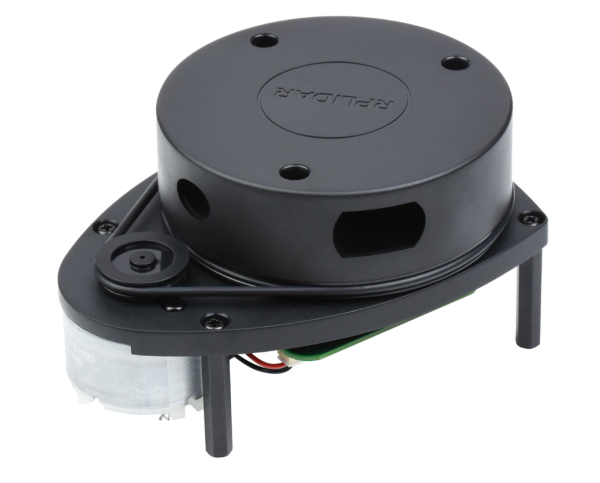
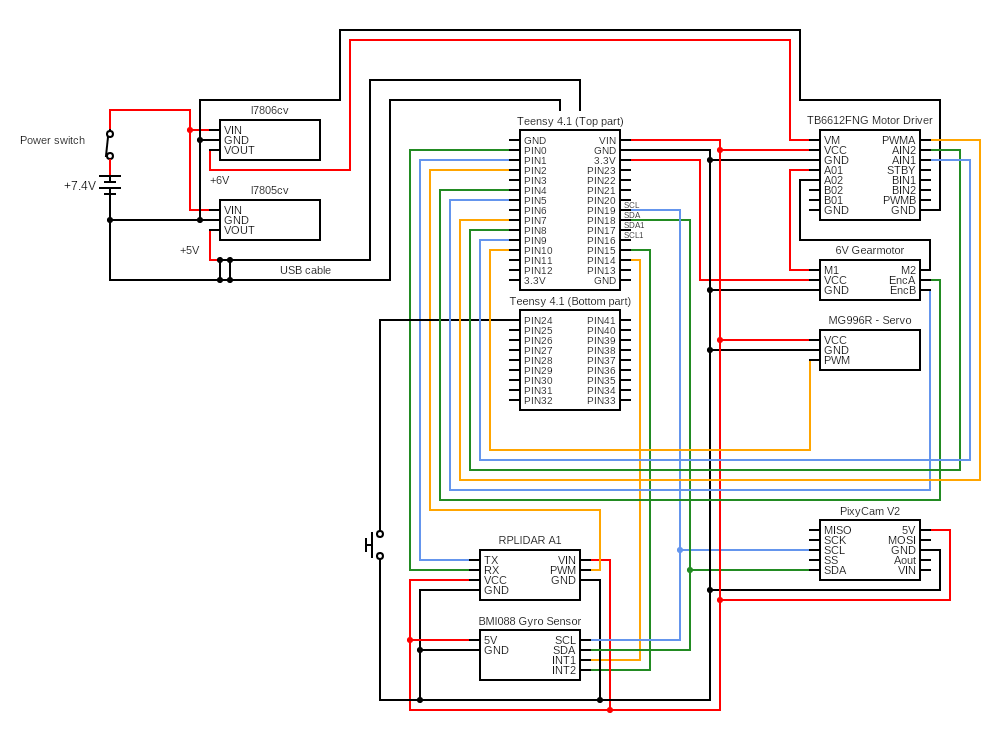

<center><h1> Nerdvana Nemesis 2023 </center>

## Table of Contents
* [Photos](#team-image)
  * [Team](#team-image)
  * [Robot](#robot-image)
* [Performance Video](#video)
* [Mobility Management](#mobility-management)
  * [Powertrain](#powertrain-mechanical)
    * [Drivetrain](#drivetrain-mechanical)
    * [Motor](#motor-mechanical)
    * [Motor Driver](#motor-driver-mechanical)
  * [Steering](#steering-mechanical)
    * [Servo Motor](#servo-motor)
  * [Chassis](#chassis-mechanical)
* [Power and Sense Management](#power-and-sense-management)
  * [Li-Po Battery](#li-po-battery)
  * [Teensy 4.1](#teensy-4.1)
  * [LIDAR](#lidar-sensor)
  * [IMU](#imu-sensor)
  * [Pixycam 2.1](#pixy-cam-2.1)
  * [Voltage Regulator](#voltage-regulator-(L7805CV))
  * [Circuit Diagram](#circuit-diagram)
* [Code for each component](#code-for-each-component)
  * [Drive Motor](#drive-motor-code)
  * [Servo Motor](#servo-motor-code)
  * [Camera](#camera-code)
  * [LIDAR](#lidar-code)
    * [Python Data Visualization](#python-data-visualization)
  * [IMU](#gyro-sensor-code)
  * [SD Card](#sd-card-code)
* [Obstacle Management](#obstacle-management)
  * [Qualification Round](#quali-management)
  * [Final Round](#final-management)
* [Randomizer](#randomizer)
* [Resources](#resources)
  * [3D Models](#3d-models-resources)
  * [Images](#images-resources)

### Team: Priboi Mihai, Onișoru Antonia, Bălan Teodor <a class="anchor" id="team-image"></a>
  

## Photos of our robot Paula Mia (**P**retty **A**wesome **U**ltra **L**ocomotion **A**utonomous **M**apping **I**ntelligence **A**ugmentation) <a class="anchor" id="robot-image"></a>

|  |  | 
| :--: | :--: | 
| *Front* | *Back* |
|  |  | 
| *Left* | *Right* |
|  |  | 
| *Top* | *Bottom* |

<br>

## Our video of the robot on [Youtube](https://youtu.be/1fn3-xTy-k4) <a class="anchor" id="video"></a>

<br>

# Mobility Management <a class="anchor" id="mobility-management"></a>


## Powertrain <a class="anchor" id="powertrain-mechanical"></a>


### Drivetrain <a class="anchor" id="drivetrain-mechanical"></a>

After reflecting on our experience from last year's competition, where we utilized a rear-wheel drive (RWD) with a differential, we opted for an all-wheel drive (AWD) system for this year's national event. We were motivated to switch because the RWD struggled with steering due to the lack of power in the front wheels. Moreover, an AWD system ensures a more even distribution of power.

However, after deciding to incorporate a LIDAR sensor, we found it essential to mount the sensor low to improve its accuracy. Given its considerable size, and the space constraints for the front differential and driveshaft—further challenged by our decision to place the servo lower to make room for the LIDAR—we ultimately returned to the RWD configuration.

To minimize friction and thereby reduce speed loss, we avoided using 3D-printed components for the moving parts in the drivetrain. Instead, we utilized Lego pieces, which are molded with high precision and therefore have a very low friction coefficient. The 3D-printed parts were reserved for the chassis and for mounting the electronic components onto the Lego structure.

### Motor <a class="anchor" id="motor-mechanical"></a>

Following an evaluation of different motors, we settled on a geared DC motor that comes with a magnetic encoder. This motor was selected for its lightweight and compact design, which stands out among others with comparable output. Additionally, the magnetic encoder offers greater precision than its optical counterpart. We secured the motor to the chassis using screws.

**Specifications:**
- Voltage: < 7V
- Gear Ratio: 1:20
- Speed: 400 ± 13% rpm
- Torque: 0.4 ± kg·cm
- Weight: 67.4g

Where to buy the motor: https://www.adafruit.com/product/4416

To connect the motor's axle to a Lego-compatible axle, we created a custom 3D-printed adapter.


### Motor Driver <a class="anchor" id="motor-driver-mechanical"></a>


To control the speed of the drive motor, we utilized a SparkFun Dual TB6612FNG motor driver.

Where to buy the motor driver: https://www.sparkfun.com/products/14450

## Steering <a class="anchor" id="steering-mechanical"></a>


After experimenting with various steering mechanisms such as Ackermann steering and bell-crank steering, we assessed their advantages and drawbacks. Ultimately, we chose a straightforward steering system consisting of a parallelogram linkage. This decision was made because the alternative systems were either too large or too complex to implement effectively. Our selected mechanism is simple, light, and compact, providing a satisfactory steering angle. While it does not adhere to the Ackermann steering geometry, our tests showed that for our robot's small size and light weight, this omission was not critically significant.

### Servo Motor <a class="anchor" id="servo-motor"></a>


For steering, we selected the MG996R servo motor, favoring it for its high torque and swift response.

**Specifications:**
- Weight: 55g
- Stall torque: 9.4 kg/cm (4.8v)
- Operating speed: 0.17 s/60 degree (4.8v)
- Rotation angle: 180 degree

Where to buy the servo motor: https://www.sigmanortec.ro/servomotor-mg996r-180-13kg

To connect the servo motor to the steering system, we fashioned a custom 3D-printed adapter. Given the dynamic geometry of the system, the connector couldn't be a single rigid piece because its length needed to be adjustable according to the wheel positions. Thus, we designed a two-part beam: the larger piece attaches to the servo and the smaller piece to the steering mechanism. The smaller piece slides into the larger one, permitting the beam's length to vary. We introduced a slight space between the two components to ensure smooth movement, while also ensuring that a significant portion of the smaller piece remains within the larger one to avoid disconnection or bending.


## Chassis <a class="anchor" id="chassis-mechanical"></a>

Our initial prototypes utilized Lego pieces to assemble all components, which simplified testing and design modifications. Once we finalized the design, we transitioned to a custom 3D-printed chassis for assembling the mechanical parts. This choice proved to be superior, resulting in a lighter and more compact structure that offered greater design flexibility compared to the Lego-based framework. The chassis accommodates the drivetrain and steering mechanism and includes designated mounts for securing the drive motor and servo motor.

Incorporating a LIDAR system necessitated maintaining all components, except for the LIDAR itself, below a certain height (approximately 8 cm, slightly less than the wall height) to ensure an unobstructed field of view for the sensor. Consequently, we had to extend the robot's length more than preferred, but this was an essential compromise. The drive motor extends out from the back of the robot, while the servo motor is centrally positioned directly beneath the LIDAR. Due to spatial constraints preventing the servo motor from being placed higher, we relinquished the all-wheel drive in favor of an alternative configuration. The gyroscope sensor is also mounted on the chassis, positioned near the drive motor.


# Power and Sense Management <a class="anchor" id="power-and-sense-management"></a>

### Li-Po Battery <a class="anchor" id="li-po-battery"></a>


Last year, we powered our robot with a 6-pack of AA Nickel-Metal Hydride (NiMH) batteries, which provided approximately 7.2V and 2000mAh but weighed around 650g. With our goal of building a smaller and lighter robot, we recognized the need for a different power source. We chose a Lithium Polymer (Li-Po) battery for its lighter weight, more compact size, and quicker charging capabilities. The specific model we selected is the *LiPo GENS ACE Soaring* (7.4V, 2200mAh, 20C). Switching to this battery reduced the weight of our power pack from 650g to 100g, almost halving the robot's weight. Moreover, the battery is more than twice as small in terms of volume.

Where to buy the battery: https://www.sierra.ro/Acumulator-LiPo-GENS-ACE-Soaring-7-4-V--2200-mA--20C-p11141p.html

### Teensy 4.1 <a class="anchor" id="teensy-4.1"></a>


At WRO2022 Future Engineers, we used a Raspberry Pi 3B+ in conjunction with an Arduino Uno Every through a serial connection. The Raspberry Pi was tasked with processing images from the camera, whereas the Arduino was dedicated to controlling the motors and collecting sensor data. This method, however, was not optimal. The processing speed of the Raspberry Pi fell short of our requirements, the serial link between the two boards was not as quick as necessary, and it also carried the risk of data loss.

Following the international competition in Dortmund, we discovered the Pixycam 2.1, a camera equipped with its own processing capabilities that can directly connect to an Arduino or other microcontrollers. With the Pixycam 2.1, we were able to remove the Raspberry Pi, thereby enhancing our robot's speed. We also upgraded from the Arduino Uno Every to a Teensy 4.1, which boasts much faster processing power.

| Specification | Arduino Nano Evey | Teensy 4.1 |
| :--: | :--: | :--: |
| Clock Speed | 20MHz | 600 MHz |
| CPU Flash Memory | 48 KB | 8 Mbytes |
| CPU RAM | 6 KB | 1 MB |
| Digital I/O Pins | 20 | 42 |
| PWM Pins | 7 | 14 |
| UART | 1 | 6 |
| SPI | 1 | 3 |
| I2C | 1 | 3 |

Where to buy the Teensy 4.1: https://www.pjrc.com/store/teensy41.html

### LIDAR <a class="anchor" id="lidar-sensor"></a>


The LIDAR A1 sensor is a crucial component of our robot. It provides the robot with a 360° view of its surroundings, allowing it to detect obstacles and avoid collisions. We selected the RPLIDAR A1, which is a low-cost LIDAR system that offers a 360° scan at a frequency of 10Hz. The sensor is equipped with a 2D laser scanner that can detect objects up to 8 meters away. The sensor is wired to the Teensy 4.1 via the SDA and SCL pins.

In the lead-up to the World Robot Olympiad (WRO) 2022, an iterative process of solution development was undertaken, aiming to resolve the persistent challenge of precise robot localization and obstacle detection under variable environmental conditions. The trials encompassed the deployment of both ultrasonic and infrared sensors. However, these sensors exhibited limitations in terms of angular sensitivity and dependability, influenced by the robot's orientation, which impeded their effectiveness for consistent environmental navigation and recognition tasks.

Where to buy the RPLIDAR A1: https://www.adafruit.com/product/4010

### IMU <a class="anchor" id="imu-sensor"></a>


One importat aspect that helps the roboy navigate is the inertial measurement unit (IMU). After using the MPU6050 last year, we decided to upgrade to a better IMU. This sensor is based on BOSCH BMI088, which is a high-performance IMU with high vibration suppression. While the IMU measure the angular velocity and the acceleration of the robot, we only use the angular velocity to calculate the angle of the robot. The IMU is wired to the SDA and SCL pins on the teensy.

**Specifications:**
- Gyroscope range: ±2000°/s
- Accelerometer range: ±24g

Where to buy the gyro sensor: https://www.seeedstudio.com/Grove-6-Axis-Accelerometer-Gyroscope-BMI088.html

### Pixycam 2.1 <a class="anchor" id="pixy-cam-2.1"></a>


Last year, one of our main challenges was the slow speed of the camera feed. We were utilizing a Raspberry Pi equipped with a PiCam V2. The delay was primarily due to the need to run a cube recognition machine learning algorithm on the Raspberry Pi itself, which limited the processed image feed to around 15 frames per second. This not only reduced the camera's efficiency but also slowed down the processing of other tasks on the Raspberry Pi.

To address this, we switched to the Pixycam 2.1, which offers several significant benefits: it possesses its own processing unit, thus preventing any lag in the rest of the system; it comes with a professionally developed machine learning algorithm for object detection and tracking, which performs reliably; and it can directly interface with an Arduino or another microcontroller, eliminating the need for a Raspberry Pi and so increasing the frequency of the readings.

Together with the Teensy 4.1, the camera delivers readings at approximately 60 frames per second, a limit we've set ourselves. Additionally, the camera's operation doesn't impact the performance of other sensors, allowing us to take full advantage of their capabilities.

Where to buy the PixyCam 2.1: https://www.robotshop.com/products/charmed-labs-pixy2-robot-vision-image-sensor-lego-rbc

### Voltage regulator <a class="anchor" id="voltage-regulator"></a>
")

To provide the Teensy 4.1 with the required 5V, we needed to decrease the output from the 7.4V battery, which can reach up to 8.4V when fully charged. We employed a linear voltage regulator, the L7805CV, capable of converting input voltages below 35V down to a steady 5V.

For the drive motor, which we want to operate at higher speeds, we use a separate voltage regulator, the L7806CV, to step down the battery's 7.4V to 6V. This approach allows us to extract more speed from the motor while maintaining consistent performance across different battery charge levels.

Where to buy the 5V voltage regulator: https://ro.mouser.com/ProductDetail/STMicroelectronics/L7805CV?qs=9NrABl3fj%2FqplZAHiYUxWg%3D%3D

Where to buy the 6V voltage regulator: https://ro.mouser.com/ProductDetail/STMicroelectronics/L7806CV?qs=K4DpzJ20gDEC%252BHE13eVUwg%3D%3D

### Circuit diagram <a class="anchor" id="circuit-diagram"></a>


<br>

# Code for each component <a class="anchor" id="code-for-each-component"></a>

## Drive Motor <a class="anchor" id="drive-motor-code"></a>

The motor driver can be directly managed with a single PWM pin that adjusts the motor's speed and two digital pins designated for determining the motor's rotation direction. Consequently, the use of any external library for motor manipulation was unnecessary.

We devised two functions within our control system: one to modify the motor's velocity and another to halt it effectively, incorporating a braking feature. To achieve this, we convert the desired speed from our established scale of -100 to +100 to the PWM equivalent of 0 to 255. The motor's direction is then adjusted according to the sign of the input value.

```ino
void motor_start(int speed) {
  speed = -speed;  
  int out = abs(speed) * 2.55; // Convert speed to PWM value (0 to 255)
  if(speed >= 0) { // Forward direction
    digitalWrite(AIN1, HIGH);
    digitalWrite(AIN2, LOW);
  }
  else { // Reverse direction
    digitalWrite(AIN1, LOW);
    digitalWrite(AIN2, HIGH);
  }
  analogWrite(PWM1, out);

  Serial << "speed: " << speed << "\n";
}

void motor_stop() {
  motor_start(-10); 
}
```

However, for the encoder, we required a specialized library to handle the more complex signal processing. The library we use for interfacing with the encoder is called *Encoder.h*.

The encoder operates with a straightforward function that we found easy to comprehend and program. The constant with which we multiply the encoder's output value was determined empirically through multiple tests with varying distances. This calibration process allowed us to accurately convert the encoder's readings into centimeters.

```ino
long read_motor_encoder() {
  return (0.01285) * (double)myEnc.read();
}
```

## Servo Motor <a class="anchor" id="servo-motor-code"></a>

For controlling the servo motor, we utilize the *Servo.h* library, which provides the necessary functions to manage the servo's movements. Initially, we configure the servo by establishing its range, defining the maximum and minimum angles it can achieve in both directions. This ensures that we can accurately position the servo within its operational limits.

```ino
// Servo
void servo_setup() {
  servo.attach(SERVO_PIN, 1400, 1611);
  move_servo(0);
  delay(50);
}
```

The function *move_servo* makes the servo to rotate a specific angle, given by the parameter _angle_. If the angle is negativ the motor will rotate to the left, and if is pozitiv the motor will rotate to right. This way 0 is going to be the position, in which the wheels are straight. Also, the values we are giving the motor need to be between -1 and 1, so we use a clamp function to limit the value we are going to give the motor to roatate to.

```ino
void move_servo(double angle) {
  angle = clamp(angle + servo_correction, -1, 1);

  double angle_deg = 90 + angle * 90.0;  // Convert angle to degrees (0 to 180)
  angle_deg = clamp(angle_deg, 0, 180);
  servo.write(angle_deg);
}
```

## Camera <a class="anchor" id="camera-code"></a>

Now that we finished to implement the functions we need to make the robot move and steer, we have to make him see the cubes and move according to them. The library we used for the camera is _Pixy2I2C.h_. The I2C address must be configured in the _Pixy2I2C.h_ library.

```ino
void camera_setup(bool debug) {
  if (debug) Serial.println(F("Camera starting..."));
  //display_print("Cam err!");
  pixy.init(0x54);
  if (debug) Serial.println(F("Camera ok!"));

  pixy.getResolution();
  image_w = pixy.frameWidth;
  image_h = pixy.frameHeight;
  // Serial << image_w << " " << image_h << '\n';
}
```

In order to read the inputs from the camera, we have some methods from the Pixy2I2C class.

```ino
pixy.ccc.blocks[i].m_signature
// The signature number of the detected object
// For us, 1 is for red, and 2 is for green
pixy.ccc.blocks[i].m_x
// The x location of the center of the detected object (0 to 316)
pixy.ccc.blocks[i].m_y
// The y location of the center of the detected object (0 to 208)
pixy.ccc.blocks[i].m_width
// The width of the detected object (1 to 316)
pixy.ccc.blocks[i].m_height
// The height of the detected object (1 to 208)
pixy.ccc.blocks[i].m_indez
// The tracking index of the block
```

For the camera we made a function in which we are reading the color of the cube in front of us.

```ino
void read_camera(bool debug) {
  if (millis() - last_camera_read >= camera_interval) {
    pixy.ccc.getBlocks();

    if(pixy.ccc.numBlocks < 1)
      cube_color = 0;
    else
      cube_color = sig_to_col[pixy.ccc.blocks[0].m_signature];

    last_camera_read = millis();
  }
}
```

## LIDAR <a class="anchor" id="lidar-code"></a>

Extracting data from the LIDAR involves processing a continuous stream via Serial1. The lidarRead() function reads bytes one at a time, confirming the correct sequence before storing them in a buffer. Once enough data is gathered, it's processed to inform the robot's navigation. If the buffer is full, the data is saved for later use and the buffer is reset for new data. This method ensures the robot receives reliable information for obstacle detection and avoidance.

```ino
void lidarRead() {
    if (!Serial1.available()) {
        return;
    }
    byte current_byte = Serial1.read();
    if (lidar_buff_ptr == 0) {
        if ((current_byte >> 4) != 0xA) {
            return;
        }
    } else if (lidar_buff_ptr == 1) {
        if ((current_byte >> 4) == 0xA) {
            lidar_buff_ptr = 0;
        } else if ((current_byte >> 4) != 0x5) {
            lidar_buff_ptr = 0;
            return;
        }
    }

    lidar_buff[lidar_buff_ptr++] = current_byte;

    if (lidar_buff_ptr == 4) {
        lidarProcessingData();
    }

    if (lidar_buff_ptr == 84) {
        memcpy(lidar_old_buff, lidar_buff, 84);
        lidar_buff_ptr = 0;
    }
}
```

The lidarProcessingData() function interprets raw LIDAR data to map out the robot's surroundings. It calculates the starting angle of the scan and then iterates over the data to determine distances and angles for various points. These values are then adjusted for the robot's current orientation, converted into X and Y coordinates, and filtered to ignore any out-of-range readings. If the readings are valid, they're processed further to assist the robot in navigation and obstacle avoidance.

```ino
void lidarProcessingData() {

    double start_angle = (((uint16_t)(lidar_buff[3] & 0b01111111) << 8) ^ lidar_buff[2]) / 64.;
    double old_start_angle = (((uint16_t)(lidar_old_buff[3] & 0b01111111) << 8) ^ lidar_old_buff[2]) / 64.;

    for (int i = 0; i < 16; ++i) {
        byte* cabin = lidar_old_buff + 5 * i + 4;
        
        d0[0] = getDiffAngle(((cabin[0] & 0b11) << 4) ^ (cabin[4] & 0b1111));
        d0[1] = getDiffAngle(((cabin[2] & 0b11) << 4) ^ (cabin[4] >> 4));

        for (int i = 0; i < 2; ++i) {
            distance[i] = ((uint16_t)cabin[2 * i + 1] << 6) ^ (cabin[2 * i] >> 2);
        }

        for (int j = 0; j < 2; ++j) {
            int k = 2 * i + 1 + j;
            double angle = old_start_angle + angleDiff(old_start_angle, start_angle) / 32 * k;
            if (angle >= 360) {
                angle -= 360;
            } else if(angle < 0) {
              angle = angle + 360;
            }

            double x, y;

            float gx_angle = fmod((double)(angle + (double)gx - current_angle), 360.0);

            y = -distance[j] * cos(radians(gx_angle));
            x = -distance[j] * sin(radians(gx_angle));

            if(distance[j] > 5 && distance[j] < 4000) {
              lidarProcessPoint(Angle(distance[j], gx_angle), Point(x, y));
            }
        }
    }
}
```

The *calculate_linear_regression_segment* function performs a linear regression analysis on a set of data points from LIDAR readings to determine the linear path that best fits the trajectory of an observed barrier. It computes the line's gradient and intercept, pinpoints the coordinates for the beginning and end of the trajectory, and ascertains the barrier's direction in relation to the robot's orientation. Additionally, this function measures the shortest distance from the robot to the barrier.

Another part of the code accumulates data points into a 'current line' array if they are incrementally consistent in distance and direction with the previously recorded point. When this collection reaches a certain size, or there is a notable shift in the data points' position or angle, it initiates the aforementioned linear regression analysis on the gathered segment. Should the barrier be located at a substantial distance, this detected range is then updated. Special conditions within the function are also set to recognize the contours of a cube, modifying the cube's recorded distances as needed when certain parameters are fulfilled.


```ino
void calculate_linear_regression_segment(Point& start, Point& end, double& dist, int& dir) {  
  if(current_line_size < 2) return; // Not enough points for regression
  
  double x_start = INFINITY, x_end = -INFINITY;
  double x_sum = 0, y_sum = 0, x2_sum = 0, xy_sum = 0;
  for(int i = 0; i < current_line_size; ++i) {
    x_sum += current_line[i].x;
    y_sum += current_line[i].y;
    x2_sum += current_line[i].x * current_line[i].x;
    xy_sum += current_line[i].x * current_line[i].y;

    if(current_line[i].x < x_start) x_start = current_line[i].x;
    if(current_line[i].x > x_end) x_end = current_line[i].x;
  }

  double m, c;

  if(current_line_size * x2_sum - x_sum * x_sum == 0) m = INF;
  else m = (current_line_size * xy_sum - x_sum * y_sum) / (current_line_size * x2_sum - x_sum * x_sum);
  
  c = (y_sum - m * x_sum) / current_line_size;

  start.x = x_start;
  start.y = m * x_start + c;
  
  end.x = x_end;
  end.y = m * x_end + c;

  dist = abs(c) / sqrt(1 + m * m);

  if(abs(m) < 0.4) {
    if((start.y + end.y) / 2 < 0) 
      dir = BACK;
    else 
      dir = FRONT;
  } else {
    if((start.x + end.x) / 2 < 0)  {
      dir = LEFT; 
    }
    else {
      dir = RIGHT;
    }
  }
  slopes[dir] = m;
}

void lidarProcessPoint(Angle angl, Point p) {
  double ang, dist;
  ang = angl.ang;
  dist = angl.dist;

  if(abs(dist - old_dist) < 10 && min(abs(ang - old_ang), 360 - abs(ang - old_ang)) < 1.5) {
    current_line[current_line_size++] = p;
  } else {
      if(current_line_size > calculate_threshold(old_dist)) {
        Point start, end;
        double wall_d;
        int wall_dir;

        calculate_linear_regression_segment(start, end, wall_d, wall_dir);

        if(wall_d > 50) {
          old_wall_dist[wall_dir] = wall_dist[wall_dir];
          wall_dist[wall_dir] = wall_d;
          if(wall_dir == FRONT && (wall_dist[FRONT] + wall_dist[BACK]) < 2800) {
            wall_dist[BACK] = 3050 - wall_d;
          }
          wall_updated[wall_dir] = true;
        }

      }
      else if(current_line_size > 2 && (abs(dist - old_dist) > 20 || 
      abs(ang - old_ang) > 5) && (old_ang > 120 && old_ang < 240) &&
       old_dist < 1000 && old_dist > 100 && (wall_dist[BACK] < 1500 ||
        wall_dist[FRONT] > 1400)) {
        xa = current_line[current_line_size / 2].x;
        ya = current_line[current_line_size / 2].y;

        if(xa && ya && wall_dist[side_wall]) {
          double na = ya - slopes[side_wall] * xa;
          dist_to_cube = (-1) * na / sqrt(slopes[side_wall] * slopes[side_wall] + 1);
          //left
          if(dist_to_cube && !last_dist_to_cube && cube_color && abs(wall_dist[side_wall] + direction * dist_to_cube) < 850) { 
            last_dist_to_cube = dist_to_cube;
            last_cube_y = wall_dist[BACK] + ya;
            if(last_cube_y > 2000)
              last_cube_y = 2000;
            if(last_cube_y < 1000)
              last_cube_y = 1000;
          } 
        }
      }
      current_line_size = 0;
      current_line[current_line_size++] = p;
  }
  old_dist = dist;
  old_ang = ang;
}
```

We found that the number of points defining a line decreases with distance in LIDAR data. To predict this variation, we applied a polynomial model that helps improve our detection and mapping accuracy.

```ino
import numpy as np

data = np.loadtxt('data.csv', delimiter=',')

distances = data[:, 0]
points = data[:, 1]

coefficients = np.polyfit(distances, points, 2)

a, b, c = coefficients

print("Best fit parameters: a =", a, "b =", b, "c =", c)

def polynomial_function(D):
    return a * D**2 + b * D + c

distance = 100
estimated_points = polynomial_function(distance)
print("Estimated points at distance", distance, "cm:", estimated_points)

```

```ino
double calculate_threshold(double distance) {
  distance /= 10.0; 
  double a = 0.0010947040728267199;
  double b = -0.46574727812407213;
  double c = 56.010728111461475;
  double points = a * distance * distance + b * distance + c;
  double threshold = max(7.0, points);  // Ensure threshold is at least 7
  threshold = min(20, threshold);
  return threshold;
}
```

The gyro sensor's measurement of the robot's rotation angle is essential for precise spatial positioning. This angle adjusts the lidar data to reflect true distances, accounting for changes in position and orientation. Neglecting this leads to mapping inaccuracies, hence, rotation compensation is critical for precise navigation.

### Python Data Visualization <a class="anchor" id="python-data-visualization"></a>

To simplify the configuration process for the LIDAR sensor, we developed a Python script that graphically represents the sensor's data. This script takes the wall segments detected by the LIDAR, illustrates them in a chart, and annotates each with the measured distance from the robot. Below, you'll find a sample visualization generated by this program.


```py
from cmath import cos
from math import radians, sin, sqrt
import math
import matplotlib.pyplot as plt
from collections import deque
import random
import time
import numpy as np
import serial


# Arduino setup
arduino = serial.Serial(port='COM9', baudrate=115200, timeout=.1)

# Create a fixed-length deque of length 50 to store the data points
data_points = deque(maxlen=600000)

# Create an empty plot
fig, ax = plt.subplots()

# Set the x-axis and y-axis limits
ax.set_xlim(-2000, 2000)
ax.set_ylim(-2000, 2000)

# Create a scatter plot to visualize the data points
scatter = ax.scatter([], [])

last_update_time = time.time()

update_interval = 0.5

data = arduino.readline().decode().strip()
old_dist, old_ang = map(float, data.split())

line_counter = 0
colorLines = ['black', 'red', 'blue', 'green', 'yellow', 'orange', 'purple', 'pink', 'brown', 'gray']
colorVec = []

saveLine = []
lines = []
cubes = []

m_left = 0

def calculate_linear_regression_segment(points):
    x, y = points[:, 0], points[:, 1]
    A = np.vstack([x, np.ones_like(x)]).T
    m, c = np.linalg.lstsq(A, y, rcond=None)[0]
    
    # Calculate endpoints of the segment
    x_start = x.min()
    y_start = m * x_start + c
    
    x_end = x.max()
    y_end = m * x_end + c

    dist = abs(c) / np.sqrt(1 + m**2)
    
    
    return x_start, y_start, x_end, y_end, m, dist

def plot_segment_with_coefficient(ax, points, order):
    global m_left
    x_start, y_start, x_end, y_end, m, dist = calculate_linear_regression_segment(points)

    color = 'black'
    #black not determined
    #red right
    #blue left
    #green up
    #yellow down

    if(abs(m) < 1): # horizontal line
      if((y_start + y_end) / 2 < 0):
        color = 'yellow'
      else:
        color = 'green'
    else:
      if (x_start + x_end) / 2 < 0:
        color = 'blue'
        m_left = m
      else:
        color = 'red'
       
    ax.plot([x_start, x_end], [y_start, y_end], color=color, linewidth=2)
    # get distnace from origin to the line
    
    ax.text((x_start + x_end) / 2, (y_start + y_end) / 2, f'{round(float(dist), 2)}', 
            horizontalalignment='center', verticalalignment='bottom')
    

def calculate_threshold(distance):
    distance = distance / 10
    a = 0.0010947040728267199
    b = -0.46574727812407213
    c = 56.010728111461475
    points = a * distance**2 + b * distance + c
    threshold = max(14, points)  # Ensure threshold is at least 14
    threshold = min(20, points)
    return threshold
    
    
# Main loop to continuously read and update data
while True:
    data = arduino.readline().decode().strip()
    if data:
        dist, ang = map(float, data.split())
        point_y = -1 * dist * cos(radians(ang));
        point_x = -1 * dist * sin(radians(ang));

        if(old_ang <= 360 and ang >= 0 and old_ang > ang):
           if(len(lines)):  

            for line in ax.lines:
              line.remove()
            for text in ax.texts:
              text.remove()

            order = 0
            for line in lines:
              plot_segment_with_coefficient(ax, line, order)
              order += 1


            if m_left:
              for cube in cubes:
                x1, y1 = cube[0]
                b = y1 - m_left * x1
                y_line = m_left * np.array([x1, x1 - 100]) + b  # x1+10 is just an example, you can choose other values
                dist = -1 * b / sqrt(m_left * m_left + 1)
                ax.plot([x1, x1 - 100], y_line, color="black", linewidth=2)
                ax.text((x1 + x1 - 100) / 2, (y1) / 2, f'{round(float(dist), 2)}', 
                  horizontalalignment='center', verticalalignment='bottom')
              
            
            cubes.clear()

            
            lines = []
            cubes = []
            
            line_counter = 0
            colorVec = []
            pointCnt = 0

            plt.pause(0.00001)
            
        if(abs(dist - old_dist) < 10 and min(abs(ang - old_ang), 360 - abs(ang - old_ang)) < 1.5):
            saveLine.append((point_x, point_y))
        else:
            if(len(saveLine) > calculate_threshold(old_dist)):

              lines.append(np.array(saveLine));
              # save line is a list of tuples

              # data_points.extend(saveLine)
              # colorVec.extend([colorLines[line_counter]] * len(saveLine))
              line_counter += 1
            elif(len(saveLine) > 2 and (abs(dist - old_dist) > 20 or abs(ang - old_ang) > 5) and (old_ang > 130 and old_ang < 240) and old_dist < 800):
               cubes.append(np.array(saveLine));
               data_points.extend(saveLine)
            saveLine.clear()
            saveLine.append((point_x, point_y))

        old_dist = dist
        old_ang = ang

# Show the plot
plt.show()

```

## IMU <a class="anchor" id="gyro-sensor-code"></a>

To utilize the gyro sensor, we needed to include the _BMI088.h_ library. During initialization, we allocate a 10-second window to measure the sensor's drift, allowing us to refine the robot's angular readings for greater precision. Additionally, we configure the sensor's output data rate to 400Hz and set the bandwidth to 47Hz. The bandwidth determines the frequency of data sampling by the sensor; a higher bandwidth yields more precise data at the cost of increased power consumption. We also designate pin 15 as an input and attach an interrupt to it, enabling us to capture data from the sensor as soon as it becomes available.

```ino
void gyro_setup(bool debug) {
  int status = accel.begin();
  status = accel.setOdr(Bmi088Accel::ODR_200HZ_BW_80HZ);
  status = accel.pinModeInt1(Bmi088Accel::PUSH_PULL,Bmi088Accel::ACTIVE_HIGH);
  status = accel.mapDrdyInt1(true);


  status = gyro.begin();

  status = gyro.setOdr(Bmi088Gyro::ODR_400HZ_BW_47HZ);
  status = gyro.pinModeInt3(Bmi088Gyro::PUSH_PULL,Bmi088Gyro::ACTIVE_HIGH);
  status = gyro.mapDrdyInt3(true);

  pinMode(15,INPUT);
  attachInterrupt(15,gyro_drdy,RISING);  


  if(status < 0) {
    if(debug) Serial << "BMI Initialization Error!  error: " << status << "\n";
    //init_error = init_gyro_error = true;
  }
  else  {
    // Gyro drift calculation
    if(debug) Serial.println("Starting gyro drift calculation...");

    gx = 0;
    gy = 0;
    gz = 0;

    gyro_last_read_time = millis();

    double start_time = millis();
    while(millis() - start_time < DRIFT_TEST_TIME * 1000) {
      gyro.readSensor();  
      double read_time = millis();
      gx += (gyro.getGyroX_rads() * (read_time - gyro_last_read_time) * 0.001);
      // gy += (bmi.getGyroY_rads() * (read_time - gyro_last_read_time) * 0.001);
      // gz += (bmi.getGyroZ_rads() * (read_time - gyro_last_read_time) * 0.001);

      gyro_last_read_time = read_time;
    }

    drifts_x = gx / DRIFT_TEST_TIME;
    // drifts_y = gy / DRIFT_TEST_TIME;
    // drifts_z = gz / DRIFT_TEST_TIME;

    if(debug) Serial.print("Drift test done!\nx: ");
    if(debug) Serial.print(drifts_x, 6);
    if(debug) Serial.print("   y: ");
    if(debug) Serial.print(drifts_y, 6);
    if(debug) Serial.print("   z: ");
    if(debug) Serial.println(drifts_z, 6);
  }
  // Gyro value reset
  gx = 0;
  gy = 0;
  gz = 0;

  gyro_last_read_time = millis();
}
```

Within the *read_gyro* function, we're retrieving data from the gyro sensor and adjusting it to account for any detected drift, enhancing the accuracy of the readings. Since the gyro provides data in radians, a conversion to degrees is necessary for our application. We're focusing solely on the rotation around the x-axis, hence we only compute the *gx* value, which represents the robot's angular rotation in degrees on that specific axis.

```ino
void read_gyro(bool debug) {
  //delta_start = millis();
  if(gyro_flag) {
    gyro_flag = false;
    cnt1++;
    gyro.readSensor();   
    double read_time = millis();

    gx += ((gyro.getGyroX_rads() - drifts_x) * (read_time - gyro_last_read_time) * 0.001) * 180.0 / PI;
    //gy -= ((bmi.getGyroY_rads() - drifts_y) * (read_time - gyro_last_read_time) * 0.001) * 180.0 / PI;
    //gz -= ((bmi.getGyroZ_rads() - drifts_z) * (read_time - gyro_last_read_time) * 0.001) * 180.0 / PI;

    gyro_last_read_time = read_time;

    //delta_gyro = millis() - delta_start;
    if(debug) Serial << "Gyro: gx: " << gx << "    gy: " << gy << "    gz: " << gz << "\n";

    if(debug) {
      Serial.print("Gyro: gx: ");
      Serial.print(gx);
      Serial.print(" gy: ");
      Serial.print(gy);
      Serial.print(" gz: ");
      Serial.println(gz);
    }
  }
}
```

## SD Card <a class="anchor" id="sd-card-code"></a>

Utilizing the Teensy 4.1, we encounter the limitation of not being able to monitor the robot's sensor data in real time. Nonetheless, it's essential for us to access this information. Our solution is straightforward: we record all the data the robot collects onto an SD card, taking advantage of the built-in SD card slot on the Teensy board. To facilitate this, we implemented the *SD.h* and *SPI.h* libraries.

To store data onto the SD card, we crafted several functions. The function named *file_print* records data continuously without line breaks, whereas *file_println* appends a newline after each entry. Both functions accept a String parameter, which represents the data being saved.

Additionally, we utilize a function named *writeSD* in our current setup. Its operation is simple: we concatenate data to a string variable, and upon completing this, the entire string is written to the SD card.

```ino
/// SD card functions

void SD_setup() {
  if (!SD.begin(chipSelect)) {
    Serial.println("Card failed, or not present!");
    //init_sd_error = true;
  }
  else {
    Serial.println("Card present!");

    // SD.remove("datalog.txt");

    int i = 0;
    do {
      char aux[100];
      itoa(i, aux, 10);

      memset(sd_filename, 0, sizeof(sd_filename));

      strcat(sd_filename, "datalog_");
      strcat(sd_filename, aux);
      strcat(sd_filename, ".csv");

      i++;
    } while(SD.exists(sd_filename));

    if(debug) Serial.print("Using filename: ");
    if(debug) Serial.println(sd_filename);
  }
}

void file_print(String s) {
  File data_file = SD.open(sd_filename, FILE_WRITE);
  if(data_file) {
    data_file.print(s);
    data_file.close();
  }
}

void file_println(String s) {
  File data_file = SD.open(sd_filename, FILE_WRITE);
  if(data_file) {
    data_file.println(s);
    data_file.close();
  }
}

void writeSD(int aux, int aux2, int aux3, int aux4) {
  data_string += "time " + String(millis()) + " , "; 
  data_string += "left " + String(wall_dist[LEFT]) +  " , right " + String(wall_dist[RIGHT]) + " , FRONT " + String(wall_dist[FRONT]) + " , ";
  data_string += "pd_case: " + String(pid_case) + " , ";
  data_string += "case: " + String(CASE) + ", ";
  data_string += "pd err: " + String(pid_error) + " ,gx " + String(gx)+ ", ang:" + String(current_angle)+'\n';

  if(aux)
    data_string += "aux: " + String(aux) + ", ";
  if(aux2)
    data_string += "aux1: " + String(aux2) + ", ";
  if(aux3)
    data_string += "aux2: " + String(aux3) + ", ";
  if(aux4)
    data_string += "aux3: " + String(aux4) + ", ";

  if(millis() - sd_last_write_time > 1000) {
    file_println(data_string);
    data_string = "";
    sd_last_write_time = millis();  
  }
}
``` 

<br>

# Obstacle Management <a class="anchor" id="obstacle-management"></a>

## Qualification Round <a class="anchor" id="quali-management"></a>

For the qualifying round, we set up a basic switch-case system to guide our robot. This system tells the robot what to do next, depending on where it is. The robot knows where it is by counting how many times it has turned.

We use three main switch cases: *SECTION*, *ROTATE*, and *STOP*.

In the *SECTION* case, the robot just moves straight. It uses a special tool (PID controller) with a gyro sensor to stay on a straight line. If it gets too close to the walls, it uses another tool (PID controller) with a LIDAR sensor to keep the right distance from the walls. When it comes to a corner, it changes to the *ROTATE* case.

```ino
case SECTION: {
  if(wall_dist[FRONT] > 0 && wall_dist[FRONT] < 500) {
    writeSD(1, -1, -1, -1);
    pid_case = 0;
    current_angle += direction * 90;
    turns++;
    last_rotate = millis();
    CASE = ROTATE;
  }
  else if(abs(pid_error) <= 0.15 || abs(wall_dist[RIGHT] - wall_dist[LEFT]) > 1200) {
    pid_case = 1;
    pid_error_gyro = (current_angle - gx) * kp_gyro + (pid_error_gyro - pid_last_error_gyro) * kd_gyro;
    pid_last_error_gyro = pid_error_gyro;

    move_servo(pid_error_gyro); 
  }
  else {
    if(millis() - last_time_pid > 10 && wall_dist[LEFT] && wall_dist[RIGHT] && abs(wall_dist[RIGHT] - wall_dist[LEFT]) < 1200) {
      pid_case = 2;
      move_servo(pid_error); 
      pid_error = (wall_dist[RIGHT] - wall_dist[LEFT]) * kp + (pid_error - pid_last_error) * kd;
      pid_last_error = pid_error;
      last_time_pid = millis();
    }
  }
  break;
}
```

The *ROTATE* case is for when the robot needs to turn at corners. It decides which way to turn based on which side has more space. If the robot has turned 12 times, it changes to the *STOP* case.

```ino
case ROTATE: {
  if((wall_dist[RIGHT] - wall_dist[LEFT]) < 1200 && abs(current_angle - gx) < 5 && millis() - last_rotate >= 1000) {
    if(turns >= 12) 
      CASE = STOP;
    else
      CASE = SECTION;
  } else {
    pid_error_gyro = (current_angle - gx) * kp_gyro + (pid_error_gyro - pid_last_error_gyro) * kd_gyro;
    pid_last_error_gyro = pid_error_gyro;

    move_servo(pid_error_gyro); 
  } 
  break;
}
```

The *STOP* case is for when the robot finishes the course. It tells the robot to stop moving.


```ino
case STOP: {
  delay(500);
  move_servo(-1);
  motor_start(-5);
  Serial.println("Stop case");
  writeSD(-1, -1, -1, -1);
  delay(100000);
  break;
}
```

## Final Round <a class="anchor" id="final-management"></a>

For the final round resolution, we adopted a three-tiered modular approach to achieve greater precision and fluidity. The first module is designed for navigating through the current section, the second for detecting and evading any immediate cubes, and the third for executing rotations and setting up for the following section.

The initial segment serves as the core switch-case structure within our code, where we continuously monitor for any cubes to avoid or for cues to initiate a rotation in preparation for the upcoming section. Should neither of these conditions arise, the robot is programmed to maintain a direct trajectory through the segment, ensuring uninterrupted progress.

```ino
case SECTION: {
  if(turn_ok && wall_dist[FRONT] && wall_dist[FRONT] < 700  && millis() - last_rotate > rotate_timeout) {
    turns++;
    last_rotate = millis();
    last_cube_color = 0;
    last_dist_to_cube = 0;
    flag = 0;
    cube_section_cnt = 0;
    if (wall_dist[side_wall] > 550)
      CASE = ROTATE;
    else
      current_angle += direction * 90;   
  } else if (last_dist_to_cube && cube_color != last_cube_color && cube_color != 0 && wall_dist[BACK] < 1800) {
    move_servo(cube_color * 1);

    if (cube_color == GREEN) {
      if(direction == 1)
        goal_distance = 250 + (wall_dist[side_wall] - 230) / 6;
      else
        goal_distance = 850 - (1000 - wall_dist[side_wall]) / 6;
    } else {
      if(direction == 1)
        goal_distance = 770 - (1000 - wall_dist[side_wall]) / 5;
      else
        goal_distance = 270 + (wall_dist[side_wall] - 200) / 5;
    }

    last_cube_color = cube_color;
    cube_section_cnt++;

    if(turns == 3) {
      final_cube_color = last_cube_color;
      final_cube_pos = cube_section_cnt;
      final_cube_turn = turns;
    } 
    if(turns == 4) {
      if(last_cube_y < 1700) {
        final_cube_color = last_cube_color;
        final_cube_pos = cube_section_cnt;
        final_cube_turn = turns;
      }
    }
    
    CASE = AVOID_CUBE;
  } else {

    if(millis() - last_turn_ok > rotate_timeout && (wall_dist[BACK] > 1850 || (wall_dist[LEFT] + wall_dist[RIGHT]) > 1200) && !turn_ok) {
      turn_ok = 1;
      last_turn_ok = millis();
    }
    pid_error_gyro = ((current_angle) - gx) * kp_gyro + (pid_error_gyro - pid_last_error_gyro) * kd_gyro;
    pid_last_error_gyro = pid_error_gyro;

    move_servo(pid_error_gyro);
  }
  break;
}
```

The *AVOID_CUBE* module is responsible for detecting and avoiding any cubes that may be present in the robot's path. It utilizes the LIDAR sensor to determine the cube's position and color, and then it calculates the shortest distance to the cube. The robot then adjusts its trajectory to avoid the cube, and once it has passed it, it goes to the *PASS CUBE* module.

In the *PASS CUBE* module, the robot moves straight until it has passed the cube. Once it has done so, it goes back to the *SECTION* module.

```ino
case AVOID_CUBE:
{
  if (last_cube_color == GREEN && ((wall_dist[side_wall] < goal_distance && direction == 1) || (wall_dist[side_wall] > goal_distance && direction == -1))  || 
        last_cube_color == RED && ((wall_dist[side_wall] > goal_distance && direction == 1) || (wall_dist[side_wall] < goal_distance && direction == -1)) && 
          (wall_dist[LEFT] + wall_dist[RIGHT]) > 800) {
    CASE = PASS_CUBE;
  } else {
    pid_error_gyro = ((current_angle + last_cube_color * 55) - gx) * kp_gyro + (pid_error_gyro - pid_last_error_gyro) * kd_gyro;
    pid_last_error_gyro = pid_error_gyro;

    move_servo(pid_error_gyro);
  }
  break;
}

case PASS_CUBE:
{
  if (wall_dist[BACK] > last_cube_y + 200 && (wall_dist[FRONT] + wall_dist[BACK]) < 3400) {
    last_dist_to_cube = 0;
    if(final_cube_color == 1 && final_cube_turn % 4 == turns % 4 && turns > 5 && final_cube_pos == cube_section_cnt)
      CASE = PASS_LAST_CUBE;
    else
      CASE = SECTION;
  } else {
    pid_error_gyro = (current_angle - gx) * kp_gyro + (pid_error_gyro - pid_last_error_gyro) * kd_gyro;
    pid_last_error_gyro = pid_error_gyro;

    move_servo(pid_error_gyro);
  }
  break;
}
```

The *ROTATE* module is designed to pivot the robot 90 degrees towards the next section. It employs a PD controller in conjunction with a gyro sensor to execute the rotation. However, if the robot is close to the inside wall, it will perform a 270-degree turn in the opposite direction rather than a 90-degree one. This ensures the robot has ample space to maneuver before approaching the next section, thereby avoiding any cubes.

```ino
case ROTATE:
{
  if (abs((current_angle - direction * 270) - gx) < 5) {
    current_angle -= direction * 270;
    last_rotate = millis();
    CASE = SECTION;
  } else if ((wall_dist[side_wall] > 500 || wall_dist[FRONT] > 450) && (wall_dist[side_wall] > 450 || wall_dist[FRONT] > 250) && flag == 0) {
    ang = myacos((wall_dist[FRONT] - 450) / sqrt((wall_dist[FRONT] - 450) * (wall_dist[FRONT] - 450) + (wall_dist[side_wall] - 500) * (wall_dist[side_wall] - 500)));

    pid_error_gyro = ((current_angle - direction * ang) - gx) * kp_gyro + (pid_error_gyro - pid_last_error_gyro) * kd_gyro;
    pid_last_error_gyro = pid_error_gyro;

    move_servo(pid_error_gyro);
  } else {
    flag = 1;
    pid_error_gyro = ((current_angle - direction * 270) - gx) * kp_gyro + (pid_error_gyro - pid_last_error_gyro) * kd_gyro;
    pid_last_error_gyro = pid_error_gyro;

    move_servo(pid_error_gyro);
  }
  break;
}
```

The *PASS_LAST_CUBE* module is designed to rotate the robot and change its direction after 2 laps, in case the last cube has the color red.

```ino
case PASS_LAST_CUBE: {
  if(wall_dist[FRONT] && wall_dist[FRONT] < 500) {
    current_angle -= 180;
    direction *= -1;
    if(side_wall == LEFT)
      side_wall = RIGHT;
    else
      side_wall = LEFT;
    last_rotate = millis();
    last_cube_color = 0;
    last_dist_to_cube = 0;
    flag = 0;
    cube_section_cnt = 0;
    turns++;
    CASE = SECTION;
  } else {
    pid_error_gyro = (current_angle - gx) * kp_gyro + (pid_error_gyro - pid_last_error_gyro) * kd_gyro;
    pid_last_error_gyro = pid_error_gyro;

    move_servo(pid_error_gyro);
  }
  break;
}
```

THe *STOP* module is designed to stop the robot after it has completed the course.

```ino
case STOP:
  {
    lidarMotorWrite(0);
    move_servo(0);
    motor_start(-10);
    Serial.println("Stop case");
    break;
  }
```

<br>

# Randomizer <a class="anchor" id="randomizer"></a>

To ensure the robot's ability to adapt to any course, we developed a randomizer that generates a random sequence of colors and positions for the cubes. You can find this web application at the following link: https://nerdvana.ro/wro-fe/

<br>

# Resources <a class="anchor" id="resources"></a>

## 3D Models <a class="anchor" id="3d-models-resources"></a>
<li> DC Motor - https://grabcad.com/library/12v-dc-motor-350rpm-w-encoder-from-dfrobot-1
<li> MG996R Servo motor - https://grabcad.com/library/servomotor-mg996r-4
<li> Sparkfun Motor Driver - https://grabcad.com/library/sparkfun-motor-driver-dual-tb6612fng-1a-1
<li> Teensy 4.1 - https://grabcad.com/library/teensy-4-1-2
<li> RPLIDAR A1 - https://grabcad.com/library/rplidar-a1-holder-1
<li> Pixycam 2.1 - https://grabcad.com/library/cmucam-pixy-2-2
<li> LiPo Battery - https://grabcad.com/library/2s-7-4v-li-po-battery-1
<li> Grove BMI088 Gyroscope - https://grabcad.com/library/mpu6050-1
<li> Linear Voltage Regulator - https://grabcad.com/library/linear-voltage-regulators-78xx-1
<li> Prototype Board - https://grabcad.com/library/pcb-board-prototype-3x7cm-1

<br>

## Images <a class="anchor" id="images-resources"></a>
<li> DC Motor - https://www.adafruit.com/product/4416
<li> Sparkfun Motor Driver - https://cdn.sparkfun.com//assets/parts/1/2/4/8/2/14450a-01.jpg
<li> MG996R Servo motor - https://www.digikey.com/htmldatasheets/production/5014637/0/0/1/media/bg1.jpg
<li> Teensy 4.1 - https://circuitpython.org/assets/images/boards/large/teensy41.jpg
<li> RPLIDAR A1 - https://www.waveshare.com/wiki/RPLIDAR_A1
<li> Pixycam 2.1 - https://pixycam.com/wp-content/uploads/2021/05/pixy2_3_result.jpg
<li> LiPo Battery - https://www.autorc.ro/16064-large_default/acumulator-lipo-gens-ace-3s-111v-2200mah-20c-mufa-xt60.jpg
<li> Grove BMI088 Gyroscope - https://files.seeedstudio.com/wiki/Grove-6-Axis_Accelerometer-Gyroscope-BMI088/img/main.jpg
<li> Linear voltage regulator - https://ro.farnell.com/productimages/standard/en_GB/GE3TO220-40.jpg


<br>

## Copyright <a class="anchor" id="copyright"></a>

Unless explicitly stated otherwise, all rights, including copyright, in the content of these files and images are owned or controlled for these purposes by Nerdvana Romania.

You may copy, download, store (in any medium), adapt, or modify the content of these Nerdvana Romania resources, provided that you properly attribute the work to Nerdvana Romania.

For any other use of Nerdvana Romania's content, please get in touch with us at office@nerdvana.ro.

© 2023 Nerdvana Romania. All rights reserved.
